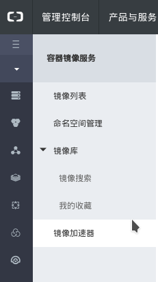
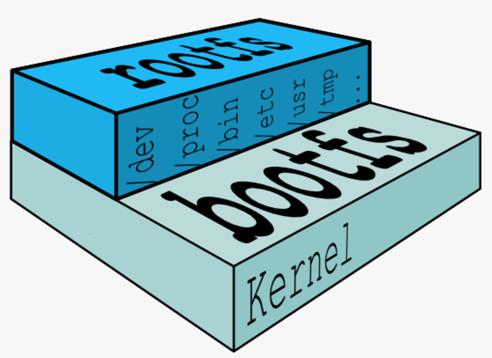
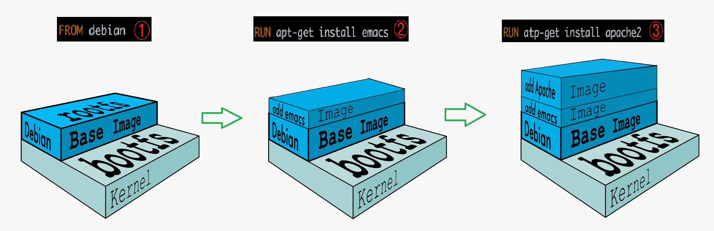
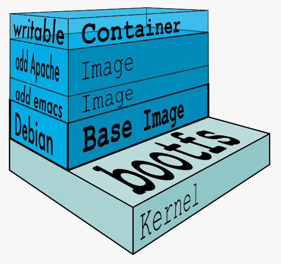

# docker基础

<!-- TOC -->

- [docker基础](#docker基础)
    - [安装docker](#安装docker)
    - [容器概念](#容器概念)
        - [什么是容器](#什么是容器)
        - [为什么需要容器](#为什么需要容器)
        - [容器怎样工作](#容器怎样工作)
    - [Docker镜像](#docker镜像)
        - [镜像的内部结构](#镜像的内部结构)
        - [base镜像](#base镜像)
        - [镜像的分层结构](#镜像的分层结构)
        - [容器层与镜像层](#容器层与镜像层)
        - [构建镜像](#构建镜像)
        - [镜像的缓存特性](#镜像的缓存特性)
        - [调试Dockerfile](#调试dockerfile)
        - [镜像命名](#镜像命名)
    - [docker容器](#docker容器)
        - [如何运行容器](#如何运行容器)
        - [进入容器的方法](#进入容器的方法)
        - [容器常用操作](#容器常用操作)
        - [容器操作图解](#容器操作图解)
        - [限制容器的资源](#限制容器的资源)
        - [实现容器的底层技术](#实现容器的底层技术)
    - [Docker网络](#docker网络)

<!-- /TOC -->

## 安装docker

Docker分为开源免费的CE(Community Edition)版本和收费的EE(Enterprise Edition)版本

Docker支持几乎所有的Linux发行版,也支持Mac和Windows.各操作系统的安装方法可以访问<https://docs.docker.com/install/>

Fedora上的安装方法:

1. 配置软件源

        ]# dnf config-manager \
        --add-repo \
        https://download.docker.com/linux/fedora/docker-ce.repo

2. 安装docker

        ]# dnf update
        ]# dnf install docker-ce

3. 开启国内镜像加速

    由于docker hub的服务器在国外,下载镜像非常慢,可以使用国内的镜像服务进行加速,例如阿里云

    

4. 启用docker daemon

        ]# systemctl start docker
        ]# systemctl enable docker

## 容器概念

### 什么是容器

容器是一种轻量级,可移植,自包含的软件打包技术,使应用程序可以在几乎任何地方以相同的方式运行

容器由应用程序和其依赖的库或其他软件组成

容器在Host操作系统的用户空间中运行,与操作系统的其他进程隔离

### 为什么需要容器

现阶段软件开发需要考虑依赖库,部署环境,服务迁移等多种挑战

容器的优势:

- 对于开发人员 - Build Once, Run Anywhere

    开发人员只需为应用创建一次运行环境,然后打包成容器便可在其他机器上运行.另外,容器环境与所在的Host环境是隔离的,就像虚拟机一样,但更快更简单

- 对于运维人员 - Configure Once, Run Anything

    只需要配置好标准的runtime环境,服务器就可以运行任何容器.这使得运维人员的工作变得更高效,一致和可重复.容器消除了开发,测试,生产环境的不一致性

### 容器怎样工作

Docker的核心组件包括:

1. Docker客户端-Client
2. Docker 服务器 - Docker daemon
3. Docker 镜像 - Image
4. Registry
5. Docker 容器 - Container

Docker架构:

Docker采用的是Client/Server架构.客户端向服务器发送请求,服务器负责构建,运行和分发容器.客户端和服务器可以运行在同一个Host上,客户端也可以通过socket或REST API与远程的服务器通信

- Docker客户端

    最常用的Docker客户端是docker命令.通过docker可以方便的在Host上构建和运行容器

- Docker服务器

    Docker daemon是服务器组件,以Linux后台服务的方式运行

    Docker daemon运行在Docker host上,负责创建,运行,监控容器,构建,存储镜像

- Docker镜像

    可将Docker镜像看成只读模板,通过它可以创建Docker容器

    镜像有多种生成方法:

    1. 可以从无到有开始创建镜像
    2. 也可以下载并使用别人创建好的现成的镜像
    3. 还可以在现有镜像上创建新的镜像

- Docker容器

    Docker容器就是Docker镜像的运行实例

    用户可以通过CLI(docker)或是API启动,停止,移动或删除容器.可以这么认为,对于应用软件,镜像是软件生命周期的构建和打包阶段,而容器则是启动和运行阶段

- Registry

    Registry是存放Docker镜像的仓库,Registry分私有和公有两种

## Docker镜像

### 镜像的内部结构

Dockerfile是镜像的描述文件,定义了如何构建Docker镜像.Dockerfile的语法简洁且可读性强

hello-world的Dockerfile内容:

    FROM scratch //此镜像是白手起家,从0开始构建
    COPY hello / //将文件"hello"复制到镜像的根目录
    CMD ["/hello"] //容器启动时,执行/hello

### base镜像

base镜像有两层含义:

1. 不依赖其他镜像,从scratch构建
2. 其他镜像可以为之基础进行扩展

通常能称作base镜像的都是各种Linux发行版的Docker镜像,比如Ubuntu,Debian,CentOS等等

对于一个base镜像,底层直接用Host的kernel(bootfs),自己只需要提供rootfs.因此base镜像的内核与Host内核一致

base镜像提供的是最小安装的Linux发行版

CentOS镜像的Dockerfile的内容:

    FROM scratch
    ADD centos-7-docker.tar.xz / //自动解压镜像的tar包到/目录下
    CMD ["/bin/bash"]

### 镜像的分层结构

docker支持通过扩展现有镜像,创建新的镜像

Dockerfile示例:

    FROM debian
    RUN apt-get install emacs
    RUN apt-get install apache2
    CMD ["/bin/bash"]

通过分层结构,多个镜像可以共享资源

### 容器层与镜像层

当容器启动时,一个新的可写层被加载到镜像的顶部.这一层通常被称作容器层,容器层之下都叫镜像层

所有对容器的改动都只会发生在容器层中

只有容器层是可写的,容器层下面的所有镜像层都是只读的

镜像层数量可能会很多,所有镜像层会联合在一起组成一个统一的文件系统.如果不同层中有一个相同路径的文件,比如/a,上层的/a会覆盖下层的/a,也就是说用户只能访问到上层中的文件/a.在容器层中,用户看到的是一个叠加之后的文件系统

1. 添加文件

    在容器中创建文件时,新文件被添加到容器层中

2. 读取文件

    在容器中读取某个文件时,Docker会从上往下依次在各镜像层中查找此文件.一旦找到,立即将其复制到容器层,然后打开并读入内存

3. 修改文件

    在容器中修改已存在的文件时,Docker会从上往下依次在各镜像层中查找此文件.一旦找到,立即将其复制到容器层,然后修改之

4. 删除文件

    在容器中删除文件时,Docker也是从上往下依次在镜像层中查找此文件.找到后,会在容器层中记录下此删除操作

只有当需要修改时才复制一份数据,这种特性被称作Copy-on-Write.可见,容器层保存的是镜像变化的部分,不会对镜像本身进行任何修改

### 构建镜像

Docker提供了两种构建镜像的方法:

1. docker commit命令
2. Dockerfile构建镜像

- docker commit

    docker commit是创建新镜像最直观的方法,其过程包括:

    1. 运行容器
    2. 修改容器
    3. 将容器保存为新的镜像

    示例:

        ]# docker run -it ubuntu
        ]# apt-get install -y vim
        ]# docker commit silly_goldberg ubuntu-with-vi

- Dockerfile构建镜像

    Dockerfile示例:

        FROM ubuntu
        RUN apt-get update && apt-get install -y vim

    使用Dockerfile构建:

        ]# ls
        Dockerfile
        ]# docker build -t ubuntu-with-vi-dockerfile .

    构建后可以通过docker images查看新的镜像

###　镜像的缓存特性

Docker会缓存已有镜像的镜像层.构建新镜像时,如果某镜像层已经存在,就直接使用,无需重新创建

Dockerfile中每一个指令都会创建一个镜像层,上层是依赖于下层的.无论什么时候,只要某一层发生变化,其上面所有层的缓存都会失效

### 调试Dockerfile

Dockerfile构建镜像的中途可能会出错,此时Docker所创建的临时容器依旧保留着

如果想要调试Dockerfile,可以进入临时容器中查看信息

### 镜像命名

一个特定镜像的名字由两部分组成:repository和tag

如果执行docker buil时没有使用指定tag,会使用默认值latest

tag除了标识一个镜像外,没有什么特殊的含义

## docker容器

### 如何运行容器

运行容器一般使用docker run命令

可用三种方式指定容器启动时执行的命令:

1. CMD指令
2. ENDPOINT指令
3. 在docker run命令行中指定

容器在执行完指令后会自动退出.如果想要容器保持running,则需要一直执行的命令

### 进入容器的方法

有两种方法可以进入容器:attach和exec

- docker attach

    通过docker attach可以attach到容器启动命令的终端

- docker exec

    在容器中打开新的终端,并连接至该终端

attch与exec主要区别:

1. attach直接进入容器启动命令的终端,不会启动新的进程
2. exec则是在容器中打开新的终端,并且可以启动新的进程

attach命令可以查看启动命令的输出,当然docker logs也可以做到这一点

如果没有什么特殊情况,一般使用exec命令

### 容器常用操作

- stop/start/restart容器

    通过docker stop可以停止运行的容器

    stop本质上是向该进程发送一个SIGTERM信号.如果想强制停止容器,可以使用docker kill命令,其作用是向容器进程发送SIGKILL信号

    对于处于停止状态的容器,可以通过docker start重新启动.start会保留容器的第一次启动时的所有参数

    docker restart可以重启容器,相当于依次执行stop和start

    对于服务类容器,还可以在其运行时添加--restart=always参数使其在退出时自动重启

- pause/unpause容器

    pause可以使容器处于暂停状态,其内存和硬盘数据依旧保持存在.而stop命令则无法保持其内存数据

    unpause用来恢复处于暂停状态的容器

- 删除容器

    使用docker一段使用后,host上可能会有大量已经退出了的容器

    这些容器依然会占用host上的存储资源,如果确认不会再重启此类容器,可以通过docker rm删除

    移除所有容器:

        ]# docker rm -v $(docker ps -aq -f status=exited)

### 容器操作图解

### 限制容器的资源

- 内存限额

    在创建docker容器时,可以加上-m和--memory-swap参数来控制容器内存的使用量

    官方的progrium/stress镜像非常适合测试容器的计算,存储资源

- CPU限制

    Docker可以通过-c或--cpu-shares设置容器使用CPU的权重.如果不指定,默认值是1024

    与内存限额不同,通过-c设置的cpu share并不是CPU资源的绝对数量,而是一个相对的权重值.某个容器最终能分配到的CPU资源取决于它的cpu share占所有容器cpu share总和的比例

- Block IO限制

    Block IO指的是磁盘的读写,docker可通过设置权重,限制bps和iops的方式控制容器读写磁盘的带宽

    --blkio-weight可用来改变容器block IO的优先级(10-1000)

    bps是byte per second,每秒读写的数据量;iops是io per second,每秒IO的次数

    可以通过以下参数控制容器的bps和iops:

    - --device-read-bps,限制读某个设备的bps
    - --device-write-bps,限制写某个设备的bps
    - --device-read-iops,限制读某个设备的iops
    - --device-write-iops,限制写某个设备的iops

### 实现容器的底层技术

cgroup和namespace是最重要的两种技术.cgroup实现资源限额,namespace实现资源隔离

- cgroup

    cgroup全称Control Group.Linux操作系统通过cgroup可以设置进程使用CPU,内存和IO资源的限额

    在/sys/fs/cgroup中可以找到docker对容器的限额

- namespace

    namespace管理着host中全局唯一的资源,并可以让每个容器都觉得只有自己在使用它.换句话说,namespace实现了容器间资源的隔离

    Linux使用了六种namespace,分别对应六种资源:Mount,UTS,IPC,PID,Network和User

## Docker网络

Docker安装时会自动在host上创建3个网络:bridge,host,none,可用docker network ls命令查看