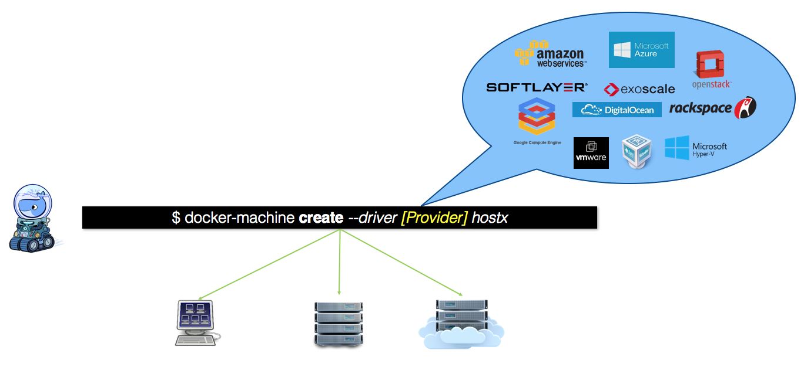

# docker多主机管理

<!-- TOC -->

- [docker多主机管理](#docker多主机管理)
    - [Docker Machine](#docker-machine)
        - [安装Docker Machine](#安装docker-machine)
        - [创建Machine](#创建machine)
        - [管理Machine](#管理machine)

<!-- /TOC -->

## Docker Machine

虽然实验环境只有一个host,但真正的环境会有多个host,容器在这些host中启动,运行,停止和销毁,相关容器会通过网络相互通信,无论它们是否位于相同的host

用Docker Machine可以批量安装docker host,其不同的环境包括:

1. 常规Linux操作系统
2. 虚拟化平台-VirtualBox,VMWare,Hyper-V
3. Openstack
4. 公有云-Amazon Web Services,Microsoft Azure,Google Compute Engine,Digital Ocean等

这些环境有统一的名字:provider.对于某个特定的provider,Docker Machine使用相应的driver安装和配置docker host

### 安装Docker Machine

参考官方安装文档:<https://docs.docker.com/machine/install-machine/>

### 创建Machine

对于Docker Machine,Machine指运行docker daemon的主机,创建Machine即在host上安装和部署docker

1. 执行docker-machine ls查看当前的machine,无machine

        ]# docker-machine ls

2. 创建Machine要求无密码登录远程主机,所以需要事先ssh-copy-id

        ]# ssh-copy-id 192.168.10.11

3. 创建host1,普通的linux使用generic driver,其他driver参考文档<https://docs.docker.com/machine/drivers/>

        ]# docker-machine create --driver generic --generic-ip-address=192.168.10.11 host1

4. 再次执行docker-machine ls,发现已有machine

5. 在host1上查看docker daemon的具体配置/etc/systemd/system/docker.service.发现-H tcp://0.0.0.0:2376接收远程连接;--tls*对远程连接启用安全认证和加密;并且hostname已经设置为host1

6. 以同样方法创建host2,创建完毕

### 管理Machine

用docker-machine创建machine的过程很简洁,非常适合多主机环境.除此之外,Docker Machine也提供了一些子命令方便对machine进行管理.其中最常用的就是无需登录到machine就能执行docker相关操作

一般来说,执行远程docker命令需要使用-H指定目标主机的连接字符串,比如:docker -H tcp://192.168.10.11:2376 ps

而Docker Machine则更简单,使用eval $(docker-machine env host1).接下来所有的docker命令都相当于在host1上执行(需要在docker-machine主机上安装docker客户端)

有用的docker-machine子命令:

1. upgrade:更新machine的docker到最新版本
2. config:查看machine的docker daemon配置
3. stop/start/restart:对machine的操作系统操作,而不是docker daemon
4. scp:在不同machine之间拷贝文件