# docker跨主机网络

<!-- TOC -->

- [docker跨主机网络](#docker跨主机网络)
    - [跨主机网络概述](#跨主机网络概述)
    - [overlay](#overlay)
        - [实验环境](#实验环境)
        - [创建overlay网络](#创建overlay网络)
        - [在overlay中运行容器](#在overlay中运行容器)
        - [overlay实现跨主机通信](#overlay实现跨主机通信)
        - [overlay的隔离性](#overlay的隔离性)
    - [macvlan](#macvlan)
        - [macvlan实验环境](#macvlan实验环境)
        - [创建macvlan网络](#创建macvlan网络)
        - [macvlan网络结构分析](#macvlan网络结构分析)
        - [用sub-interface实现多macvlan网络](#用sub-interface实现多macvlan网络)
    - [flannel](#flannel)
        - [flannel实验环境](#flannel实验环境)
        - [安装配置etcd](#安装配置etcd)
        - [安装配置flannel](#安装配置flannel)
        - [在Docker中使用flannel](#在docker中使用flannel)
        - [flannel的连通与隔离](#flannel的连通与隔离)
            - [flannel网络连通性](#flannel网络连通性)
            - [flannel网络隔离](#flannel网络隔离)
            - [flannel与外网连通性](#flannel与外网连通性)
        - [使用flannel host-gw backend](#使用flannel-host-gw-backend)
            - [配置flannel](#配置flannel)
            - [host-gw与vxlan这两种backend的对比](#host-gw与vxlan这两种backend的对比)
    - [Weave](#weave)
        - [weave实验环境](#weave实验环境)
        - [安装部署weave](#安装部署weave)
        - [启动weave](#启动weave)
        - [Weave网络结构](#weave网络结构)
        - [容器在Weave中的通信与隔离](#容器在weave中的通信与隔离)
            - [weave网络连通性](#weave网络连通性)
            - [weave网络隔离](#weave网络隔离)
        - [Weave与外网的通信](#weave与外网的通信)
            - [将主机加入到weave网关](#将主机加入到weave网关)
            - [让其他非weave主机访问到weave容器](#让其他非weave主机访问到weave容器)
            - [IPAM](#ipam)
    - [Calico](#calico)

<!-- /TOC -->

## 跨主机网络概述

跨主机网络方案包括:

1. docker原生的overlay和macvlan
2. 第三方方案:常用的包括flannel,weave和calico

众多网络方案的实现标准:libnetwork & CNM

libnetwork是docker容器网络库,最核心的内容是其定义的Container Network Model(CNM),这个模型对容器网络进行了抽象,由以下三个组件组成:

1. Sandbox

    Sandbox是容器的网络栈,包含容器的interface,路由表和DNS设置.Linux Network Namespace是Sandbox的标准实现.Sandbox可以包含来自不同Network的 Endpoint

2. Endpoint

    Endpoint的作用是将Sandbox接入Network.Endpoint的典型实现是veth pair,后面我们会举例.一个Endpoint只能属于一个网络,也只能属于一个Sandbox

3. Network

    Network包含一组 Endpoint,同一 Network的 Endpoint可以直接通信.Network的实现可以是Linux Bridge,VLAN等

    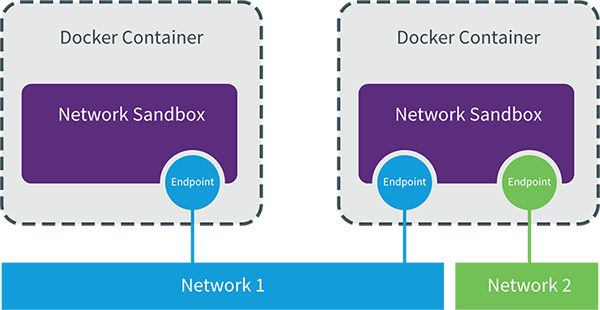

libnetwork CNM定义了docker容器的网络模型,按照该模型开发出的driver就能与docker daemon协同工作,实现容器网络.docker原生的driver包括none,bridge,overlay和macvlan,第三方driver包括flannel,weave,calico等

## overlay

为支持容器跨主机通信,Docker提供了overlay driver,使用户可以创建基于VxLAN的overlay网络.VxLAN可将二层数据封装到UDP进行传输,VxLAN提供与VLAN相同的以太网二层服务,但是拥有更强的扩展性和灵活性

overlay网络需要一个key-value数据库用于保存网络状态信息,包括Network,Endpoint,IP等.Consul,Etcd和ZooKeeper都是Docker支持的Key-value软件

### 实验环境

host1:192.168.122.10,docker-machine
host2:192.168.122.20,machine
host3:192.168.122.30,machine

1. 在host1上安装Consul(使用容器,通过<http://192.168.122.10:8500>访问Consul)

        ]# docker run -d -p 8500:8500 -h consul --name consul progrium/consul -server -bootstrap

2. 修改host2和host3上docker daemon的配置文件

        ]# vim /etc/systemd/system/docker.service.d/10-machine.conf

        ExecStart= ... --cluster-store=consul://192.168.122.10:8500 --cluster-advertise=eth0:2376

    --cluster-store指定consul的地址
    --cluster-advertise告知consul自己的连接地址

3. 重启docker daemon,访问Consul可以看到host2和host3自动被注册到Consul数据库中

### 创建overlay网络

在host2中创建overlay网络ov_net1

    ]# docker network create -d overlay ov_net1

-d overlay指定driver为overlay

docker network ls查看当前网络,可以看到ov_net1的SCOPE为global,而其他网络为local

在host2上查看网络,也能看到ov_net1.这是因为host1将overlay网络信息存入了consul,host2从consul读取到新网络的数据,之后ov_net的任何变化都会同步到host1和host

查看ov_net1的详细信息

    ]# docker network inspect ov_net1
    ...
    "Name": "ov_net1",
    "Scope": "global",
    "Driver": "overlay",
    "IPAM": {
        "Driver": "default",
        "Options": {},
        "Config": [
            {
                "Subnet": "10.0.0.0/24",
                "Gateway": "10.0.0.1"
            }
        ]
    },
    ...

### 在overlay中运行容器

运行一个busybox容器并连接到ov_net1

    ]# docker run -itd --name bbox1 --network ov_net1 busybox

查看容器的网络配置

    ]# docker exec bbox1 ip r
    default via 172.18.0.1 dev eth1
    10.0.0.0/24 dev eth0 scope link  src 10.0.0.2
    172.18.0.0/16 dev eth1 scope link  src 172.18.0.2

bbox1有两个网络接口eth0和eth1.eth0的IP为10.0.0.2,连接的是overlay网络ov_net1;eth1的IP为172.18.0.2,连接的是bridge网络docker_gwbridge,目的是为所有连接到overlay网络的容器提供访问外网的能力

bbox1可以通过docker_gwbridge访问外网

    ]# docker exec bbox1 ping -c1 baidu.com
    PING baidu.com (220.181.57.216): 56 data bytes
    64 bytes from 220.181.57.216: seq=0 ttl=47 time=62.958 ms

如果外网要访问容器,可通过主机端口映射

### overlay实现跨主机通信

在host3中同样运行busybox

    ]# docker run -itd --name bbox2 --network ov_net1 busybox

bbox2的IP是10.0.0.3,可以直接ping bbox1(需要安装libvirt)

    ]# docker exec bbox2 ping -c1 bbox1
    PING bbox1 (10.0.0.2): 56 data bytes
    64 bytes from 10.0.0.2: seq=0 ttl=64 time=0.385 ms

可见overlay网络中的容器可以直接通信,同时docker也实现了DNS服务

overlay网络的具体实现:

docker会为每个overlay网络创建一个独立的network namespace,其中会有一个linux bridge br0,endpoint还是由veth pair实现,一端连接到容器中(即eth0),另一端连接到namespace的br0上

br0除了连接所有的endpoint,还会连接一个vxlan设备,用于与其他host建立vxlan tunnel.容器之间的数据就是通过这个tunnel通信的

逻辑网络拓扑结构如图所示:

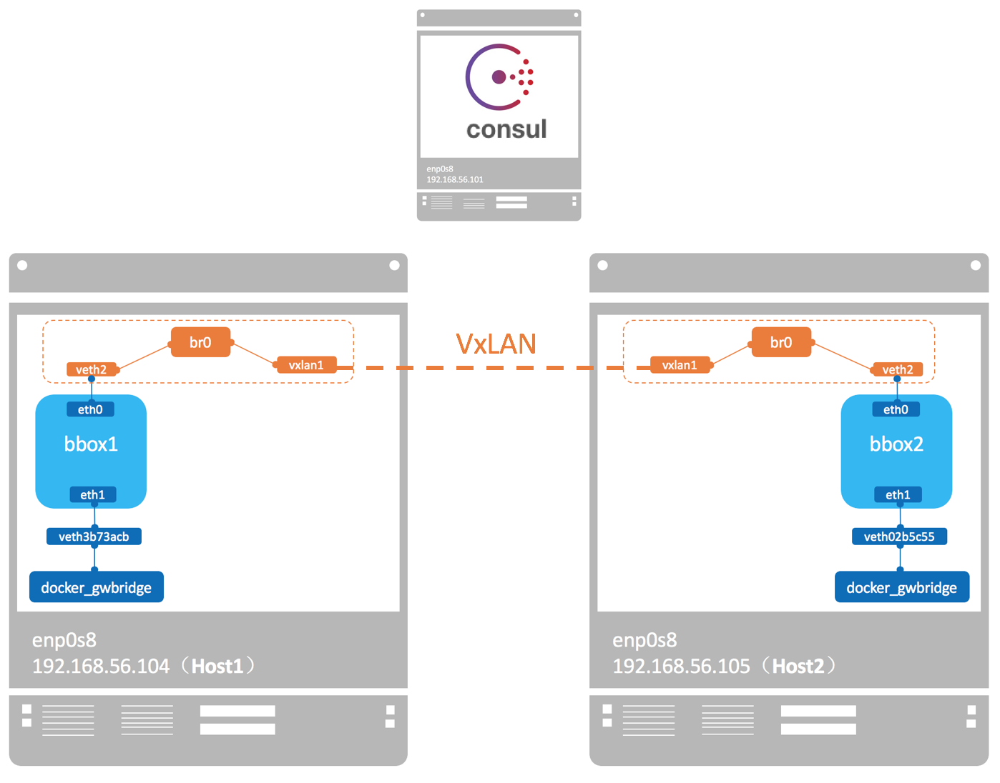

执行过ln -s /var/run/docker/netns /var/run/netns后,可以通过ip netns命令查看overlay网络的namespace.两个host上的namespace相同

查看namespace中br0上的设备

    ]# ip netns exec 1-4d1f8bd07f brctl show
    bridge name     bridge id               STP enabled     interfaces
    br0             8000.b280b5114139       no              veth0
                                                            vxlan0

查看vxlan0设备的具体配置信息可知此overlay使用的VNI(VxLAN ID)为256

    ]# ip netns exec 1-4d1f8bd07f ip -d l show vxlan0
    8: vxlan0: <BROADCAST,MULTICAST,UP,LOWER_UP> mtu 1450 qdisc noqueue master br0 state UNKNOWN mode DEFAULT group defat
        link/ether b2:80:b5:11:41:39 brd ff:ff:ff:ff:ff:ff link-netnsid 0 promiscuity 1
        vxlan id 256 srcport 0 0 dstport 4789 proxy

### overlay的隔离性

不同的overlay网络是相互隔离的

创建第二个overlay网络ov_net2

    ]# docker network create -d overlay ov_net2

查看ov_net2的详细信息,可以发现网段和ov_net1不同

    ]# docker network inspect ov_net2
    "Config": [
        {
            "Subnet": "10.0.1.0/24",
            "Gateway": "10.0.1.1"
        }
    ]

当然,创建网络时也可以指定IP空间

    ]# docker network create -d overlay --subnet 10.1.1.0/24 ov_net3

## macvlan

macvlan本身是linux kernel模块,其功能是允许在同一个物理网卡上配置多个MAC地址,即多个interface,每个interface可以配置自己的IP

macvlan本质上是一种虚拟化技术,因而Docker可以使用macvlan实现容器网络

macvlan的最大优点是性能极好.相比其他实现,macvlan不需要创建Linux Bridge,而是直接通过以太interface连接到物理网络

### macvlan实验环境

在host2和host3上,为保证多个mac地址的网络包都可以从eth0通过,需要打开网卡的混杂模式

    ]# ip link set eth0 promisc on

### 创建macvlan网络

在host2和host3上创建macvlan网络mac_net1

    ]# docker network create -d macvlan --subnet 172.16.10.0/24 --gateway 172.16.10.1 -o parent=eth0 mac_net1

macvlan网络是local网络,为了保证跨主机能够通信,用户需要自己管理IP subnet(docker选择的IP subnet可能不同)

与其他网络不同,docker不会为macvlan创建网关,这里的网关应该是真实存在的,否则容器无法路由

在host1中运行容器bbox1并连接到mac_net1(host2运行bbox2)

    ]# docker run -idt --name bbox1 --ip=172.16.10.10 --network mac_net1 busybox

自动分配IP可能会造成IP冲突,最好手动指定

验证bbox1和bbox2的连通性,可以ping通(但无法解析主机名)

    ]# docker exec bbox1 ping -c1 172.16.10.20
    PING 172.16.10.20 (172.16.10.20): 56 data bytes
    64 bytes from 172.16.10.20: seq=0 ttl=64 time=0.550 ms

可见docker并没有为macvlan提供DNS服务

### macvlan网络结构分析

macvlan不依赖Linux Bridge,brctl show可以确认没有创建新的bridge

查看容器bbox1的网络设备

    ]# docker exec bbox1 ip link
    1: lo: <LOOPBACK,UP,LOWER_UP> mtu 65536 qdisc noqueue qlen 1000
        link/loopback 00:00:00:00:00:00 brd 00:00:00:00:00:00
    7: eth0@if2: <BROADCAST,MULTICAST,UP,LOWER_UP,M-DOWN> mtu 1500 qdisc noqueue
        link/ether 02:42:ac:10:0a:0a brd ff:ff:ff:ff:ff:ff

注意eth0后面的@if2,这表明该interface有一个对应的interface,且全局编号是4.可以发现host2的eth0的编号就是4

可见容器的eth0@if2就是host2中eth0通过macvlan虚拟出来的interface.容器的interface直接与主机的网卡连接,这种方案使得容器无需通过NAT和端口映射就能与外网直接通信(只要有网关),在网络上与其他独立主机没有区别

此时,容器的eth0@if2和host2中的eth0可以认为是同一张网卡的不同namespace实现,并没有明显的主次之分.容器的IP可以在外界存活

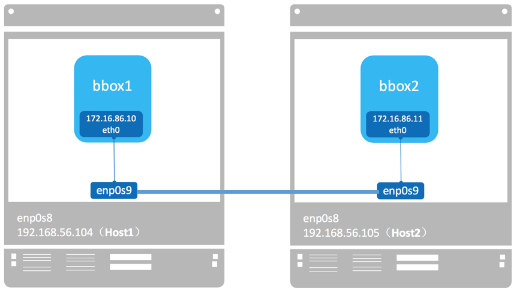

### 用sub-interface实现多macvlan网络

macvlan会独占主机的网卡,也就是说一个网卡只能创建一个macvlan网络,否则会报错.不过好在macvlan也可以连接到sub-interface

VLAN是sub-inteface的一种实现方式,它可以将物理的二层网络划分成多达4094个逻辑网络,这些逻辑网络在二层上隔离

1. 创建VLAN(host2,host3)

        ]# nmcli c add ifname eth0.10 con-name eth0.10 type vlan dev eth0 id 10
        ]# nmcli c add ifname eth0.20 con-name eth0.20 type vlan dev eth0 id 20

2. 创建macvlan网络(host2,host3)

        ]# docker network create -d macvlan --subnet=192.168.10.0/24 --gateway=192.168.10.1 -o parent=eth0
        .10 mac_net10
        ]#docker network create -d macvlan --subnet=192.168.20.0/24 --gateway=192.168.20.1 -o parent=eth0
        .20 mac_net20

3. 运行容器(host2,host3需要修改IP)

        ]# docker run -itd --name bbox1 --ip=192.168.10.10 --network mac_net10 busybox
        ]# docker run -itd --name bbox2 --ip=192.168.20.10 --network mac_net20 busybox

    测试ping,可以发现同一macvlan网络可以通信,不同macvlan网络不能通信

    不同macvlan网络在二层隔离,但在三层上不隔离,可以通过路由转发的方法使它们通信

    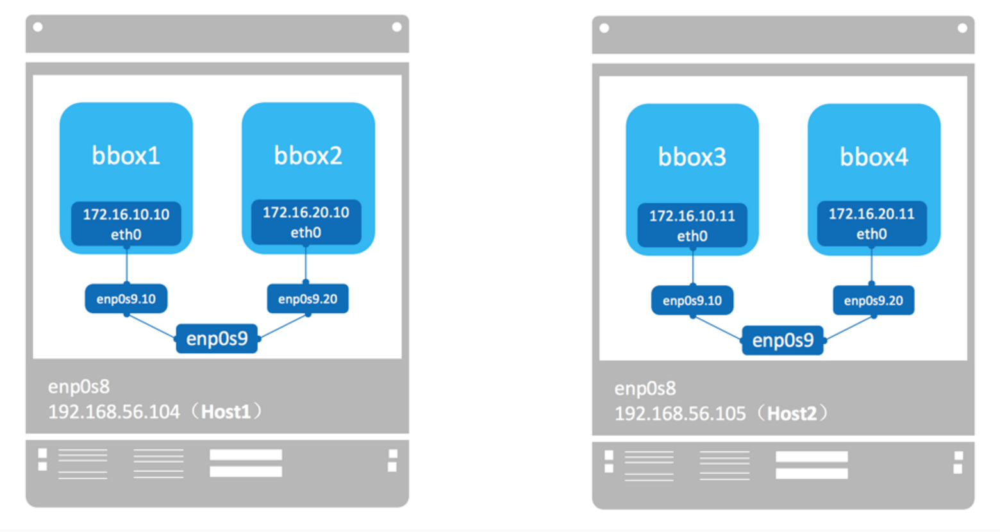

4. 在host1上创建VLAN10和VLAN20,并设置网关IP

        ]# nmcli c add ifname eth0.10 con-name eth0.10 type vlan dev eth0 id 10 ip4 192.168.10.1/24
        ]# nmcli c add ifname eth0.20 con-name eth0.20 type vlan dev eth0 id 20 ip4 192.168.20.1/24

5. 添加iptables规则,转发不同VLAN的数据包

        ]# iptables -t nat -A POSTROUTING -o eth0.10 -j MASQUERADE
        ]# iptables -t nat -A POSTROUTING -o eth0.20 -j MASQUERADE

        ]# iptables -A FORWARD -i eth0.10 -o eth0.20 -j ACCEPT
        ]# iptables -A FORWARD -i eth0.20 -o eth0.10 -j ACCEPT

    测试ping,发现不同macvlan网段可以ping通

    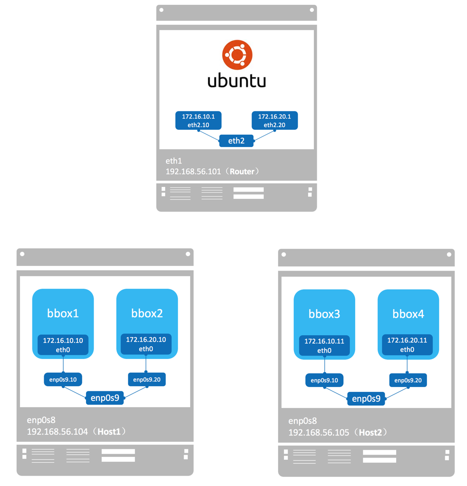

## flannel

flannel是CoreOS开发的容器解决方案.flannel为每个host分配一个subnet,容器从此subnet中分配IP,这些IP可以在host间路由,容器间无需NAT和port mapping就可以跨主机通信

每个subnet都是从一个更大的IP池中划分的,flannel会在每个主机上运行一个叫flanneld的agent,其职责是从池子中分配subnet

为了在各个主机间共享信息,flannel用etcd(与consul类似的key-value分布式数据库)存放网络配置,已分配的subnet,host的IP等信息

数据包如何在主机间转发是由backend实现的.flannel提供了多种backend,最常用的有vxlan和host-gw

### flannel实验环境

host1:192.168.122.10,etcd
host2:192.168.122.20,flannel
host3:192.168.122.30,flannel

### 安装配置etcd

1. 在<https://github.com/coreos/etcd/releases>找到etcd的最新版本

2. 将etcd,etcdctl复制到/usr/bin目录下

3. 启用etcd

        ]# etcd --listen-client-urls 'http://192.168.122.10:2379' --advertise-client-urls 'http://192.168.122.10:2379'

4. 测试etcd

        ]# etcdctl --endpoints="http://192.168.122.10:2379" set foo "bar"
        ]# etcdctl --endpoints="http://192.168.122.10:2379" get foo

### 安装配置flannel

1. 在github上下载flannel的可执行文件,也可自己编译

    flannel地址:<github.com/coreos/flannel>

2. 将flannel的可执行文件拷贝到host2和host3

        ]# cp flanneld-amd64 /usr/local/bin
        ]# chmod u+x /usr/local/bin/flanneld-amd64

3. 在host1上将flannel的网络配置保存到etcd

        ]# vim /etc/flannel-config.json
        {
        "Network": "10.2.0.0/16",
        "SubnetLen": 24,
        "Backend": {
            "Type": "vxlan"
        }
        }

    1. Network定义该网络的IP池
    2. SubnetLen指定每个主机分配到的subnet大小为24位,即10.2.x.0/24
    3. Backend为vxlan,即主机间通过vxlan通信

4. 将配置存入etcd

        ]# etcdctl --endpoints=http://192.168.122.10:2379 set /docker-test/network/config < /etc/flannel-config.json

    /docker-test/network/config是此etcd数据项的key,而flannel-config.json的内容是其value.该key是flanneld的一个启动参数

        ]# etcdctl --endpoints=http://192.168.122.10:2379 get /docker-test/network/config
        {
        "Network": "10.2.0.0/16",
        "SubnetLen": 24,
        "Backend": {
            "Type": "vxlan"
        }
        }

5. 启动flannel

    在host2和host3上启动flannel

        ]# flanneld-amd64 --etcd-endpoints=http://192.168.122.10:2379 --iface=eth0 --etcd-prefix=/docker-test/network &

    --etcd-endpoints指定etcd url
    --iface指定主机间数据传输使用的interface
    --etcd-prefix指定etcd存放flannel网络配置信息的key

6. 观察现象

    host2和host3都会启动一个新的interface:flannel.1,且添加了一条路由,用于不同主机之间通信

    host2上flannel.1的信息:

        ]# ip addr show flannel.1
        9: flannel.1: <BROADCAST,MULTICAST,UP,LOWER_UP> mtu 1450 qdisc noqueue state UNKNOWN group default
            link/ether 5a:c4:0f:98:0a:50 brd ff:ff:ff:ff:ff:ff
            inet 10.2.26.0/32 scope global flannel.1
            valid_lft forever preferred_lft forever

    host2上配置上了subnet的第一个IP:10.2.26.0

    host2上的路由信息:

        ]# ip route
        10.2.76.0/24 via 10.2.76.0 dev flannel.1 onlink
        ...

    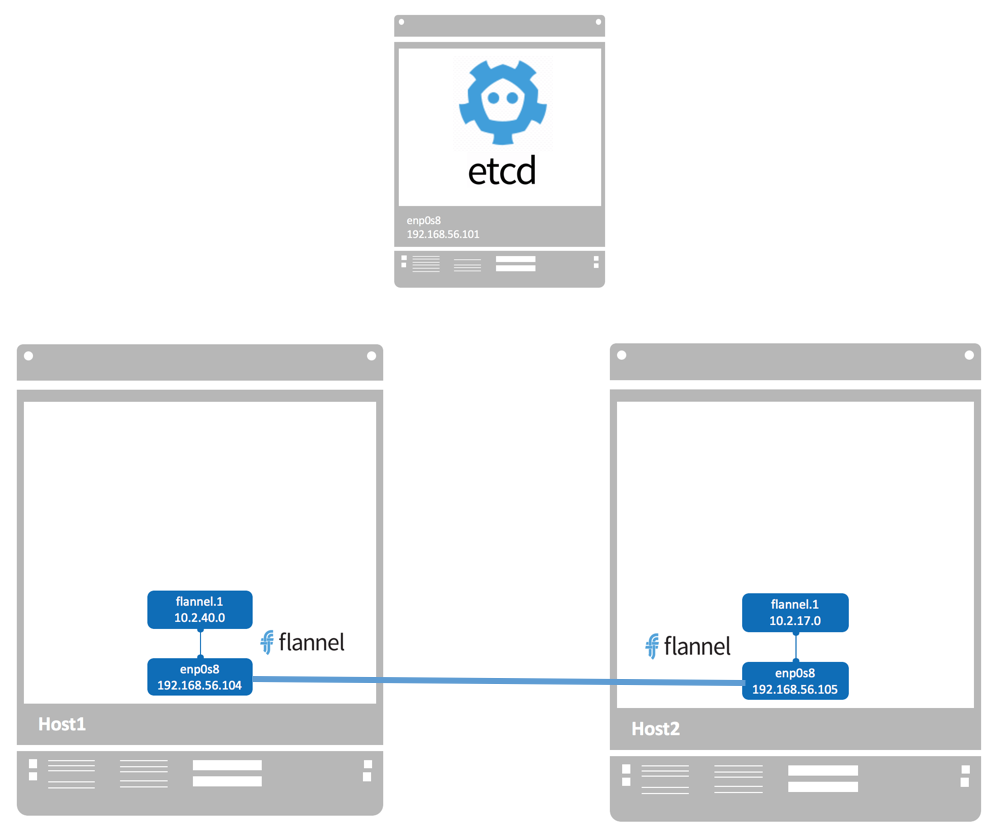

### 在Docker中使用flannel

1. 在host2和host3上编辑Docker的systemd配置文件,添加--bip和--mtu,必须与/run/flannel/subnet.env中的FLANNEL_SUBNET和FLANNEL_MTU相一致

        ]# cat /run/flannel/subnet.env
        FLANNEL_NETWORK=10.2.0.0/16
        FLANNEL_SUBNET=10.2.26.1/24
        FLANNEL_MTU=1450
        FLANNEL_IPMASQ=false

        ]# cat /etc/systemd/system/docker.service.d/10-machine.conf
        [Service]
        ... --cluster-advertise=eth0:2376 --bip=10.2.26.1/24 --mtu=1450

2. 重启Docker daemon

        ]# systemctl daemon-reload
        ]# systemctl restart docker.service

3. 查看现象

    Docker直接将10.2.26.1配置到Linux Bridge docker0上,并添加10.2.26.0/24的路由

        ]# ip addr show docker0
        8: docker0: <BROADCAST,MULTICAST,UP,LOWER_UP> mtu 1450 qdisc noqueue state UP group default
            inet 10.2.26.1/24 brd 10.2.26.255 scope global docker0

        ]# ip route
        10.2.26.0/24 dev docker0 proto kernel scope link src 10.2.26.1

    可见,flannel没有创建新的docker网络,而是直接使用默认的bridge网络.同一主机的容器通过docker0连接,跨主机流量通过flannel.1转发

    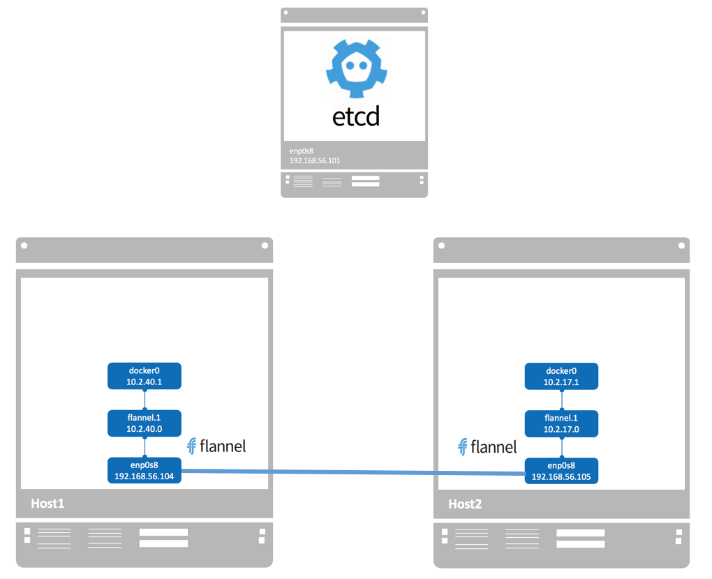

4. 将容器连接到flannel网络

    在host2和host3中运行busybox

        ]# docker run -itd --name bbox1 busybox

    查看bbox1的IP

        ]# ]# docker exec bbox1 ip addr
        10: eth0@if11: <BROADCAST,MULTICAST,UP,LOWER_UP,M-DOWN> mtu 1450 qdisc noqueue
            inet 10.2.26.2/24 brd 10.2.26.255 scope global eth0

### flannel的连通与隔离

#### flannel网络连通性

不同网段的bbox1和bbox2可以互相通信,其数据包流向:

1. bbox1与bbox2不是一个subnet,数据包发送给默认网关10.2.26.1(docker0)
2. 根据host2的路由表,数据包会发给flannel.1
3. flannel.1将数据包封装成VxLAN,通过eth0发送给host3
4. host3收到包并解封装,发现数据包目的地址为10.2.76.2,根据路由表将数据包发送给flannel.1,并通过docker0到达bbox2

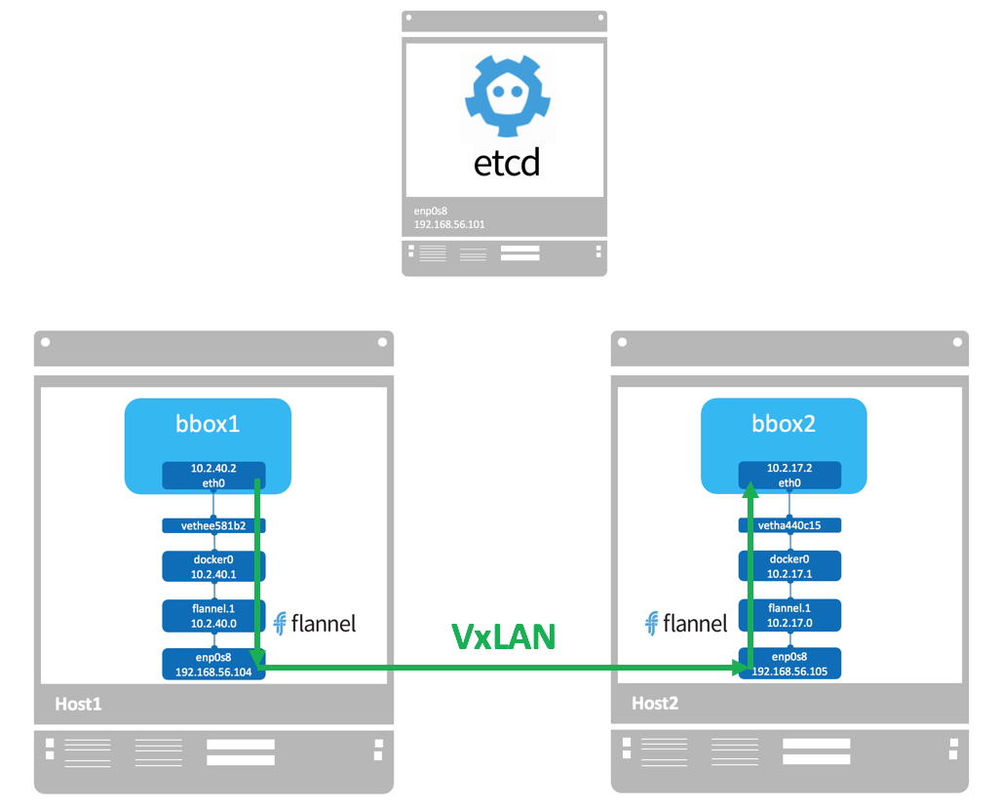

另外,flannel是没有dns服务的,容器无法通过hostname通信

#### flannel网络隔离

flannel为每个主机分配了独立的subnet,但flannel.1将这些subnet连接起来了,相互之间可以路由.本质上,flannel将各主机上相互独立的docker0容器网络组成了一个互通的大网络,实现了容器跨主机通信.flannel没有提供隔离

#### flannel与外网连通性

因为flannel网络利用的是默认的bridge网络,所以容器与外网的连通方式与bridge网络一样,即:

1. 容器通过docker0 NAT访问外网
2. 通过主机端口映射,外网可以访问容器

### 使用flannel host-gw backend

flannel支持多种backend,除了之前的vxlan以外,host-gw是另一个backend

与vxlan不同,host-gw不会封装数据包,而是在主机的路由表中创建到其他主机subnet的路由条目,从而实现容器跨主机通信

#### 配置flannel

1. 首先修改flanenl的配置flannel-config.json

        {
        "Network": "10.2.0.0/16",
        "SubnetLen": 24,
        "Backend": {
            "Type": "host-gw"
        }
        }

2. 更新etcd数据库

        ]# etcdctl --endpoints="http://192.168.122.10:2379" set /docker-test/network/config < /etc/flannel-config.json

3. kill掉之前host2和host3上的flannel进程并重启

        ]# pkill -9 flannel
        ]# flanneld-amd64 --etcd-endpoints=http://192.168.122.10:2379 --iface=eth0 --etcd-prefix=/docker-test/network &

4. 观察现象

    查看host2的路由表,增加了一条到10.2.76.0/24的路由,网关的IP为192.168.122.30

        ]# ip route
        10.2.76.0/24 via 192.168.122.30 dev eth0

    从/run/flannel/subnet.env可以看到host-gw使用的MTU为1500

        ]# cat /run/flannel/subnet.env
        FLANNEL_NETWORK=10.2.0.0/16
        FLANNEL_SUBNET=10.2.26.1/24
        FLANNEL_MTU=1500
        FLANNEL_IPMASQ=false

    因此需要修改docker启动参数--mtu=1500并重启docker daemon

#### host-gw与vxlan这两种backend的对比

1. host-gw把每个主机都配置成网关,主机知道其他主机的subnet和转发地址.vxlan则在主机间建立隧道,不同主机的容器都在一个大的网段内(比如10.2.0.0/16)
2. 虽然vxlan与host-gw使用不同的机制建立主机之间连接,但对于容器则无需任何改变,bbox1仍然可以与bbox2通信
3. 由于vxlan需要对数据进行额外打包和拆包,性能会稍逊于host-gw

## Weave

weave是Weaveworks开发的容器网络解决方案.weave创建的虚拟网络可以将部署在多个主机上的容器连接起来
对容器来说,weave就像一个巨大的以太网交换机,所有容器都被接入这个交换机,容器可以直接通信,无需NAT和端口映射.除此之外,weave的DNS模块使容器可以通过hostname访问

### weave实验环境

weave不依赖分布式数据库交换网络信息,每个主机上只需运行weave组件就能建立跨主机容器网络

host2:192.168.122.20,weave
host3:192.168.122.30,weave

### 安装部署weave

weave安装非常简单,在host2和host3上执行如下命令:

    ]# wget https://github.com/weaveworks/weave/releases/download/v2.3.0/weave -O /usr/local/bin/weave
    ]# chmod +x /usr/local/bin/weave

### 启动weave

下载的weave实际上是一个shell脚本,它会根据调用的参数执行对应的命令

在host2上执行weave launch命令,启动weave相关服务.weave的所有组件都是以容器方式运行的,weave会从docker hub上下载最新的image并启动容器

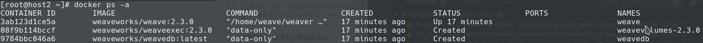

weave运行了三个容器:

1. weave是主程序,负责建立weave网络,收发数据,提供DNS服务等
2. weaveplugin是libnetwork CNM driver,实现Docker网络
3. weaveproxy提供Docker命令的代理服务,当用户运行Docker CLI创建容器时,它会自动将容器添加到weave网络

weave会创建一个新的Docker网络weave,driver为weavemesh,IP范围是10.32.0.0/12

    ]# docker network inspect weave
    "Name": "weave",
    "Scope": "local",
    "Driver": "weavemesh",
    "IPAM": {
        "Driver": "weavemesh",
        "Options": null,
        "Config": [
            {
                "Subnet": "10.32.0.0/12"
            }
        ]
    },
    ...

在host2中运行容器bbox1:

    ]# eval $(weave env)
    ]# docker run --name bbox1 -itd busybox

如需恢复之前的环境,可执行eval $(weave env --restore)

### Weave网络结构

查看容器bbox1的网络配置:

    ]# docker exec bbox1 ip addr
    1: lo: <LOOPBACK,UP,LOWER_UP> mtu 65536 qdisc noqueue qlen 1000
        inet 127.0.0.1/8 scope host lo
    17: eth0@if18: <BROADCAST,MULTICAST,UP,LOWER_UP,M-DOWN> mtu 1500 qdisc noqueue 
        inet 10.2.26.2/24 brd 10.2.26.255 scope global eth0
    19: ethwe@if20: <BROADCAST,MULTICAST,UP,LOWER_UP,M-DOWN> mtu 1376 qdisc noqueue 
        inet 10.32.0.1/12 brd 10.47.255.255 scope global ethwe

bbox1有两个网络接口eth0和ethwe,其中eth0连接的是默认bridge网络,即网桥docker0

ethwe与vethwepl3486是一对veth pair,且挂在host上的Linux Bridge weave上

    ]# brctl show
    bridge name     bridge id               STP enabled     interfaces
    docker0         8000.024209d5424c       no              vethcd94202
    virbr0          8000.5254007ecfc2       yes             virbr0-nic
    weave           8000.bee6904b3172       no              vethwe-bridge
                                                            vethwepl3486

除了vethwepl3486,weave还挂了一个vethwe-bridge,它和vethwe-datapath是一对veth pair

    ]# ip -d link show
    15: vethwe-bridge@vethwe-datapath: <BROADCAST,MULTICAST,UP,LOWER_UP> mtu 1376 qdisc noqueue master weave state UP mode DEFAULT group default
    veth
    bridge_slave
    14: vethwe-datapath@vethwe-bridge: <BROADCAST,MULTICAST,UP,LOWER_UP> mtu 1376 qdisc noqueue master datapath state UP mode DEFAULT group default
    veth
    openvswitch_slave
    9: datapath: <BROADCAST,MULTICAST,UP,LOWER_UP> mtu 1376 qdisc noqueue state UNKNOWN mode DEFAULT group default qlen 1000
    openvswitch
    16: vxlan-6784: <BROADCAST,MULTICAST,UP,LOWER_UP> mtu 65520 qdisc noqueue master datapath state UNKNOWN mode DEFAULT group default qlen 1000
    vxlan id 0 srcport 0 0 dstport 6784 nolearning ageing 300 udpcsum noudp6zerocsumtx udp6zerocsumrx external
    openvswitch_slave

可以看到,这里出现了多个新的interface:

1. vethwe-bridge与vethwe-datapath是veth pair
2. vethwe-datapath的父设备(master)是datapath
3. datapath是一个openvswitch
4. vxlan-6784是vxlan interface,其master也是datapath,weave主机间是过VxLAN通信的

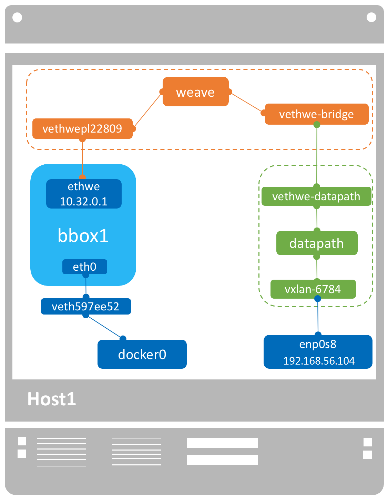

weave网络包含两个虚拟交换机:Linux bridge weave 和Open vSwitch datapath,veth pair vethwe-bridge和vethwe-datapath将二者连接在一起.weave和datapath分工不同,weave负责将容器接入weave网络,datapath负责在主机间VxLAN隧道中并收发数据

再在host2上运行容器bbox2

weave DNS为容器bbox2创建了默认域名bbox2.weave.local,bbox1能够直接通过hostname与bbox1通信

    ]# docker exec bbox2 hostname
    bbox2.weave.local
    ]# docker exec bbox2 ping -c1 bbox1
    PING bbox1 (10.32.0.1): 56 data bytes
    64 bytes from 10.32.0.1: seq=0 ttl=64 time=0.060 ms

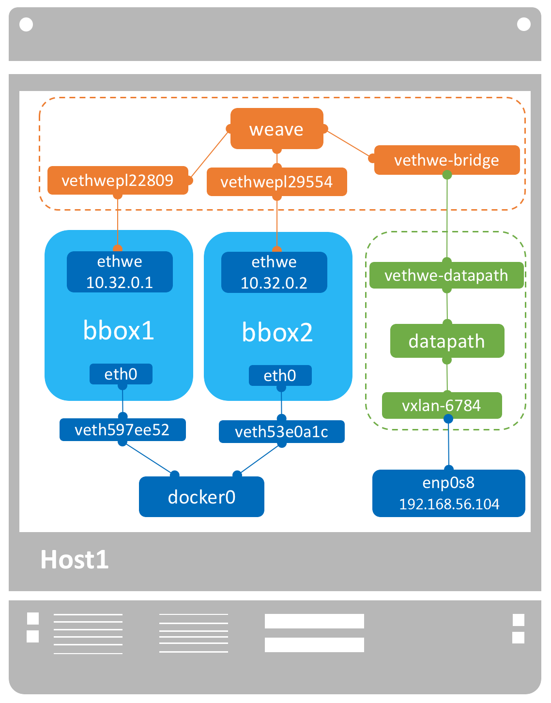

### 容器在Weave中的通信与隔离

在host3上执行如下命令(注意清空原来weave容器与网络):

    ]# weave launch 192.168.122.20

这里需要指定host2的IP地址,这样host2和host3才能加入到同一个weave网络

运行容器bbox3:

    ]# eval $(weave env)
    ]# docker run -itd --name bbox3 busybox

#### weave网络连通性

bbox3能够直接ping bbox1和bbox2

    ]# docker exec bbox3 ping -c1 bbox1
    PING bbox1 (10.32.0.1): 56 data bytes
    64 bytes from 10.32.0.1: seq=0 ttl=64 time=2.563 ms

bbox1,bbox2,bbox3的IP位于同一个subnet10.32.0.0/12.通过host2和host3之间的VxLAN隧道,这三个容器逻辑上是在同一个LAN中,所以能直接通信

bbox3 ping bbox1的数据流向:

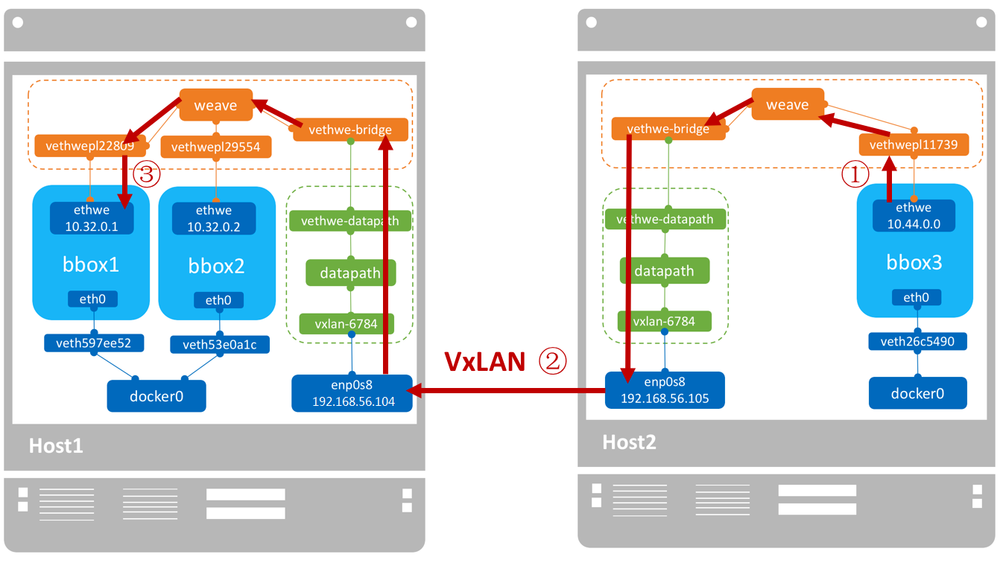

#### weave网络隔离

默认配置下,weave使用一个大subnet(例如10.32.0.0/12),所有主机的容器都从这个地址空间中分配IP,因为同属一个subnet,容器可以直接通信.如果要实现网络隔离,可以通过环境变量WEAVE_CIDR为容器分配不同subnet的IP

    ]# docker run -e WEAVE_CIDR=net:10.32.2.0/24 -it busybox

这里WEAVE_CIDR=net:10.32.2.0/24的作用是使容器配置到IP 10.32.2.2.由于10.32.0.0/12与10.32.2.0/24位于不同的subnet,所以无法ping到bbox1

除了subnet,我们还可以直接分配特定的IP

    ]# docker run -e WEAVE_CIDR=ip:10.32.6.6/24 -it busybox

### Weave与外网的通信

weave是一个私有的VxLAN网络,默认与外部网络隔离

如果外部网络想要访问到weave,则需要:

1. 将主机加入到weave网关
2. 把主机当做访问weave网络的网关

#### 将主机加入到weave网关

要将主机加入到weave,执行weave expose

    ]# weave expose
    10.32.0.1

这时,这个IP10.32.0.1会被配置到host2的weave网络上

    ]# ip addr show weave
    8: weave: <BROADCAST,MULTICAST,UP,LOWER_UP> mtu 1376 qdisc noqueue state UP group default qlen 1000
        inet 10.32.0.1/12 brd 10.47.255.255 scope global weave

此时host2的网络结构:

weave网桥位于root namespace,它负责将容器接入weave网络.给weave配置同一subnet的IP其本质就是将host2接入weave网络.host2现在已经可以直接与同一weave网络中的容器通信了,无论容器是否位于host2

在host2中ping同一主机的bbox1:

    ]# ping -c1 10.32.0.2
    PING 10.32.0.2 (10.32.0.2) 56(84) bytes of data.
    64 bytes from 10.32.0.2: icmp_seq=1 ttl=64 time=0.036 ms

在host2中ping位于host3的bbox3:

    ]# ping -c1 10.44.0.0
    PING 10.44.0.0 (10.44.0.0) 56(84) bytes of data.
    64 bytes from 10.44.0.0: icmp_seq=1 ttl=64 time=0.228 ms

#### 让其他非weave主机访问到weave容器

若想要其他非weave主机访问到box1和bbox3,如host1,只需在host1上添加到容器的路由

    ]# ip route add 10.32.0.0/12 via 192.168.122.20

#### IPAM

10.32.0.0/12是weave网络使用的默认subnet,如果此地址空间与现有IP冲突,可以通过--ipalloc-range分配特定的subnet

    ]# weave launch --ipalloc-range 10.2.0.0/16

## Calico