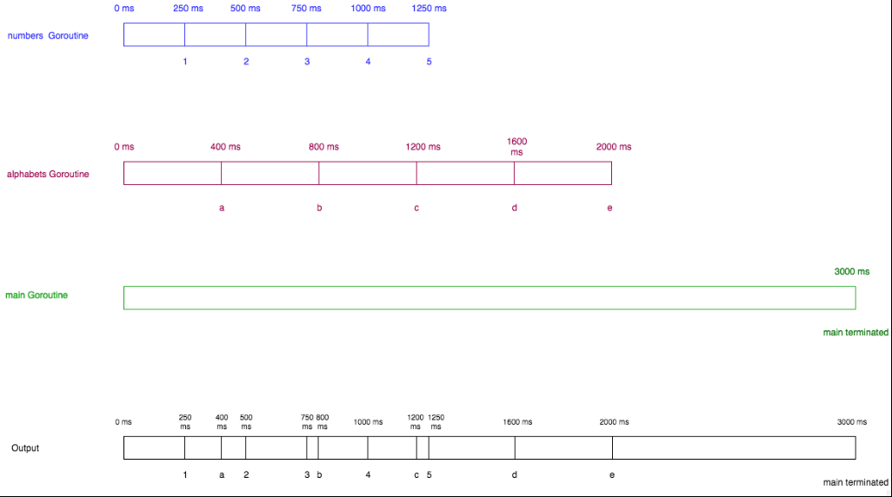

# go语法

<!-- TOC -->

- [go语法](#go语法)
    - [变量](#变量)
        - [什么是变量](#什么是变量)
        - [声明单一变量](#声明单一变量)
        - [声明一个带初值的变量](#声明一个带初值的变量)
        - [类型推导](#类型推导)
        - [多变量声明](#多变量声明)
        - [简短声明](#简短声明)
    - [类型](#类型)
        - [bool](#bool)
        - [有符号整型](#有符号整型)
        - [无符号整型](#无符号整型)
        - [浮点型](#浮点型)
        - [复数类型](#复数类型)
        - [其他数字类型](#其他数字类型)
        - [string类型](#string类型)
        - [类型转换](#类型转换)
    - [常量](#常量)
        - [定义常量](#定义常量)
        - [字符串常量](#字符串常量)
        - [布尔常量](#布尔常量)
        - [数值常量](#数值常量)
        - [数值表达式](#数值表达式)
    - [函数](#函数)
        - [什么是函数](#什么是函数)
        - [函数声明](#函数声明)
        - [函数示例](#函数示例)
        - [多个返回值](#多个返回值)
        - [命令的返回值](#命令的返回值)
        - [空白标识符](#空白标识符)
    - [包](#包)
        - [main函数和main包](#main函数和main包)
        - [创建自定义包](#创建自定义包)
        - [导出名称](#导出名称)
        - [init函数](#init函数)
        - [空白标识符的使用](#空白标识符的使用)
        - [包的别名](#包的别名)
    - [if_else语句](#if_else语句)
        - [if语句](#if语句)
        - [else组件](#else组件)
        - [可选的statement组件](#可选的statement组件)
        - [杂项](#杂项)
    - [循环](#循环)
        - [for循环语法](#for循环语法)
        - [break](#break)
        - [continue](#continue)
        - [更多示例](#更多示例)
        - [无限循环](#无限循环)
    - [Switch语句](#switch语句)
        - [默认case](#默认case)
        - [多个表达式的情况](#多个表达式的情况)
        - [没有表达式的switch](#没有表达式的switch)
        - [fallthrough语句](#fallthrough语句)
    - [Arrays](#arrays)
        - [声明](#声明)
        - [数组是值类型](#数组是值类型)
        - [数组的长度](#数组的长度)
        - [多维数组](#多维数组)
    - [Slices](#slices)
        - [创建一个slice](#创建一个slice)
        - [修改切片](#修改切片)
        - [切片的长度和容量(capacity)](#切片的长度和容量capacity)
        - [使用make函数创建切片](#使用make函数创建切片)
        - [追加到一个切片](#追加到一个切片)
        - [把切片传递给函数](#把切片传递给函数)
        - [多维切片](#多维切片)
        - [内存优化](#内存优化)
    - [可变参数函数](#可变参数函数)
        - [什么是可变参数函数](#什么是可变参数函数)
        - [语法](#语法)
        - [例子和理解可变参数函数如何工作](#例子和理解可变参数函数如何工作)
        - [将一个切片传入可变参数函数](#将一个切片传入可变参数函数)
        - [可变参数函数的杂项](#可变参数函数的杂项)
    - [Map](#map)
        - [map是什么](#map是什么)
        - [如何创建一个map](#如何创建一个map)
        - [给map添加元素](#给map添加元素)
        - [访问一个map的元素](#访问一个map的元素)
        - [删除元素](#删除元素)
        - [map的长度](#map的长度)
        - [map是引用类型](#map是引用类型)
        - [map比较相等](#map比较相等)
    - [String](#string)
        - [什么是string](#什么是string)
        - [获得一个string的个别字节](#获得一个string的个别字节)
        - [rune类型](#rune类型)
        - [string的for range循环](#string的for-range循环)
        - [使用字节的切片来构造一个string](#使用字节的切片来构造一个string)
        - [string的长度](#string的长度)
        - [string无法改变](#string无法改变)
    - [Pointer](#pointer)
        - [声明一个pointer](#声明一个pointer)
        - [空值的pointer](#空值的pointer)
        - [解引用一个指针](#解引用一个指针)
        - [给函数传递指针](#给函数传递指针)
        - [Go不支持指针运算](#go不支持指针运算)
    - [Structure](#structure)
        - [什么是结构体](#什么是结构体)
        - [声明一个结构体](#声明一个结构体)
        - [创建命名结构体](#创建命名结构体)
        - [创建匿名结构体](#创建匿名结构体)
        - [空值的结构体](#空值的结构体)
        - [结构体指针](#结构体指针)
        - [匿名字段](#匿名字段)
        - [嵌套结构体](#嵌套结构体)
        - [提升字段](#提升字段)
        - [导出的结构体和字段](#导出的结构体和字段)
        - [比较结构体](#比较结构体)
        - [tag](#tag)
    - [Method](#method)
        - [什么是方法](#什么是方法)
        - [方法示例](#方法示例)
        - [为何用方法](#为何用方法)
        - [指针接收器和值接收器的比较](#指针接收器和值接收器的比较)
        - [何时使用指针接收器与值接收器](#何时使用指针接收器与值接收器)
        - [匿名字段的方法](#匿名字段的方法)
        - [方法中的值接收器和函数中的参数的比较](#方法中的值接收器和函数中的参数的比较)
        - [方法中的指针接收器和函数中的指针参数的比较](#方法中的指针接收器和函数中的指针参数的比较)
        - [非结构类型的方法](#非结构类型的方法)
    - [Interface](#interface)
        - [什么是接口](#什么是接口)
        - [声明和实施一个接口](#声明和实施一个接口)
        - [接口的实际用处](#接口的实际用处)
        - [接口的内部表示](#接口的内部表示)
        - [空接口](#空接口)
        - [类型断言](#类型断言)
        - [类型交换](#类型交换)
        - [实施接口比较:指针接收器和值接收器](#实施接口比较指针接收器和值接收器)
        - [实施多种接口](#实施多种接口)
        - [嵌入接口](#嵌入接口)
        - [接口的空值](#接口的空值)
    - [Introduction to Concurrency](#introduction-to-concurrency)
        - [什么是并发](#什么是并发)
        - [什么是并行](#什么是并行)
        - [并发性和并行性-从技术观点](#并发性和并行性-从技术观点)
        - [在Go中并发的支持](#在go中并发的支持)
    - [Goroutine](#goroutine)
        - [什么是Goroutine](#什么是goroutine)
        - [比起线程来说,Goroutine的优点](#比起线程来说goroutine的优点)
        - [如何开始一个goroutine](#如何开始一个goroutine)
        - [开始多个Goroutine](#开始多个goroutine)
    - [Channel](#channel)
        - [什么是channel](#什么是channel)
        - [声明channel](#声明channel)
        - [从channel发送和接收数据](#从channel发送和接收数据)
        - [发送和接收默认是阻塞的](#发送和接收默认是阻塞的)
        - [channel示例程序](#channel示例程序)
        - [channel的其它例子](#channel的其它例子)
        - [死锁](#死锁)
        - [单向channel](#单向channel)
        - [关闭channel和channel的for_range循环](#关闭channel和channel的for_range循环)
    - [Buffered Channel](#buffered-channel)
        - [什么是缓冲channel](#什么是缓冲channel)
        - [示例](#示例)
        - [另一个示例](#另一个示例)
        - [缓冲channel的死锁](#缓冲channel的死锁)
        - [缓冲channel的长度与容量](#缓冲channel的长度与容量)
    - [Worker Pool](#worker-pool)
        - [WaitGroup](#waitgroup)
        - [实施工作池](#实施工作池)
    - [Select](#select)
        - [什么是select](#什么是select)
        - [Select示例](#select示例)
        - [select的实际应用](#select的实际应用)
        - [Select的默认case](#select的默认case)
        - [死锁和默认case](#死锁和默认case)
        - [随机选择](#随机选择)
        - [杂项:空选择](#杂项空选择)
    - [Mutex](#mutex)
        - [竞争情况的程序](#竞争情况的程序)
        - [使用互斥解决竞争情况](#使用互斥解决竞争情况)
        - [使用channel解决竞争情况](#使用channel解决竞争情况)
        - [Mutex与Channel的比较](#mutex与channel的比较)

<!-- /TOC -->

## 变量

### 什么是变量

变量(Variable)是给某个内存地址起的一个名字.用来存储某个特定类型的值

### 声明单一变量

声明一个变量的语法为:var name type.例如:

    var age int

声明了一个类型为int,名称为age的变量.如果一个变量没有被赋予任何值,go会自动将这个变量初始化为其类型的0值

    fmt.Println("my age is",age)

    输出:my age is 0

一个变量可以被赋予其类型的任何值

    age=24
    age=28

### 声明一个带初值的变量

声明一个带初值的变量的语法为:var name type = initialvalue:例如:

    var age int = 29

### 类型推导

如果声明一个变量时提供了初始值,Go可以根据该初始值来自动推导变量的类型.即如果声明变量时提供了初始值,就可以不必指定其类型

    var age = 29

### 多变量声明

多变量声明的语法为:var name1, name2 type = initialvalue1, initialvalue2,例如:

    var width, height int = 100, 50

如果制定初始值,则type可以省略:

    var width, height = 100, 50

如果不指定width和height的初值,它们将自动被赋值为0

有时需要在一条语句中声明多个不同类型的变量:

    var (
        name1 = initialvalue1,
        name2 = initialvalue2
    )

### 简短声明

声明变量的简短语法是 name := initialvalue.例如:

    name, age := "naveen", 29

该简短声明允许给已声明的变量赋值,但必须有一个新声明的变量

    a, b := 10, 20

    fmt.Println("a =", a, "b =", b)

    b, c := 10, 20

    fmt.Println("b =", b, "c =", c)

    a,b:=100,200 //错误,没有新变量

    注:简短声明只能用在函数中

变量可以被赋予运行时产生的值:

    a := math.Min(a,b)

## 类型

下面是Go支持的基本类型

- bool
- Numeric Types
    - int8, int16, int32, int64, int
    - uint8, uint16, uint32, uint64, uint
    - float32, float64
    - complex64, complex128
    - byte
    - rune
- string

### bool

bool类型表示一个布尔值,值为true或者false

    a := true
    b := false

    c := a && b //false
    d := a || b //true

### 有符号整型

- int8

    表示8位有符号整型
    大小:8位
    范围:-128～127

- int16

    表示16位有符号整型
    大小:16位
    范围:-32768～32767

- int32

    表示32位有符号整型
    大小:32位
    范围:-2147483648～2147483647

- int64

    表示64位有符号整型
    大小:64位
    范围:-9223372036854775808～9223372036854775807

- int

    根据不同的底层平台(Underlying Platform),表示32或64位整型.除非对整型的大小有特定的需求,否则通常应该使用int表示整型
    大小:在32位系统下是32位,而在64位系统下是64位
    范围:在32位系统下是-2147483648～2147483647,而在64位系统是-9223372036854775808～9223372036854775807

在Printf方法中,使用"%T"格式说明符,可以打印出变量的类型
Go的unsafe包提供了一个Sizeof函数,接受变量并返回它的字节大小(小心使用,可能有移植性问题)

    a := 10

    fmt.Printf("%T", a) //int
    fmt.Printf("%d",unsafe.Sizeof(a)) //8,即64位

### 无符号整型

- uint8

    表示8位无符号整型
    大小：8 位
    范围：0～255

- uint16

    表示16位无符号整型
    大小:16位
    范围:0～65535

- uint32

    表示32位无符号整型
    大小:32位
    范围:0～4294967295

- uint64

    表示64位无符号整型
    大小:64位
    范围:0～18446744073709551615

- uint

    根据不同的底层平台,表示32或64位无符号整型
    大小:在32位系统下是32位,而在64位系统下是64位
    范围:在32位系统下是0～4294967295,而在64位系统是0～18446744073709551615

### 浮点型

- float32

    32位浮点数

- float64

    64位浮点数

### 复数类型

- complex64

    实部和虚部都是float32类型的的复数

- complex128

    实部和虚部都是float64类型的的复数

使用简短语法创建复数:

    c := 6+7i

内建函数complex创建一个包含实部和虚部的复数,complex函数的定义如下:

    func complex(r,i FloatType) ComplexType

该函数的参数分别是实部和虚部,并返回一个复数类型
实部和虚部应该是相同的类型,也就是float32或float64
如果类型是float32,则返回complex64;如果都是float64,则返回complex128

例:

    c1 := 3 + 6i
    c2 := complex(4, 9)
    cadd := c1 + c2
    fmt.Println(c1, cadd)

    输出:(3+6i) (7+15i)

### 其他数字类型

byte是uint8的别名
rune是int32的别名

### string类型

在Golang中,字符串是字节的集合

    first := "Wan"
    last := "ShaoBo"
    name := first +" "+ last
    fmt.Println("My name is",name)

    输出:My name is Wan ShaoBo

### 类型转换

Go 有着非常严格的强类型特征.Go 没有自动类型提升或类型转换

    i := 55      //int
    j := 67.8    //float64
    sum := i + j //错误,不允许int+float64

要修复这个错误,需要类型转换

    sum := i + int(j) //j被转换为int类型

## 常量

### 定义常量

常量(constant)表示固定的值,比如2,-32,"abc",23.23等等

    var a int = 50
    var b string = "abc"

    a和b分别被赋值为常量50和"abc"
    关键字const用于指示常量,如50和"abc"
    上例尽管没有const关键字,但它们在Go的内部表示为常量

关键字cosnt修饰的名字为常量,不能被重新赋予任何值

    const a = 55
    a = 90 //错误

常量的值必须在编译期间确定.因此不能将函数的返回值赋给常量

    const a = math.Sqrt(4) //错误

### 字符串常量

在Go中任何用双引号括起来的值都是字符串常量

字符串常量没有类型

    const hello = "hello" //"hello"无类型,hello也无类型

Go是强类型语言,所有变量都需要显式类型
在需要类型的场合,编译器会根据常量的值和上下文将常量转换为相应的类型

    var name = "Sam" //变量name被赋值为无类型常量时会获取其默认类型

可以创建一个有类型的常量

    const name string = "hello"

### 布尔常量

布尔常量与字符串常量(在概念上)没有区别.布尔常量只包含两个值:true和false

    const trueConst = true

### 数值常量

数值常量包括整数,浮点数以及复数常量

    const a = 5
    var intVar int = a
    var int32Var int32 = a
    var float64Var float64 = a
    var complex64Var complex64 = a

    a无类型,使用时随上下文变化而变化

### 数值表达式

数值常量可以在表达式中自由的混合和匹配,仅当将它们赋值给变量或者在代码中明确需要类型的时候,才需要它们的类型

    a := 3.6 / 3
    fmt.Println(a) //输出1.2

## 函数

### 什么是函数

函数是一段可以实现特定任务的代码块.一个函数接收一个输入,对其执行一些运算,然后生成一个输出

### 函数声明

声明一个函数的语法:

    func functionname(parametername type) returntype {  
        //function body
    }

    指定一个参数的语法是参数名后面跟随着参数类型.任何数量的参数都可以被指定为像(parameter1 type, parameter2 type)的样式

参数和返回类型在函数中是可选的.也就是说函数可以无输入也无输出:

    func functionname() {  
    }

### 函数示例

写一个简单的函数,以商品的价格和数量作为输入,以总共的价格作为输出

    func calculateBill(price int, no int) int {  
        var totalPrice = price * no
        return totalPrice
    }

    上述函数有两个输入的参数price和no,类型是int.返回totalPrice,类型是int

如果连续的参数是同样的类型,我们可以避免每次都写类型,在参数的最后写一次即可

    func calculateBill(price, no int) int {  
        var totalPrice = price * no
        return totalPrice
    }

### 多个返回值

Go允许函数拥有多个返回值

    package main

    import (  
        "fmt"
    )

    func rectProps(length, width float64)(float64, float64) {  
        var area = length * width
        var perimeter = (length + width) * 2
        return area, perimeter
    }

    func main() {  
            area, perimeter := rectProps(10.8, 5.6)
        fmt.Printf("Area %f Perimeter %f", area, perimeter)

### 命令的返回值

如果返回值在一开始即被命名,可以认为它们在函数的第一行即被定义

    func rectProps(length, width float64)(area, perimeter float64) {  
        area = length * width
        perimeter = (length + width) * 2
        return //no explicit return value
    }

    area和perimeter是被命名的返回变量.当return语句出现时,它们会自动从函数中返回

### 空白标识符

_是Go中的空白标识符.它可以代替任何类型的任何变量

_可以用在以下情况:函数有多个返回值,而实际需要的返回值却不是全部
这时,就可以使用_来代替不需要的返回值

area, _ := rectProps(10.8, 5.6) // perimeter is discarded

## 包

在现实场景,把整个源代码都写在一个文件中是不行的
包用于组织go的源代码为了更高的可重用性和可读性

### main函数和main包

每个可执行的go程序一定包含一个main函数.这个函数是执行入口.main函数应该在main包中

语法package packagename指定了一个源文件属于一个包.这应该在每个go源文件的第一行

go install命令会查找一个有main函数的文件,然后编译它并放在工作目录的bin文件夹下

### 创建自定义包

属于某个包的源文件应该被放置在它们自己的文件夹中.把文件夹命名为包的名称是Go的惯例

### 导出名称

在Go中,任何以大写字母开头的变量或函数是导出名称
只有导出的函数和变量能被其他包访问

### init函数

每个包可以包括一个init函数.init函数没有参数和返回值,并且不能明确的去调用它

    func init() {
    }

init函数可以用来执行初始化任务,也可以在程序执行之前判断其正确性

一个包初始化的顺序:

包的初始化顺序实际上就是代码的顺序

1. 导入的包,如果包中有init函数则立刻执行
2. 全局变量,又称包级别的变量
3. main包的init函数
4. main函数(如果有的话)

如果一个包导入其他包,那么被导入的包首先初始化

一个包只会初始化一次,即使它被多个包导入

### 空白标识符的使用

在Go中,导入一个包却不使用是不合法的
但在开发中,导入一个包以待以后使用是很常见的.此时,"_"将解决这些问题

    var _ = rectangle.Area

有时我们需要导入一个包仅仅是为了确认包的初始化是否生效,而完全不需要包中的函数和变量,此时也可以使用"_"

    import (
        _ "geometry/rectangle"
    )

这个程序只会执行rectangle包的init函数

### 包的别名

如果包的名称过于冗长,则可以给其起一个别名

    import (
        a "fmt"
    )

    func main() {
        a.Println("helloworld")
    }

## if_else语句

### if语句

if是一个条件语句.它的语法是:

    if condition {  
    }

如果condition是true,那么{}中的语句将被执行

不同于C,{}块是强制的,即使其中只有一个语句

### else组件

if语句有可选的else if和else组件

    if condition {  
    } else if condition {
    } else {
    }

可以有任意数量的else if语句

例:查找一个数是奇数还是偶数

    package main

    import (  
        "fmt"
    )

    func main() {  
        num := 10
        if num % 2 == 0 { //checks if number is even
            fmt.Println("the number is even")
        }  else {
            fmt.Println("the number is odd")
        }
    }

### 可选的statement组件

有一个if语句的变种,它包括一个可选的statement部件,在判定条件之前被执行:

    if statement; condition {  
    }

例:重写奇偶数的判定

    package main

    import (  
        "fmt"
    )

    func main() {  
        if num := 10; num % 2 == 0 { //checks if number is even
            fmt.Println(num,"is even")
        }  else {
            fmt.Println(num,"is odd")
        }
    }

在该程序,num在if语句块中被初始化
需要注意的是变量num只在该if_else语句块中可用.当我们在if_else语句块外使用变量num,编译器会报错

### 杂项

else语句应当和if的反大括号}位于同一行.如果不这么做编译器将会报错

例:

    if num % 2 == 0 { //checks if number is even
            fmt.Println("the number is even")
        }  
        else {
            fmt.Println("the number is odd")
        }

该程序中else和}并不在同一行,这在Go中是不允许的

这样做的原因是:如果}是一行最后的符号,那么Go会在其后添加一个分号,以作为语句块的结束.但是,if_else语句显然并不是在其if语句的最后就结束的

## 循环

一个循环语句用于反复执行一个语句块

在Go中,for是唯一可用的循环语句.Go不存在while或者do while语句

### for循环语法

    for initialisation; condition; post {  
    }

initialisation语句只会被执行一次
在循环初始化后,condition语句将被检查,如果是true则执行{}块中的代码
post语句将在每次循环成功迭代后被执行
在post语句被执行后,condition语句重新被检测,如果true,循环将重复执行,否则循环结束

这三个组件,即initialisation,condition,post都是可选的

例:重复打印数字,从1到10

    package main

    import (  
        "fmt"
    )

    func main() {  
        for i := 1; i <= 10; i++ {
            fmt.Printf(" %d",i)
        }
    }

该程序将会打印1 2 3 4 5 6 7 8 9 10
在循环中声明的变量仅仅在循环中有效.即变量i不能在循环语句外使用

### break

break语句用于在循环语句中突然终止循环

例:打印数字到5后终止循环

    package main

    import (  
        "fmt"
    )

    func main() {  
        for i := 1; i <= 10; i++ {
            if i > 5 {
                break //loop is terminated if i > 5
            }
            fmt.Printf("%d ", i)
        }
        fmt.Printf("\nline after for loop")
    }

### continue

continue语句用于跳出循环的该次迭代,并立即开始下次迭代

例:只打印偶数

    package main

    import (  
        "fmt"
    )

    func main() {  
        for i := 1; i <= 10; i++ {
            if i%2 == 0 {
                continue
            }
            fmt.Printf("%d ", i)
        }
    }

### 更多示例

    package main

    import (  
        "fmt"
    )

    func main() {  
        i := 0
        for ;i <= 10; { // initialisation and post are omitted
            fmt.Printf("%d ", i)
            i += 2
        }
    }

该for循环只有condition组件

上面for循环的分号也可以被忽略.这种格式被认为是while循环的一种替代:

    package main

    import (  
        "fmt"
    )

    func main() {  
        i := 0
        for i <= 10 { //semicolons are ommitted and only condition is present
            fmt.Printf("%d ", i)
            i += 2
        }
    }

可以在循环中声明和操作多个变量:

    package main

    import (  
        "fmt"
    )

    func main() {  
        for no, i := 10, 1; i <= 10 && no <= 19; i, no = i+1, no+1 { //multiple initialisation and increment
            fmt.Printf("%d * %d = %d\n", no, i, no*i)
        }

    }

### 无限循环

无限循环的语法:

    for {  
    }

示例:重复打印

    package main

    import "fmt"

    func main() {  
        for {
            fmt.Println("Hello World")
        }
    }

## Switch语句

switch语句可以判断一个表达式,和一系列可能的匹配相比对,最后根据符合的匹配执行代码块
switch语句可以被认为是写if_else子句的惯用方式

例:根据手指号打印手指名

    package main

    import (  
        "fmt"
    )

    func main() {  
        finger := 4
        switch finger {
        case 1:
            fmt.Println("Thumb")
        case 2:
            fmt.Println("Index")
        case 3:
            fmt.Println("Middle")
        case 4:
            fmt.Println("Ring")
        case 5:
            fmt.Println("Pinky")

        }
    }

重复的常量case是不被允许的

例:case常量重复,报错

    switch finger {
        case 1:
            fmt.Println("Thumb")
        case 2:
            fmt.Println("Index")
        case 3:
            fmt.Println("Middle")
        case 4:
            fmt.Println("Ring")
        case 4://duplicate case
            fmt.Println("Another Ring")
        case 5:
            fmt.Println("Pinky")
        }

### 默认case

当没有任何一个case匹配时,默认case将被执行

例:

    switch finger := 8; finger {
        case 1:
            fmt.Println("Thumb")
        case 2:
            fmt.Println("Index")
        case 3:
            fmt.Println("Middle")
        case 4:
            fmt.Println("Ring")
        case 5:
            fmt.Println("Pinky")
        default: //default case
            fmt.Println("incorrect finger number")
        }

finger的值是8,它不匹配任何case,因此default子句将被执行
default子句可以在switch的任何位置

一个switch可以包含一个可选的statement,它将在表达式判断之前执行

### 多个表达式的情况

可能在一个case子句中包含多个表达式.它们之间用逗号分离

例:

    package main

    import (  
        "fmt"
    )

    func main() {  
        letter := "i"
        switch letter {
        case "a", "e", "i", "o", "u": //multiple expressions in case
            fmt.Println("vowel")
        default:
            fmt.Println("not a vowel")
        }
    }

### 没有表达式的switch

如果表达式被忽略,那么该switch就会被认为是switch true

例:

    num := 75
        switch { // expression is omitted
        case num >= 0 && num <= 50:
            fmt.Println("num is greater than 0 and less than 50")
        case num >= 51 && num <= 100:
            fmt.Println("num is greater than 51 and less than 100")
        case num >= 101:
            fmt.Println("num is greater than 100")
        }

### fallthrough语句

在Go中,当一个case被执行,控制权将立刻跳出switch语句
fallthrough语句可以用来把控制权转交给被执行的case语句的下一个语句

例:

    switch num := number(); { //num is not a constant
        case num < 50:
            fmt.Printf("%d is lesser than 50\n", num)
            fallthrough
        case num < 100:
            fmt.Printf("%d is lesser than 100\n", num)
            fallthrough
        case num < 200:
            fmt.Printf("%d is lesser than 200", num)
        }

    输出:
        75 is lesser than 100  
        75 is lesser than 200

fallthrough语句应该是一个case语句的最后一个语句.如果它被放在case的中间位置,编译器将会报错

## Arrays

一个数组是相同元素的集合.在Go中一个数组是不能包含相同元素的

### 声明

一个数组是[n]T类型的.n是元素的数量,T是每个元素的类型

有多种不同的方式声明一个数组.首先看第一种:

    var a [3]int
    fmt.Println(a)

var a[3]int声明了一个长度为3的整型数组
所有在数组中的元素会自动初始化为其类型的零值
运行该程序将输出[0 0 0]

一个数组的索引从0开始,length-1结束:

    var a [3]int //int array with length 3
    a[0] = 12 // array index starts at 0
    a[1] = 78
    a[2] = 50

使用简短声明声明一个数组:

    a := [3]int{12, 78, 50}

简短声明不必要对数组的每个元素都进行声明:

    a := [3]int{12}
    fmt.Println(a) //输出[12 0 0]

甚至可以在数组的声明中忽略其长度并用...代替:

    a := [...]int{12, 78, 50}

    这样编译器将会自动确定数组的长度

数组的长度事实上也是类型的一部分.因此[5]int和[25]int是不同类型的.因为这,数组的长度是固定的,无法改变.如果需要改变长度,可以使用切片类型

### 数组是值类型

在Go中,数组是值类型而不是引用类型

当拷贝数组时,原始数组的值将拷贝到新的数组.当新数组改变,原始数组不会有影响:

    a := [...]string{"USA","China","India","Germany"}
    b := a
    b[0] = "Singapore"
    fmt.Println("a is ",a) //a is [USA China India Germany France]
    fmt.Println("b is ",b) //b is [Singapore China India Germany France]

相似的,当像函数传递数组参数时,它们通过值传递,原始数组不会改变:

    func changeLocal(num [5]int) {  
        num[0] = 55
        fmt.Println("inside function ", num)

    }
    func main() {  
        num := [...]int{5, 6, 7, 8, 8}
        fmt.Println("before passing to function ", num)
        changeLocal(num) //num is passed by value
        fmt.Println("after passing to function ", num)

    输出:
        before passing to function  [5 6 7 8 8]  
        inside function  [55 6 7 8 8]  
        after passing to function  [5 6 7 8 8]

### 数组的长度

通过向函数len传递数组参数可以得到该数组的长度:

    a := [...]float64{67.7, 89.8, 21, 78}
    fmt.Println("length of a is",len(a)) //输出4

使用长度迭代数组
for循环可以用来迭代数组的每个元素:

    a := [...]float64{67.7, 89.8, 21, 78}
    for i := 0; i < len(a); i++ { //looping from 0 to the length of the array
            fmt.Printf("%d th element of a is %.2f\n", i, a[i])
    }

for循环的range用法可以更好的迭代数组:

    for i, v := range a {//range returns both the index and value
        fmt.Printf("%d the element of a is %.2f\n", i, v)
    }

如果只想要value而忽略index,可以使用_来代替index:

    for _, v := range a { //ignores index  
    }

### 多维数组

至今使用的都是单维数组,可以创建一个多维数组:

    package main

    import (  
        "fmt"
    )

    func printarray(a [3][2]string) {  
        for _, v1 := range a {
            for _, v2 := range v1 {
                fmt.Printf("%s ", v2)
            }
            fmt.Printf("\n")
        }
    }

    func main() {  
        a := [3][2]string{
            {"lion", "tiger"},
            {"cat", "dog"},
            {"pigeon", "peacock"}, //this comma is necessary. The compiler will complain if you omit this comma
        }
        printarray(a)
        var b [3][2]string
        b[0][0] = "apple"
        b[0][1] = "samsung"
        b[1][0] = "microsoft"
        b[1][1] = "google"
        b[2][0] = "AT&T"
        b[2][1] = "T-Mobile"
        fmt.Printf("\n")
        printarray(b)
    }

## Slices

slice是在数组之上的包装,方便,灵活,强大
slice没有自己的数据,它仅仅是已存在数组的引用

### 创建一个slice

一个有类型T元素的切片可以认为是类型[]T

    a := [5]int{76, 77, 78, 79, 80}
    var b []int = a[1:4] //creates a slice from a[1] to a[3]
    fmt.Println(b) //输出[77,78,79]

    a[start:end]从数组a创建了一个切片

创建切片的其它方式:

    c := []int{6,7,8}
    fmt.Println(c) //输出:[6 7 8]

    该程序创建了一个数组,并返回了一个存储在c中的切片引用

### 修改切片

切片没有自己的数据,它仅仅是底层数组的引用
任何对切片的修改将影响到底层数组

    darr := [...]int{57, 89, 90, 82, 100, 78, 67, 69, 59}
    dslice := darr[2:5]
    fmt.Println("array before",darr)
    for i := range dslice {
        dslice[i]++
    }
    fmt.Println("array after",darr)

    输出:
        array before [57 89 90 82 100 78 67 69 59]
        array after [57 89 91 83 101 78 67 69 59]  

    dslice从数组的2,3,4引用创建切片,然后通过for循环修改数组的值

当多个切片同时映射一个底层数组时,每个切片的改变都会影响到数组:

    numa := [3]int{78, 79 ,80}
    nums1 := numa[:] //creates a slice which contains all elements of the array
    nums2 := numa[:]
    fmt.Println("array before change 1",numa)
    nums1[0] = 100
    fmt.Println("array after modification to slice nums1", numa)
    nums2[1] = 101
    fmt.Println("array after modification to slice nums2", numa)

### 切片的长度和容量(capacity)

切片的长度是切片中元素的数量.切片的容量是其底层数组从创建切片的索引到最后的元素的数量

    fruitarray := [...]string{"apple", "orange", "grape", "mango", "water melon", "pine apple", "chikoo"}
    fruitslice := fruitarray[1:3]
    fmt.Printf("length of slice %d capacity %d", len(fruitslice), cap(fruitslice)) //length of is 2 and capacity is 6

    切片fruitslice从fruitarray的索引1到2创建.因此fruitslice的长度是2
    fruitarray的长度是7.fruitslice从索引1开始创建.因此fruitslice的容量是6

一个切片可以重新切割直至它的容量.如果超过它的容量则会报错

    fruitslice = fruitslice[:cap(fruitslice)] //re-slicing furitslice till its capacity
    fmt.Println("After re-slicing length is",len(fruitslice), "and capacity is",cap(fruitslice))

    切片被重新切割至它的容量.该程序输出:
        length of slice 2 capacity 6  
        After re-slicing length is 6 and capacity is 6

### 使用make函数创建切片

函数make可以用来创建一个切片,其参数是类型,长度和容量.容量类型是可选的,默认即是长度.语法:

    func make([]T, len, cap) []T

make函数创建一个数组,然后返回一个引用它的切片

    i := make([]int, 5, 5)
    fmt.Println(i) //输出[0 0 0 0 0]

使用make创建切片时,其中的元素都默认是0

### 追加到一个切片

slice是动态的,新的元素可以使用函数append追加到一个slice,语法:

    func append(s []T, x ...T) []T

    x...T意味着函数接受可变数量的参数附加到参数x上.这种类型的函数被称为可变参数函数

当新的元素被追加到slice时,一个新的array被创建,原有数组的元素被拷贝到新的数组中,并且基于新数组的引用的切片将被返回
新的切片的容量是原有切片容量的两倍

    cars := []string{"Ferrari", "Honda", "Ford"}
    fmt.Println("cars:", cars, "has old length", len(cars), "and capacity", cap(cars)) //capacity of cars is 3
    cars = append(cars, "Toyota")
    fmt.Println("cars:", cars, "has new length", len(cars), "and capacity", cap(cars)) //capacity of cars is doubled to 6

    输出:
        cars: [Ferrari Honda Ford] has old length 3 and capacity 3
        cars: [Ferrari Honda Ford Toyota] has new length 4 and capacity 6

拥有0个元素的slice的类型是nil.一个nil切片的长度和容量都是0
可以通过函数append给nil切片追加元素

    func main() {  
        var names []string //zero value of a slice is nil
        if names == nil {
            fmt.Println("slice is nil going to append")
            names = append(names, "John", "Sebastian", "Vinay")
            fmt.Println("names contents:",names)
        }
    }

    输出:
        slice is nil going to append  
        names contents: [John Sebastian Vinay]

也可以使用运算符...把一个切片追加到另一个切片

    func main() {  
        veggies := []string{"potatoes","tomatoes","brinjal"}
        fruits := []string{"oranges","apples"}
        food := append(veggies, fruits...)
        fmt.Println("food:",food)
    }

    输出:
        food: [potatoes tomatoes brinjal oranges apples]

### 把切片传递给函数

切片在内部可以看作是一个结构体类型:

    type slice struct {  
        Length        int
        Capacity      int
        ZerothElement *byte
    }

一个切片包含了长度,容量和一个指向数组第零个元素的指针
当一个切片被传入函数时,即使它是值传递,指针变量也同样会指向其底层的数组
因此,当切片被当作参数传入函数时,在函数内部的改变也会影响到函数外部

    func subtactOne(numbers []int) {  
        for i := range numbers {
            numbers[i] -= 2
        }

    }
    func main() {  
        nos := []int{8, 7, 6}
        fmt.Println("slice before function call", nos)
        subtactOne(nos)                               //function modifies the slice
        fmt.Println("slice after function call", nos) //modifications are visible outside
    }

    输出:
        array before function call [8 7 6]
        array after function call [6 5 4]

### 多维切片

与数组相似,切片也可以有多维

    func main() {  
            pls := [][]string {
                {"C", "C++"},
                {"JavaScript"},
                {"Go", "Rust"},
                }
        for _, v1 := range pls {
            for _, v2 := range v1 {
                fmt.Printf("%s ", v2)
            }
            fmt.Printf("\n")
        }
    }

### 内存优化

slice持有对底层数组的引用,只要slice在内存中,数组就不会被GC回收

假设有一个非常大的数组,而我们只处理其中的一小部分
我们从该数组创建一个切片并且开始处理切片
需要注意的是,只要有切片引用它,那个数组将一直存在于内存中

一个解决方案是使用函数copy:

    func copy(dst, src []T) int

函数copy创建一个原有slice的拷贝
这样就可以使用新的slice,而旧的数组将被GC回收

    func countries() []string {  
        countries := []string{"USA", "Singapore", "Germany", "India", "Australia"}
        neededCountries := countries[:len(countries)-2]
        countriesCpy := make([]string, len(neededCountries))
        copy(countriesCpy, neededCountries) //copies neededCountries to countriesCpy
        return countriesCpy
    }
    func main() {  
        countriesNeeded := countries()
        fmt.Println(countriesNeeded)
    }

## 可变参数函数

### 什么是可变参数函数

可变参数函数是指一个函数能够接受可变数量的参数

### 语法

如果函数最后的参数被表示为...T,那么这个函数可以接受任意数量的类型为T的参数
可变参数函数的最后一个参数的类型是切片

注意:只有最后一个参数允许是可变长的

### 例子和理解可变参数函数如何工作

之前使用过的append函数即是一个可变函数函数

    func append(slice []Type, elems ...Type) []Type

    elems是一个可变长的参数,因此append可以接受许多参数

例:在一系列整数中查找一个整数

    func find(num int, nums ...int) {  
        fmt.Printf("type of nums is %T\n", nums) //type of nums is []int
        found := false
        for i, v := range nums {
            if v == num {
                fmt.Println(num, "found at index", i, "in", nums)
                found = true
            }
        }
        if !found {
            fmt.Println(num, "not found in ", nums)
        }
        fmt.Printf("\n")
    }
    func main() {  
        find(89, 89, 90, 95)
        find(45, 56, 67, 45, 90, 109)
        find(78, 38, 56, 98)
        find(87)
    }

可变参数函数工作的方式:当可变数量的参数传入函数中时,它们将被转化为相同类型的切片
比如,当89,90,95这三个参数传入find前,编译器将它们变为[]int{89,90,95}的切片类型,然后再传入find函数
如果未传入参数,那么传入的则会是nil切片,其长度和容量都是0

### 将一个切片传入可变参数函数

例:

    nums := []int{89, 90, 95}

    如果直接传入切片,编译器会报错,因为find函数想要的是int类型,而传入的则是[]int类型

有一个语法糖可以使切片传入可变参数函数
在切片的后缀加上...,那么切片将直接传入函数而没必要创建一个新的切片

    nums := []int{89, 90, 95}
    find(89,nums...)

### 可变参数函数的杂项

如果将切片传入可变参数函数,由于切片是引用传递,函数中的改变会影响到切片底层数组,因此必须谨慎对待

## Map

### map是什么

map是Go中的一个内置变量,它能把一个值与一个键相关联

### 如何创建一个map

可以通过make函数创建一个map.语法:

    make(map[type of key]type of value)

示例:

    personSalary := make(map[string]int)

    创建了一个名为personSalary的map,具有string类型的key和int类型的value

没有value的map是nil.无法给nil map添加元素,因此只能通过make函数初始化map

    func main() {  
        var personSalary map[string]int
        if personSalary == nil {
            fmt.Println("map is nil. Going to make one.")
            personSalary = make(map[string]int)
        }
    }

    该程序中,personSalary是nil,因此它应该使用make进行初始化

### 给map添加元素

map添加元素的语法和array相同

    func main() {  
        personSalary := make(map[string]int)
        personSalary["steve"] = 12000
        personSalary["jamie"] = 15000
        personSalary["mike"] = 9000
        fmt.Println("personSalary map contents:", personSalary)
    }

    输出:
        personSalary map contents: map[steve:12000 jamie:15000 mike:9000]

也可以在声明map时就初始化

    func main() {  
        personSalary := map[string]int {
            "steve": 12000,
            "jamie": 15000,
        }
        personSalary["mike"] = 9000
        fmt.Println("personSalary map contents:", personSalary)
    }

    输出:
        personSalary map contents: map[steve:12000 jamie:15000 mike:9000]

map的键没有必要必须是string,所有的可比的类型都可以是键,例如boolean,integer,float,complex等等

### 访问一个map的元素

得到一个map的元素的语法:

    map[key]

例如

    func main() {  
        personSalary := map[string]int{
            "steve": 12000,
            "jamie": 15000,
        }
        personSalary["mike"] = 9000
        employee := "jamie"
        fmt.Println("Salary of", employee, "is", personSalary[employee])
    }

    输出:
        Salary of jamie is 15000

如果一个元素不存在怎么办?map会返回那个元素的零值
在personSalary map的示例中,int类型的零值将被返回

如果想知道一个键是否在map中?

    value, ok := map[key]

    如果ok的值是true,则指定的键是存在的并且它的值是value,否则键不存在

for循环的range格式可以用来遍历一个map

    func main() {  
        personSalary := map[string]int{
            "steve": 12000,
            "jamie": 15000,
        }
        personSalary["mike"] = 9000
        fmt.Println("All items of a map")
        for key, value := range personSalary {
            fmt.Printf("personSalary[%s] = %d\n", key, value)
        }

    }

    在使用for range时,遍历一个map的顺序是不保证的

### 删除元素

从一个map中删除一个key的语法是:

    delete(map, key)

    delete函数不返回任何值

例:

    delete(personSalary, "steve")

### map的长度

可以使用len函数确定一个map的长度

    func main() {  
        personSalary := map[string]int{
            "steve": 12000,
            "jamie": 15000,
        }
        personSalary["mike"] = 9000
        fmt.Println("length is", len(personSalary))

    }

    输出:
        length is 3

### map是引用类型

与slice相似,map也是引用类型
当map分配给一个新的变量的时候,它们同时指向一个内部的数据结构体.因此一个有改动就会影响另一个

例:

    func main() {  
        personSalary := map[string]int{
            "steve": 12000,
            "jamie": 15000,
        }
        personSalary["mike"] = 9000
        fmt.Println("Original person salary", personSalary)
        newPersonSalary := personSalary
        newPersonSalary["mike"] = 18000
        fmt.Println("Person salary changed", personSalary)

    }

    输出:
        Original person salary map[steve:12000 jamie:15000 mike:9000]
        Person salary changed map[steve:12000 jamie:15000 mike:18000]

### map比较相等

map不能使用==运算符比较.只有一个map是nil时才可以用==
比较两个map的方法只有遍历其中的所有元素

## String

String在Go中应被特殊提及,它不同于其它语言中的string

### 什么是string

在Go中,string是字节的切片.可以通过把内容包在""间来创建一个string

string也可以被包含到反引号``间,这样,Go将不会对其内容做任何转义

    func main() {  
        name := "Hello World"
        fmt.Println(name)
    }

string是utf-8编码的

### 获得一个string的个别字节

由于string是字节的切片,可以获得一个string的每个字节

    func printBytes(s string) {  
        for i:= 0; i < len(s); i++ {
            fmt.Printf("%x ", s[i])
        }
    }

    func main() {  
        name := "Hello World"
        printBytes(name)
    }

    输出:
        48 65 6c 6c 6f 20 57 6f 72 6c 64

len(s)返回一个string中的字节数
%x是十六进制的格式控制符

注意:如果依据len(s)对string的每个字节进行打印,则无法正常显示占用大于一个字节的字符的值

### rune类型

rune是Go中的一个内置类型,它是int32的别名
rune代表一个unicode代码点,它可以解决使用for循环无法打印utf字符的问题

    func printBytes(s string) {  
        for i:= 0; i < len(s); i++ {
            fmt.Printf("%x ", s[i])
        }
    }

    func printChars(s string) {  
        runes := []rune(s)
        for i:= 0; i < len(runes); i++ {
            fmt.Printf("%c ",runes[i])
        }
    }

    func main() {  
        name := "Hello World"
        printBytes(name)
        fmt.Printf("\n")
        printChars(name)
        fmt.Printf("\n\n")
        name = "Señor"
        printBytes(name)
        fmt.Printf("\n")
        printChars(name)
    }

    输出:
        48 65 6c 6c 6f 20 57 6f 72 6c 64
        H e l l o   W o r l d

        53 65 c3 b1 6f 72
        S e ñ o r

string中每个字符的字节数依类型而定可能是int8,int16,int24或int32,用len(s)的方式遍历的是string的每个字节
如果在遍历前将string的每个字符都扩容到int32,则用len(s)的方式遍历就可以正确打印每个字符

### string的for range循环

Go提供了一个更简单的方式去迭代string的每个字符

    func printCharsAndBytes(s string) {  
        for index, rune := range s {
            fmt.Printf("%c starts at byte %d\n", rune, index)
        }
    }

    func main() {  
        name := "Señor"
        printCharsAndBytes(name)
    }

    输出:
        S starts at byte 0  
        e starts at byte 1  
        ñ starts at byte 2
        o starts at byte 4  
        r starts at byte 5  

### 使用字节的切片来构造一个string

使用十六进制构造

    func main() {  
        byteSlice := []byte{0x43, 0x61, 0x66, 0xC3, 0xA9}
        str := string(byteSlice)
        fmt.Println(str)
    }

    输出:
        Café

使用十进制构造,和十六进制一样

    func main() {  
        byteSlice := []byte{67, 97, 102, 195, 169}//decimal equivalent of {'\x43', '\x61', '\x66', '\xC3', '\xA9'}
        str := string(byteSlice)
        fmt.Println(str)
    }

使用rune的切片构造一个字符串

例:构造Señor

    func main() {  
        runeSlice := []rune{0x0053, 0x0065, 0x00f1, 0x006f, 0x0072} //Unicode code points
        str := string(runeSlice)
        fmt.Println(str)
    }

### string的长度

utf8包中的RuneCountInString函数可以知道一个字符串的长度

    func RuneCountInString(s string) (n int)

    该方法以一个string作为参数然后返回它的rune的数量

例:

    package main

    import (  
        "fmt"
        "unicode/utf8"
    )

    func length(s string) {  
        fmt.Printf("length of %s is %d\n", s, utf8.RuneCountInString(s))
    }

    func main() {  

        word1 := "Señor"
        length(word1)
        word2 := "Pets"
        length(word2)
    }

    输出:
        length of Señor is 5  
        length of Pets is 4  

### string无法改变

在Go中,string是无法改变的.一旦一个string被创建,就不可能改变它

    h := "hello"
    h[0] = 'a' //报错:main.go:8: cannot assign to s[0]

为了解决string的无法改变性,string可以先转化为rune的切片,改变了需要的内容并且返回要给新的string

    func mutate(s []rune) string {  
        s[0] = 'a'
        return string(s)
    }
    func main() {  
        h := "hello"
        fmt.Println(mutate([]rune(h)))
    }

## Pointer

pointer是一个存储着其它变量的地址的变量

### 声明一个pointer

*T是一个pointer变量,它指向一个类型为T的变量

例:

    func main() {  
        b := 255
        var a *int = &b
        fmt.Printf("Type of a is %T\n", a)
        fmt.Println("address of b is", a)
    }

    输出:
        Type of a is *int  
        address of b is 0x1040a124  

&操作符用于得到一个变量的地址

### 空值的pointer

空值的pointer是nil

例:

    func main() {  
        a := 25
        var b *int
        if b == nil {
            fmt.Println("b is", b)
            b = &a
            fmt.Println("b after initialization is", b)
        }
    }

    输出:
        b is <nil>  
        b after initialisation is 0x1040a124  

### 解引用一个指针

解引用指针意味着获得指针指向的那个变量的值
*a是解引用a的语法

例:

    func main() {  
        b := 255
        a := &b
        fmt.Println("address of b is", a)
        fmt.Println("value of b is", *a)
    }

    输出:
        address of b is 0x1040a124  
        value of b is 255  

    func main() {  
        b := 255
        a := &b
        fmt.Println("address of b is", a)
        fmt.Println("value of b is", *a)
        *a++
        fmt.Println("new value of b is", b)
    }

    输出:
        address of b is 0x1040a124  
        value of b is 255  
        new value of b is 256  

### 给函数传递指针

例:

    func change(val *int) {  
        *val = 55
    }
    func main() {  
        a := 58
        fmt.Println("value of a before function call is",a)
        b := &a
        change(b)
        fmt.Println("value of a after function call is", a)
    }

    输出:
        value of a before function call is 58  
        value of a after function call is 55  

不要用数组指针作为函数的参数,用切片代替
采用数组指针的方式可以使函数改变数组

例:

    func modify(arr *[3]int) {  
        (*arr)[0] = 90
    }

    func main() {  
        a := [3]int{89, 90, 91}
        modify(&a)
        fmt.Println(a)
    }

    输出:
        [90 90 91]

    a[x]是(*a)[x]的简短声明.因此(*arr)[0]可以用arr[0]替换

    即使这样可以改变一个数组,在Go中这也不是一个管用方式,我们可以用切片做到这些

例:使用切片

    func modify(sls []int) {  
        sls[0] = 90
    }

    func main() {  
        a := [3]int{89, 90, 91}
        modify(a[:])
        fmt.Println(a)
    }

### Go不支持指针运算

Go不像C一样支持指针运算

例:

    func main() {  
        b := [...]int{109, 110, 111}
        p := &b
        p++
    }

    报错:
        main.go:6: invalid operation: p++ (non-numeric type *[3]int)

## Structure

### 什么是结构体

结构体是用户定义的类型,代表一些字段的集合
结构体用于将数据分组到一个单独的集合比起维持它们每一个为单独的类型更有意义的情况

例如:一个员工firstName,lastName和age.那么将这3个属性分组到一个单独的结构体employee是有意义的

### 声明一个结构体

例:声明一个结构体Employee

    type Employee struct {  
        firstName string
        lastName  string
        age       int
    }

同样类型的变量可以写在同一行

    type Employee struct {  
        firstName, lastName string
        age, salary         int
    }

上面的Employee结构体被称为命名结构体.因为它创建了一个新的类型叫做Employee,可以用Employee类型创建结构体

可以声明一个结构体但不声明一个新的变量
这种类型的结构体叫做匿名结构体

    var employee struct {  
            firstName, lastName string
            age int
    }

### 创建命名结构体

可以先声明一个结构体,在用其创建结构体

    type Employee struct {  
        firstName, lastName string
        age, salary         int
    }

    func main() {

        //creating structure using field names
        emp1 := Employee{
            firstName: "Sam",
            age:       25,
            salary:    500,
            lastName:  "Anderson",
        }

        //creating structure without using field names
        emp2 := Employee{"Thomas", "Paul", 29, 800}

        fmt.Println("Employee 1", emp1)
        fmt.Println("Employee 2", emp2)
    }

    输出:
        Employee 1 {Sam Anderson 25 500}  
        Employee 2 {Thomas Paul 29 800}  

### 创建匿名结构体

匿名结构体不需要定义任何新的结构体类型,就可以创建新的结构体变量

    func main() {  
        emp3 := struct {
            firstName, lastName string
            age, salary         int
        }{
            firstName: "Andreah",
            lastName:  "Nikola",
            age:       31,
            salary:    5000,
        }

        fmt.Println("Employee 3", emp3)
    }

    输出:
        Employee 3 {Andreah Nikola 31 5000}

### 空值的结构体

当一个结构体在初始化的时候没有赋任何值,那么该字段将会默认赋其类型的零值

    type Employee struct {  
        firstName, lastName string
        age, salary         int
    }

    func main() {  
        var emp4 Employee //zero valued structure
        fmt.Println("Employee 4", emp4)
    }

    输出:
        Employee 4 {  0 0}

也可以将值赋予指定的字段而忽略剩下的.那样,被忽略的字段就会被赋予空值

    func main() {  
        emp5 := Employee{
            firstName: "John",
            lastName:  "Paul",
        }
        fmt.Println("Employee 5", emp5)
    }

    输出:
        Employee 5 {John Paul 0 0}

获取一个结构体中指定的字段
使用点运算符.可以获得一个结构体的指定的字段

    func main() {  
        emp6 := Employee{"Sam", "Anderson", 55, 6000}
        fmt.Println("First Name:", emp6.firstName)
        fmt.Println("Last Name:", emp6.lastName)
        fmt.Println("Age:", emp6.age)
        fmt.Printf("Salary: $%d", emp6.salary)
    }

    输出:
        First Name: Sam  
        Last Name: Anderson  
        Age: 55  
        Salary: $6000  

也可以先创建一个零值的结构体,然后再给它的字段赋值

    func main() {  
        var emp7 Employee
        emp7.firstName = "Jack"
        emp7.lastName = "Adams"
        fmt.Println("Employee 7:", emp7)
    }

    输出:
        Employee 7: {Jack Adams 0 0}

### 结构体指针

可以创建一个指针并指向一个结构体

    func main() {  
        emp8 := &Employee{"Sam", "Anderson", 55, 6000}
        fmt.Println("First Name:", (*emp8).firstName)
        fmt.Println("Age:", (*emp8).age)
    }

    输出:
        First Name: Sam  
        Age: 55  

    Go可以使用emp8.firstName来代替(*emp8).firstName访问firstname字段

### 匿名字段

可以在结构体中创建一个没有字段名只有类型的字段

    type Person struct {  
        string
        int
    }

    func main() {  
        p := Person{"Naveen", 50}
        fmt.Println(p)
    }

    输出:
        {Naveen 50}

即使一个匿名字段没有名称,默认情况下一个匿名字段的名称就是它的类型名

    type Person struct {  
        string
        int
    }

    func main() {  
        var p1 Person
        p1.string = "naveen"
        p1.int = 50
        fmt.Println(p1)
    }

    输出:
        {Naveen 50}

### 嵌套结构体

可以在结构体中包含结构体类型的字段

    type Address struct {  
        city, state string
    }
    type Person struct {  
        name string
        age int
        address Address
    }

    func main() {  
        var p Person
        p.name = "Naveen"
        p.age = 50
        p.address = Address {
            city: "Chicago",
            state: "Illinois",
        }
        fmt.Println("Name:", p.name)
        fmt.Println("Age:",p.age)
        fmt.Println("City:",p.address.city)
        fmt.Println("State:",p.address.state)
    }

    输出:
        Name: Naveen  
        Age: 50  
        City: Chicago  
        State: Illinois

### 提升字段

提升字段是指类型为结构体的匿名字段中的字段
提升字段可以直接在结构体中获得,而不用再多一层嵌套

例:city和state字段为提升字段

    type Address struct {  
        city, state string
    }
    type Person struct {  
        name string
        age  int
        Address
    }

    func main() {  
        var p Person
        p.name = "Naveen"
        p.age = 50
        p.Address = Address{
            city:  "Chicago",
            state: "Illinois",
        }
        fmt.Println("Name:", p.name)
        fmt.Println("Age:", p.age)
        fmt.Println("City:", p.city) //city is promoted field
        fmt.Println("State:", p.state) //state is promoted field
    }

    输出:
        Name: Naveen  
        Age: 50  
        City: Chicago  
        State: Illinois  

### 导出的结构体和字段

如果一个结构体以一个大写字母开头,那么它就是一个可被导出的类型,并且能被其它包访问
同样的,一个结构体中的字段如果开头大写,那么它可以被其它包访问

    src  
        structs
                computer
                        spec.go
                main.go

    spec.go

        package computer

        type Spec struct { //exported struct  
            Maker string //exported field
            model string //unexported field
            Price int //exported field
        }

    main.go

        package main

        import "structs/computer"  
        import "fmt"

        func main() {  
            var spec computer.Spec
            spec.Maker = "apple"
            spec.Price = 50000
            fmt.Println("Spec:", spec) //Spec: {apple  50000}
        }

如果使用model字段,那么编译器将会报错

### 比较结构体

结构体是值类型
如果两个结构体的每个字段可比较,那么结构体就是可比较的
如果两个结构体对应的字段都相等,那么这两个结构体就相等

    type name struct {  
        firstName string
        lastName string
    }

    func main() {  
        name1 := name{"Steve", "Jobs"}
        name2 := name{"Steve", "Jobs"}
        if name1 == name2 {
            fmt.Println("name1 and name2 are equal")
        } else {
            fmt.Println("name1 and name2 are not equal")
        }

        name3 := name{firstName:"Steve", lastName:"Jobs"}
        name4 := name{}
        name4.firstName = "Steve"
        if name3 == name4 {
            fmt.Println("name3 and name4 are equal")
        } else {
            fmt.Println("name3 and name4 are not equal")
        }
    }

    输出:
        name1 and name2 are equal  
        name3 and name4 are not equal

如果有字段是不可比较类型,则结构体无法比较

    type image struct {  
        data map[int]int
    }

### tag

可以为struct的每个字段写上一个tag.这个tag可以通过反射的机制获取到,最常用的场景就是json序列化和反序列化

例:获取结构体字段的小写形式

    type student struct {
        Name string `json:"name"`
        Age int `json:"age"`
    }

## Method

### 什么是方法

一个方法只是一个具有特殊接收器类型的函数,接收器写在func关键字和方法名称之间
接收器可以是结构类型或非结构类型,可用于在该方法内进行访问

创建一个方法的语法:

    func (t Type) methodName(parameter list) {  
    }

### 方法示例

使用结构体类型的方法并且调用它

    type Employee struct {  
        name     string
        salary   int
        currency string
    }

    /*
        displaySalary() method has Employee as the receiver type
    */
    func (e Employee) displaySalary() {  
        fmt.Printf("Salary of %s is %s%d", e.name, e.currency, e.salary)
    }

    func main() {  
        emp1 := Employee {
            name:     "Sam Adolf",
            salary:   5000,
            currency: "$",
        }
        emp1.displaySalary() //Calling displaySalary() method of Employee type
    }

    输出:
        Salary of Sam Adolf is $5000

### 为何用方法

使用函数也能达到上述程序一样的结果

    func displaySalary(e Employee) {  
        fmt.Printf("Salary of %s is %s%d", e.name, e.currency, e.salary)
    }

    func main() {  
        displaySalary(emp1)
    }

使用方法的理由:

1. Go不是一个纯面向对象语言.它不支持类.因此方法是一种表现行为类似类的方式
2. Go能够定义名称相同,类型不同的方法,而无法定义名称相同的函数

示例:

    package main

    import (  
        "fmt"
        "math"
    )

    type Rectangle struct {  
        length int
        width  int
    }

    type Circle struct {  
        radius float64
    }

    func (r Rectangle) Area() int {  
        return r.length * r.width
    }

    func (c Circle) Area() float64 {  
        return math.Pi * c.radius * c.radius
    }

    func main() {  
        r := Rectangle{
            length: 10,
            width:  5,
        }
        fmt.Printf("Area of rectangle %d\n", r.Area())
        c := Circle{
            radius: 12,
        }
        fmt.Printf("Area of circle %f", c.Area())
    }

    输出:
        Area of rectangle 50  
        Area of circle 452.389342  

### 指针接收器和值接收器的比较

值接收器方法只在方法中有效,而指针接收器方法则全局有效

    type Employee struct {  
        name string
        age  int
    }

    /*
    Method with value receiver  
    */
    func (e Employee) changeName(newName string) {  
        e.name = newName
    }

    /*
    Method with pointer receiver  
    */
    func (e *Employee) changeAge(newAge int) {  
        e.age = newAge
    }

    func main() {  
        e := Employee{
            name: "Mark Andrew",
            age:  50,
        }
        fmt.Printf("Employee name before change: %s", e.name)
        e.changeName("Michael Andrew")
        fmt.Printf("\nEmployee name after change: %s", e.name)

        fmt.Printf("\n\nEmployee age before change: %d", e.age)
        (&e).changeAge(51)
        fmt.Printf("\nEmployee age after change: %d", e.age)
    }

    输出:
        Employee name before change: Mark Andrew  
        Employee name after change: Mark Andrew

        Employee age before change: 50  
        Employee age after change: 51  

changeName方法没有改变原结构体的变量,而changeAge方法改变了
因为指针传递,需要使用(&e).changeAge(51)去调用方法
我们也可以使用e.changeAge(51),编译器会将其翻译为&e

### 何时使用指针接收器与值接收器

一般来说,指针接收器可以在调用者需要看到方法内部变化的时候使用

指针接收器也可以用在拷贝一个数据结构体不合算的时候

在其它情况下则可以使用值接收器

### 匿名字段的方法

一个结构类型的匿名字段的方法也可以被调用,就像它们属于那个定义匿名字段的结构体一样

    type address struct {  
        city  string
        state string
    }

    func (a address) fullAddress() {  
        fmt.Printf("Full address: %s, %s", a.city, a.state)
    }

    type person struct {  
        firstName string
        lastName  string
        address
    }

    func main() {  
        p := person{
            firstName: "Elon",
            lastName:  "Musk",
            address: address {
                city:  "Los Angeles",
                state: "California",
            },
        }

        p.fullAddress() //accessing fullAddress method of address struct

    }

    输出:
        Full address: Los Angeles, California

### 方法中的值接收器和函数中的参数的比较

当一个函数有一个值参数,它就仅仅接受一个值参数

当一个方法有一个值接收器,它将同时接受值接收器和指针接收器

    type rectangle struct {  
        length int
        width  int
    }

    func area(r rectangle) {  
        fmt.Printf("Area Function result: %d\n", (r.length * r.width))
    }

    func (r rectangle) area() {  
        fmt.Printf("Area Method result: %d\n", (r.length * r.width))
    }

    func main() {  
        r := rectangle{
            length: 10,
            width:  5,
        }
        area(r)
        r.area()

        p := &r
        /*
            compilation error, cannot use p (type *rectangle) as type rectangle
            in argument to area  
        */
        //area(p)

        p.area()//calling value receiver with a pointer
    }

    输出:
        Area Function result: 50  
        Area Method result: 50  
        Area Method result: 50  

如果向函数传递指针,那么编译器将会报错
如果向方法传递指针,那么编译器将会把p.area()转化为(*p).area()

### 方法中的指针接收器和函数中的指针参数的比较

有指针参数的函数仅仅接受指针
有指针接收器的方法可同时接受指针和值接收器

    type rectangle struct {  
        length int
        width  int
    }

    func perimeter(r *rectangle) {  
        fmt.Println("perimeter function output:", 2*(r.length+r.width))

    }

    func (r *rectangle) perimeter() {  
        fmt.Println("perimeter method output:", 2*(r.length+r.width))
    }

    func main() {  
        r := rectangle{
            length: 10,
            width:  5,
        }
        p := &r //pointer to r
        perimeter(p)
        p.perimeter()

        /*
            cannot use r (type rectangle) as type *rectangle in argument to perimeter
        */
        //perimeter(r)

        r.perimeter()//calling pointer receiver with a value

    }

    输出:
        perimeter function output: 30  
        perimeter method output: 30  
        perimeter method output: 30  

如果向函数传递值参数,那么编译器将会报错
如果向方法传递指针接收器,那么编译器将会把r.perimeter()转化为(&r).perimeter()

### 非结构类型的方法

使用一个类型定义一个方法时,会有一个问题:方法的接收器的类型的定义和方法的定义应该被放在同一个包中

至此,所有的结构和结构类型的方法都在同一个main包中,所以它们能够正常工作

例:定义一个int类型的方法

    package main

    func (a int) add(b int) {  
    }

    func main() {

    }

如上程序想要使用内置类型int定义一个方法,是不允许的.因此int类型的定义和add方法的定义不在同一个包中

想要解决这个问题的话,可以创建一个类型作为int的别名

    package main

    import "fmt"

    type myInt int

    func (a myInt) add(b myInt) myInt {  
        return a + b
    }

    func main() {  
        num1 := myInt(5)
        num2 := myInt(10)
        sum := num1.add(num2)
        fmt.Println("Sum is", sum)
    }

    输出:
        Sum is 15

## Interface

### 什么是接口

在面向对象世界中,接口指:"接口定义了一个对象的行为"
它仅仅指出对象应该做什么,而接口所实现的行为应该不拘泥于对象

在Go中,接口是一系列方法的签名.接口指定了一个类型应该拥有什么方法和如何实施这些方法

### 声明和实施一个接口

例:创建接口并实施它

    //interface definition
    type VowelsFinder interface {  
        FindVowels() []rune
    }

    type MyString string

    //MyString implements VowelsFinder
    func (ms MyString) FindVowels() []rune {  
        var vowels []rune
        for _, rune := range ms {
            if rune == 'a' || rune == 'e' || rune == 'i' || rune == 'o' || rune == 'u' {
                vowels = append(vowels, rune)
            }
        }
        return vowels
    }

    func main() {  
        name := MyString("Sam Anderson")
        var v VowelsFinder
        v = name // possible since MyString implements VowelsFinder
        fmt.Printf("Vowels are %c", v.FindVowels())

    }

    输出:
        Vowels are [a e o]

    VowelsFinder是一个接口类型,包含了FindVowels()函数签名
    任何定义了FindVowels()方法的类型都可以被认为是实施了VowelsFinder接口

    MyString类型拥有一个名为FindVowels() []rune的方法
    由于MyString拥有VowelsFinder接口的所有方法签名,因此可以说MyString实施了VowelsFinder接口

    类型为MyString的变量name将值赋给类型为VowelsFinder的变量v.如果MyString实施了VowelsFinder的话这是被允许的

### 接口的实际用处

上述程序若没有接口也能生效.可以写一个简单的程序,计算一个公司中员工的个人薪水的总共费用

    type SalaryCalculator interface {  
        CalculateSalary() int
    }

    type Permanent struct {  
        empId    int
        basicpay int
        pf       int
    }

    type Contract struct {  
        empId  int
        basicpay int
    }

    //salary of permanent employee is sum of basic pay and pf
    func (p Permanent) CalculateSalary() int {  
        return p.basicpay + p.pf
    }

    //salary of contract employee is the basic pay alone
    func (c Contract) CalculateSalary() int {  
        return c.basicpay
    }

    /*
    total expense is calculated by iterating though the SalaryCalculator slice and summing  
    the salaries of the individual employees  
    */
    func totalExpense(s []SalaryCalculator) {  
        expense := 0
        for _, v := range s {
            expense = expense + v.CalculateSalary()
        }
        fmt.Printf("Total Expense Per Month $%d", expense)
    }

    func main() {  
        pemp1 := Permanent{1, 5000, 20}
        pemp2 := Permanent{2, 6000, 30}
        cemp1 := Contract{3, 3000}
        employees := []SalaryCalculator{pemp1, pemp2, cemp1}
        totalExpense(employees)

    }

    输出:
        Total Expense Per Month $14050

结构体Permanent和Contract都实施了SalaryCalculator接口
totalExpense函数计算以SalaryCalculator接口数组作为参数,计算所有员工的总薪水

使用接口的最大的好处是:totalExpense可以扩展任意的员工类型而不需要任何的代码改动

### 接口的内部表示

一个接口可以被认为是一个元组(type,value)
type是接口的底层具体类型,value则是那个具体类型的值

    type Test interface {  
        Tester()
    }

    type MyFloat float64

    func (m MyFloat) Tester() {  
        fmt.Println(m)
    }

    func describe(t Test) {  
        fmt.Printf("Interface type %T value %v\n", t, t)
    }

    func main() {  
        var t Test
        f := MyFloat(89.7)
        t = f
        describe(t)
        t.Tester()
    }

    输出:
        Interface type main.MyFloat value 89.7  
        89.7  

### 空接口

一个没有方法签名的接口被称为空接口.它可以用interface{}代表
由于空接口没有方法签名,因此所有类型都实施了空接口

    func describe(i interface{}) {  
        fmt.Printf("Type = %T, value = %v\n", i, i)
    }

    func main() {  
        s := "Hello World"
        describe(s)
        i := 55
        describe(i)
        strt := struct {
            name string
        }{
            name: "Naveen R",
        }
        describe(strt)
    }

    输出:
        Type = string, value = Hello World  
        Type = int, value = 55  
        Type = struct { name string }, value = {Naveen R}

### 类型断言

类型断言被用于提取接口的底层值

i.(T)是得到具体类型为T的接口i的底层值的语法

    func assert(i interface{}) {  
        s := i.(int) //get the underlying int value from i
        fmt.Println(s)
    }
    func main() {  
        var s interface{} = 56
        assert(s)
    }

    输出:
        56

    s的具体类型是int,其底层值是56

如果接口i的类型不是int,那么程序将会崩溃
如果不确定接口i的具体类型,可以使用该语法:v, ok := i.(T)
如果i的具体类型不是T,那么ok为false,v是类型T的零值

    func assert(i interface{}) {  
        v, ok := i.(int)
        fmt.Println(v, ok)
    }
    func main() {  
        var s interface{} = 56
        assert(s)
        var i interface{} = "Steven Paul"
        assert(i)
    }

    输出:
        56 true  
        0 false  

### 类型交换

与switch_case语句类似,类型交换可以将一个接口的具体类型和一些指定的类型相比较,唯一不同的是指定的是类型而不是变量

    func findType(i interface{}) {  
        switch i.(type) {
        case string:
            fmt.Printf("I am a string and my value is %s\n", i.(string))
        case int:
            fmt.Printf("I am an int and my value is %d\n", i.(int))
        default:
            fmt.Printf("Unknown type\n")
        }
    }
    func main() {  
        findType("Naveen")
        findType(77)
        findType(89.98)
    }

    输出:
        I am a string and my value is Naveen  
        I am an int and my value is 77  
        Unknown type  

也可以将一个类型和接口相比较
如果有一个实施了一个接口的类型,那么这个类型就能和它实施的接口相比较

    type Describer interface {  
        Describe()
    }
    type Person struct {  
        name string
        age  int
    }

    func (p Person) Describe() {  
        fmt.Printf("%s is %d years old", p.name, p.age)
    }

    func findType(i interface{}) {  
        switch v := i.(type) {
        case Describer:
            v.Describe()
        default:
            fmt.Printf("unknown type\n")
        }
    }

    func main() {  
        findType("Naveen")
        p := Person{
            name: "Naveen R",
            age:  25,
        }
        findType(p)
    }

    输出:
        unknown type  
        Naveen R is 25 years old  

### 实施接口比较:指针接收器和值接收器

除了使用值接收器外,也可以使用指针接收器

    type Describer interface {  
        Describe()
    }
    type Person struct {  
        name string
        age  int
    }

    func (p Person) Describe() { //implemented using value receiver  
        fmt.Printf("%s is %d years old\n", p.name, p.age)
    }

    type Address struct {  
        state   string
        country string
    }

    func (a *Address) Describe() { //implemented using pointer receiver  
        fmt.Printf("State %s Country %s", a.state, a.country)
    }

    func main() {  
        var d1 Describer
        p1 := Person{"Sam", 25}
        d1 = p1
        d1.Describe()
        p2 := Person{"James", 32}
        d1 = &p2
        d1.Describe()

        var d2 Describer
        a := Address{"Washington", "USA"}

        /* compilation error if the following line is
            uncommented
            cannot use a (type Address) as type Describer
            in assignment: Address does not implement
            Describer (Describe method has pointer
            receiver)
        */
        //d2 = a

        d2 = &a //This works since Describer interface
        //is implemented by Address pointer in line 22
        d2.Describe()

    }

    输出:
        Sam is 25 years old
        James is 32 years old
        State Washington Country USA

值接收器可以接受指针和值,而指针接收器却只能接受指针
原因是指针接收器方法能够同时接受指针或能够得到地址的值,而接口的具体的值是不可寻址的.因此编译器无法自动获得a的地址而失败

### 实施多种接口

一个类型可以实施多于一个的接口

    type SalaryCalculator interface {  
        DisplaySalary()
    }

    type LeaveCalculator interface {  
        CalculateLeavesLeft() int
    }

    type Employee struct {  
        firstName string
        lastName string
        basicPay int
        pf int
        totalLeaves int
        leavesTaken int
    }

    func (e Employee) DisplaySalary() {  
        fmt.Printf("%s %s has salary $%d", e.firstName, e.lastName, (e.basicPay + e.pf))
    }

    func (e Employee) CalculateLeavesLeft() int {  
        return e.totalLeaves - e.leavesTaken
    }

    func main() {  
        e := Employee {
            firstName: "Naveen",
            lastName: "Ramanathan",
            basicPay: 5000,
            pf: 200,
            totalLeaves: 30,
            leavesTaken: 5,
        }
        var s SalaryCalculator = e
        s.DisplaySalary()
        var l LeaveCalculator = e
        fmt.Println("\nLeaves left =", l.CalculateLeavesLeft())
    }

    输出:
        Naveen Ramanathan has salary $5200  
        Leaves left = 25  

### 嵌入接口

尽管Go没有提供继承,但可以通过嵌入其它接口来创建一个新的接口

    type SalaryCalculator interface {  
        DisplaySalary()
    }

    type LeaveCalculator interface {  
        CalculateLeavesLeft() int
    }

    type EmployeeOperations interface {  
        SalaryCalculator
        LeaveCalculator
    }

    type Employee struct {  
        firstName string
        lastName string
        basicPay int
        pf int
        totalLeaves int
        leavesTaken int
    }

    func (e Employee) DisplaySalary() {  
        fmt.Printf("%s %s has salary $%d", e.firstName, e.lastName, (e.basicPay + e.pf))
    }

    func (e Employee) CalculateLeavesLeft() int {  
        return e.totalLeaves - e.leavesTaken
    }

    func main() {  
        e := Employee {
            firstName: "Naveen",
            lastName: "Ramanathan",
            basicPay: 5000,
            pf: 200,
            totalLeaves: 30,
            leavesTaken: 5,
        }
        var empOp EmployeeOperations = e
        empOp.DisplaySalary()
        fmt.Println("\nLeaves left =", empOp.CalculateLeavesLeft())
    }

    输出:
        Naveen Ramanathan has salary $5200  
        Leaves left = 25  

### 接口的空值

接口的空值是nil.一个nil的接口的底层值和具体类型都是nil

    type Describer interface {  
        Describe()
    }

    func main() {  
        var d1 Describer
        if d1 == nil {
            fmt.Printf("d1 is nil and has type %T value %v\n", d1, d1)
        }
    }

    输出:
        d1 is nil and has type <nil> value <nil>

如果调用nil接口的方法,那么程序将会崩溃

## Introduction to Concurrency

Go是一个并发的语言而不是并行的

### 什么是并发

并发指的是一次处理大量事情的能力

举例:一个人在慢跑.在跑步的时候发现自己的鞋带解开了,于是它就停下来系上鞋带,然后接着跑步.并发即是指他能够处理跑步和系鞋带

### 什么是并行

并行指的是同时处理很多事情

举例:一个人在慢跑,并且他同时还在听音乐.并行指的是他能同时跑步和听音乐

### 并发性和并行性-从技术观点

假设一个浏览器拥有网页渲染组件和文件下载组件(可以用线程或者协程)
当该浏览器运行在单独的处理器中,那么处理器需要对浏览器的两个组件不断进行上下文切换.这就是并发
当运行在多个处理器中,网页渲染组件在一个处理器中运行,文件下载组件在另外一个不同的处理器中运行.这就是并行

并行不一定总是有更快的处理速度
并行模式运行的组件需要具备相互交谈的能力.比如在浏览器中文件下载完成后,需要用弹出窗口告诉使用者
这种交流在并发系统中开销很低,而在并行系统中则较高

### 在Go中并发的支持

并发在Go中是固有组件,用Goroutine和channel完成

## Goroutine

### 什么是Goroutine

Goroutine是可以同其它函数或方法并发运行的函数或方法
Goroutine可以认为是轻量级的线程
创建一个Goroutine的开销是十分小的,因此常常看见Go应用程序创建数以千计的Goroutine

### 比起线程来说,Goroutine的优点

1. 比起线程,Goroutine是极度轻量级的.它们仅仅需要几kb的栈内存,并且栈能根据应用程序的需要增长和收缩.而线程的栈内存则往往是规定并且是固定的

2. Goroutine被多路复用至os的少量线程.可能一个程序中数千个Goroutine仅仅需要一个线程.如果任何Goroutine需要等待用户输入而被阻塞,那么剩下的Goroutine会被移动至其它的os线程

3. Goroutine使用channel进行通信.使用Goroutine访问共享内存时,通道设计可防止竞争情况发生.channel可以认为是goroutine交流的管道

### 如何开始一个goroutine

在函数或方法的前面加上一个关键词go,就可以拥有一个并发的goroutine

    func hello() {  
        fmt.Println("Hello world goroutine")
    }
    func main() {  
        go hello()
        fmt.Println("main function")
    }

    输出:
        main function

当一个新的Goroutine开始运行时,它立刻返回而不像函数那样执行完毕后才返回.控制权立刻转交给下一行代码,并且任何Goroutine的返回值都会被忽略

主goroutine应该和等待所有其它goroutine运行完才运行.如果主goroutine终止,那么程序将会终止,而其它的goroutine将不会运行

在该程序中,main Goroutine运行完毕后,hello Goroutine没有机会运行,因此不会输出"Hello world goroutine"

可以修改一下

    package main

    import (  
        "fmt"
        "time"
    )

    func hello() {  
        fmt.Println("Hello world goroutine")
    }
    func main() {  
        go hello()
        time.Sleep(1 * time.Second)
        fmt.Println("main function")
    }

    输出:
        Hello world goroutine
        main function

    通过把main Goroutine睡眠的方式等待其它Goroutine执行仅仅是一个演示.Channel可以用于阻塞main Goroutine

### 开始多个Goroutine

示例

    import (  
        "fmt"
        "time"
    )

    func numbers() {  
        for i := 1; i <= 5; i++ {
            time.Sleep(250 * time.Millisecond)
            fmt.Printf("%d ", i)
        }
    }
    func alphabets() {  
        for i := 'a'; i <= 'e'; i++ {
            time.Sleep(400 * time.Millisecond)
            fmt.Printf("%c ", i)
        }
    }
    func main() {  
        go numbers()
        go alphabets()
        time.Sleep(3000 * time.Millisecond)
        fmt.Println("main terminated")
    }

    输出:
        1 a 2 3 b 4 c 5 d e main terminated  

示意图:

## Channel

### 什么是channel

channel可以认为是Goroutine交流的管道

### 声明channel

每一个channel都有一个类型与之相关联.这个类型是channel允许传输的数据的类型

语法:chan T指类型为T的channel

零值channel是nil.nil的channel没有任何用,因此channel应该使用make函数定义

    func main() {  
        var a chan int
        if a == nil {
            fmt.Println("channel a is nil, going to define it")
            a = make(chan int)
            fmt.Printf("Type of a is %T", a)
        }
    }

    输出:
        channel a is nil, going to define it  
        Type of a is chan int  

短型声明同样有效

    a := make(chan int)

### 从channel发送和接收数据

从channel发送和接收数据的语法

    data := <- a // read from channel a  
    a <- data // write to channel a  

### 发送和接收默认是阻塞的

当数据发送至一个channel时,send语句会阻塞,直到有Goroutine从该channel中读取数据
同样,当需要从channel中读取数据时,read语句是阻塞的,直到有Goroutine从该channel中写数据

channel的这个属性帮助Goroutine高效率的交流而不需要明确的使用锁或者有条件的变量.这在其它语言中十分普遍

### channel示例程序

示例程序

    func hello(done chan bool) {  
        fmt.Println("Hello world goroutine")
        done <- true
    }
    func main() {  
        done := make(chan bool)
        go hello(done)
        <-done
        fmt.Println("main function")
    }

    输出:
        Hello world goroutine  
        main function  

    <-done从已经执行的Goroutine中得到数据,但是并不在任何变量中使用或存储任何数据.这完全是合法的

### channel的其它例子

示例

    func calcSquares(number int, squareop chan int) {  
        sum := 0
        for number != 0 {
            digit := number % 10
            sum += digit * digit
            number /= 10
        }
        squareop <- sum
    }

    func calcCubes(number int, cubeop chan int) {  
        sum := 0
        for number != 0 {
            digit := number % 10
            sum += digit * digit * digit
            number /= 10
        }
        cubeop <- sum
    }

    func main() {  
        number := 589
        sqrch := make(chan int)
        cubech := make(chan int)
        go calcSquares(number, sqrch)
        go calcCubes(number, cubech)
        squares, cubes := <-sqrch, <-cubech
        fmt.Println("Final output", squares + cubes)
    }

    输出:
        Final output 1536  

### 死锁

当使用channel时,一个重要的因素是死锁.如果一个Goroutine正在向channel发送数据,那么正常情况下其它的Goroutine应该接收数据
如果这没有发生,那么程序将会因为死锁而崩溃

    func main() {  
        ch := make(chan int)
        ch <- 5
    }

    程序报错:deadlock

### 单向channel

之前的channel都是双向channel,数据既可以发送也可以接收
也可以创建单向channel,其只能发送数据或者接收数据

    func sendData(sendch chan<- int) {  
        sendch <- 10
    }

    func main() {  
        sendch := make(chan<- int)
        go sendData(sendch)
        fmt.Println(<-sendch)
    }

    报错:invalid operation

    sendch是只发送channel,如果从sendch接收数据,那么程序将会报错

一个只发送channel没有任何用处.但可以通过channel转换机制使其有用
channel转换可以将双向channel转换为单向channel,但反之则不行

    func sendData(sendch chan<- int) {  
        sendch <- 10
    }

    func main() {  
        chnl := make(chan int)
        go sendData(chnl)
        fmt.Println(<-chnl)
    }

    输出:
        10

    sendData函数把双向channel转化为单向channel
    在sendData Goroutine内,channel是单向的;而在main Goroutine内,channel是双向的

### 关闭channel和channel的for_range循环

发送者有能力关闭channel去提醒接收者已经没有更多的数据发送给channel了

接收者可以使用一个多余的变量,用于在接收数据时检查channel是否已经被关闭

    v, ok := <- ch

    如果ok是true,表示变量成功从channel中接收数据
    如果ok是false,则表示正在从已关闭的channel中接收数据.接受的数据将是channel类型的零值

示例

    func producer(chnl chan int) {  
        for i := 0; i < 10; i++ {
            chnl <- i
        }
        close(chnl)
    }
    func main() {  
        ch := make(chan int)
        go producer(ch)
        for {
            v, ok := <-ch
            if ok == false {
                break
            }
            fmt.Println("Received ", v, ok)
        }
    }

    输出:
        Received  0 true  
        Received  1 true  
        Received  2 true  
        Received  3 true  
        Received  4 true  
        Received  5 true  
        Received  6 true  
        Received  7 true  
        Received  8 true  
        Received  9 true  

producer Goroutine调用close()关闭channel

示例

    func producer(chnl chan int) {  
        for i := 0; i < 10; i++ {
            chnl <- i
        }
        close(chnl)
    }
    func main() {  
        ch := make(chan int)
        go producer(ch)
        for v := range ch {
            fmt.Println("Received ",v)
        }
    }

事实上,如果channel关闭,那么for_range循环将会自动退出

综合示例:数值

    func digits(number int, dchnl chan int) {  
        for number != 0 {
            digit := number % 10
            dchnl <- digit
            number /= 10
        }
        close(dchnl)
    }
    func calcSquares(number int, squareop chan int) {  
        sum := 0
        dch := make(chan int)
        go digits(number, dch)
        for digit := range dch {
            sum += digit * digit
        }
        squareop <- sum
    }

    func calcCubes(number int, cubeop chan int) {  
        sum := 0
        dch := make(chan int)
        go digits(number, dch)
        for digit := range dch {
            sum += digit * digit * digit
        }
        cubeop <- sum
    }

    func main() {  
        number := 589
        sqrch := make(chan int)
        cubech := make(chan int)
        go calcSquares(number, sqrch)
        go calcCubes(number, cubech)
        squares, cubes := <-sqrch, <-cubech
        fmt.Println("Final output", squares+cubes)
    }

    输出:
        Final output 1536  

## Buffered Channel

### 什么是缓冲channel

之前提到的channel都是未缓冲的
未缓冲channel发送和接收数据都是阻塞的

可以创建一个带buffer的channel
向缓冲channel发送数据只有当缓冲已满时才会阻塞
从缓冲channel接收数据只有当缓冲为空时才会阻塞

创建缓冲channel,可以通过给make函数添加一个额外的capacity参数,它指定了buffer的大小

    ch := make(chan type, capacity)

一个没有缓冲的channel的容量默认是0
如果想要有一个缓冲的channel,那么其容量应该大于0

### 示例

创建一个缓冲channel

    func main() {  
        ch := make(chan string, 2)
        ch <- "naveen"
        ch <- "paul"
        fmt.Println(<- ch)
        fmt.Println(<- ch)
    }

    输出:
        naveen  
        paul  

### 另一个示例

使用Goroutine的缓冲channel

    import (  
        "fmt"
        "time"
    )

    func write(ch chan int) {  
        for i := 0; i < 5; i++ {
            ch <- i
            fmt.Println("successfully wrote", i, "to ch")
        }
        close(ch)
    }
    func main() {  
        ch := make(chan int, 2)
        go write(ch)
        time.Sleep(2 * time.Second)
        for v := range ch {
            fmt.Println("read value", v,"from ch")
            time.Sleep(2 * time.Second)

        }
    }

    输出:
        successfully wrote 0 to ch
        successfully wrote 1 to ch
        read value 0 from ch
        successfully wrote 2 to ch
        read value 1 from ch
        successfully wrote 3 to ch
        read value 2 from ch
        successfully wrote 4 to ch
        read value 3 from ch
        read value 4 from ch

### 缓冲channel的死锁

例

    func main() {  
        ch := make(chan string, 2)
        ch <- "naveen"
        ch <- "paul"
        ch <- "steve"
        fmt.Println(<-ch)
        fmt.Println(<-ch)
    }

    报错:
        deadlock

### 缓冲channel的长度与容量

缓冲channel的容量是指channel可以储存的变量个数
缓冲channel的长度是指当前正在排队的元素的个数

    func main() {  
        ch := make(chan string, 3)
        ch <- "naveen"
        ch <- "paul"
        fmt.Println("capacity is", cap(ch))
        fmt.Println("length is", len(ch))
        fmt.Println("read value", <-ch)
        fmt.Println("new length is", len(ch))
    }

    输出:
        capacity is 3  
        length is 2  
        read value naveen  
        new length is 1

## Worker Pool

### WaitGroup

WaitGroup被用于实施工作池
工作池用于等待一个集合的Goroutine执行完毕.工作池的控制权在所有的Goroutine执行完毕前都处于阻塞状态

比如现在有3个正在执行的Goroutine,main Goroutine在终止前等待其它的Goroutine执行完毕.这可以通过WaitGroup完成

    package main

    import (  
        "fmt"
        "sync"
        "time"
    )

    func process(i int, wg *sync.WaitGroup) {  
        fmt.Println("started Goroutine ", i)
        time.Sleep(2 * time.Second)
        fmt.Printf("Goroutine %d ended\n", i)
        wg.Done()
    }

    func main() {  
        no := 3
        var wg sync.WaitGroup
        for i := 0; i < no; i++ {
            wg.Add(1)
            go process(i, &wg)
        }
        wg.Wait()
        fmt.Println("All go routines finished executing")
    }

    输出:
        started Goroutine  2  
        started Goroutine  0  
        started Goroutine  1  
        Goroutine 0 ended  
        Goroutine 2 ended  
        Goroutine 1 ended  
        All go routines finished executing  

WaitGroup是一个结构体
WaitGroup工作的方式是使用一个计数器
当调用Add方法并传入一个整型值,那么WaitGroup的计数器将会增加那个整型值
当调用Done()方法,WaitGroup的计数器将会减1
Wait()方法将会阻塞调用它的那个Goroutine,直至计数器的值减至0

注意一定要传入wg的地址而不是值,如果不传入地址,那么每个Goroutine都会有一份WaitGroup的拷贝

### 实施工作池

使用缓冲channel的一个重要的应用就是工作池的实施

一般来说,一个工作池是一系列线程的集合.它们等待分配的任务,一旦完成任务后,它们再次可用并继续等待任务

可以使用缓冲channel实施工作池.下面是我们的工作池的核心功能:
    1.创建一个Goroutine池,监听输入缓冲channel,等待任务的分配
    2.将作业添加到输入缓冲channel
    3.在作业完成后,将结果写到一个输出缓冲channel
    4.从输出缓冲channel读取并打印结果

示例:

    package main

    import (  
        "fmt"
        "math/rand"
        "sync"
        "time"
    )

    type Job struct {  
        id       int
        randomno int
    }
    type Result struct {  
        job         Job
        sumofdigits int
    }

    var jobs = make(chan Job, 10)  
    var results = make(chan Result, 10)

    func digits(number int) int {  
        sum := 0
        no := number
        for no != 0 {
            digit := no % 10
            sum += digit
            no /= 10
        }
        time.Sleep(2 * time.Second)
        return sum
    }
    func worker(wg *sync.WaitGroup) {  
        for job := range jobs {
            output := Result{job, digits(job.randomno)}
            results <- output
        }
        wg.Done()
    }
    func createWorkerPool(noOfWorkers int) {  
        var wg sync.WaitGroup
        for i := 0; i < noOfWorkers; i++ {
            wg.Add(1)
            go worker(&wg)
        }
        wg.Wait()
        close(results)
    }
    func allocate(noOfJobs int) {  
        for i := 0; i < noOfJobs; i++ {
            randomno := rand.Intn(999)
            job := Job{i, randomno}
            jobs <- job
        }
        close(jobs)
    }
    func result(done chan bool) {  
        for result := range results {
            fmt.Printf("Job id %d, input random no %d , sum of digits %d\n", result.job.id, result.job.randomno, result.sumofdigits)
        }
        done <- true
    }
    func main() {  
        startTime := time.Now()
        noOfJobs := 100
        go allocate(noOfJobs)
        done := make(chan bool)
        go result(done)
        noOfWorkers := 10
        createWorkerPool(noOfWorkers)
        <-done
        endTime := time.Now()
        diff := endTime.Sub(startTime)
        fmt.Println("total time taken ", diff.Seconds(), "seconds")
    }

    输出:
        Job id 1, input random no 636, sum of digits 15  
        Job id 0, input random no 878, sum of digits 23  
        Job id 9, input random no 150, sum of digits 6  
        ...
        total time taken  20.01081009 seconds  

## Select

### 什么是select

select语句用于从多个发送/接收channel运算符中选择
select语句会阻塞,直至一个发送/接收运算符准备开始.如果多个运算符已准备,会随机选择其中一个
select语句类似于switch语句,除了每个case语句都是一个channel运算符

### Select示例

一个select示例:

    package main

    import (  
        "fmt"
        "time"
    )

    func server1(ch chan string) {  
        time.Sleep(6 * time.Second)
        ch <- "from server1"
    }
    func server2(ch chan string) {  
        time.Sleep(3 * time.Second)
        ch <- "from server2"

    }
    func main() {  
        output1 := make(chan string)
        output2 := make(chan string)
        go server1(output1)
        go server2(output2)
        select {
        case s1 := <-output1:
            fmt.Println(s1)
        case s2 := <-output2:
            fmt.Println(s2)
        }
    }

    输出:
        from server2  

### select的实际应用

设想现实中有大于一台的数据库服务器,一个应用程序接收其信息并且越快越好.这是就需要使用select语句同时等待多个服务器的回复

### Select的默认case

在select语句中,默认case会在没有其它case准备好时执行
使用默认case是为了防止select语句阻塞

    package main

    import (  
        "fmt"
        "time"
    )

    func process(ch chan string) {  
        time.Sleep(10500 * time.Millisecond)
        ch <- "process successful"
    }

    func main() {  
        ch := make(chan string)
        go process(ch)
        for {
            time.Sleep(1000 * time.Millisecond)
            select {
            case v := <-ch:
                fmt.Println("received value: ", v)
                return
            default:
                fmt.Println("no value received")
            }
        }

    }

    输出:
        no value received  
        no value received  
        no value received  
        no value received  
        no value received  
        no value received  
        no value received  
        no value received  
        no value received  
        no value received  
        received value:  process successful

### 死锁和默认case

如果channel一直处于阻塞状态,那么就会造成死锁

    package main

    func main() {  
        ch := make(chan string)
        select {
        case <-ch:
        }
    }

    报错:deadlock

如果使用默认case,那么deadlock将不会发生

    package main

    import "fmt"

    func main() {  
        ch := make(chan string)
        select {
        case <-ch:
        default:
            fmt.Println("default case executed")
        }
    }

    输出:
        default case executed

同样的,如果select只有nil的channel,那么默认case也会执行

    package main

    import "fmt"

    func main() {  
        var ch chan string
        select {
        case v := <-ch:
            fmt.Println("received value", v)
        default:
            fmt.Println("default case executed")

        }
    }

    输出:
        default case executed

### 随机选择

当select语句的多个case都准备好了,那么它们其中随机的一个将会执行

    func server1(ch chan string) {  
        ch <- "from server1"
    }
    func server2(ch chan string) {  
        ch <- "from server2"

    }
    func main() {  
        output1 := make(chan string)
        output2 := make(chan string)
        go server1(output1)
        go server2(output2)
        time.Sleep(1 * time.Second)
        select {
        case s1 := <-output1:
            fmt.Println(s1)
        case s2 := <-output2:
            fmt.Println(s2)
        }
    }

### 杂项:空选择

示例:空select语句

    package main

    func main() {  
        select {}
    }

    报错:deadlock

    select语句会阻塞直至其中的一个case被执行,如果没有case语句,那么程序将会发生死锁

## Mutex

在并发编程中,修改共享资源(如全局变量)的代码不应该同时被多个Goroutine执行

一个Mutex提供了一个锁机制保证在任何一个时间点,只能有一个Goroutine运行.这样就阻止了资源竞争情况的发生

Mutex在sync包中,Mutex有两个方法,名为Lock和Unlock
任何在Lock和Unlock这两个方法间的代码都只将被一个Goroutine执行

    mutex.Lock()
    x = x + 1
    mutex.Unlock()

如果一个Goroutine已经拥有锁,若此时一个新的Goroutine想要获得锁,那么新的Goroutine将会被阻塞直至解锁

### 竞争情况的程序

示例

    package main  
    import (  
        "fmt"
        "sync"
        )
    var x  = 0  
    func increment(wg *sync.WaitGroup) {  
        x = x + 1
        wg.Done()
    }
    func main() {  
        var w sync.WaitGroup
        for i := 0; i < 1000; i++ {
            w.Add(1)
            go increment(&w)
        }
        w.Wait()
        fmt.Println("final value of x", x)
    }

### 使用互斥解决竞争情况

示例

    package main  
    import (  
        "fmt"
        "sync"
        )
    var x  = 0  
    func increment(wg *sync.WaitGroup, m *sync.Mutex) {  
        m.Lock()
        x = x + 1
        m.Unlock()
        wg.Done()
    }
    func main() {  
        var w sync.WaitGroup
        var m sync.Mutex
        for i := 0; i < 1000; i++ {
            w.Add(1)
            go increment(&w, &m)
        }
        w.Wait()
        fmt.Println("final value of x", x)
    }

    输出:
        final value of x 1000

### 使用channel解决竞争情况

也可以使用channel解决资源的竞争情况

    package main  
    import (  
        "fmt"
        "sync"
        )
    var x  = 0  
    func increment(wg *sync.WaitGroup, ch chan bool) {  
        ch <- true
        x = x + 1
        <- ch
        wg.Done()
    }
    func main() {  
        var w sync.WaitGroup
        ch := make(chan bool, 1)
        for i := 0; i < 1000; i++ {
            w.Add(1)
            go increment(&w, ch)
        }
        w.Wait()
        fmt.Println("final value of x", x)
    }

    输出:
        final value of x 1000

### Mutex与Channel的比较

mutex和channel都可以解决竞争情况
到底是使用mutex还是channel取决于我们需要解决什么样的问题:绝大多数情况:mutex,Goroutine的交流:channel