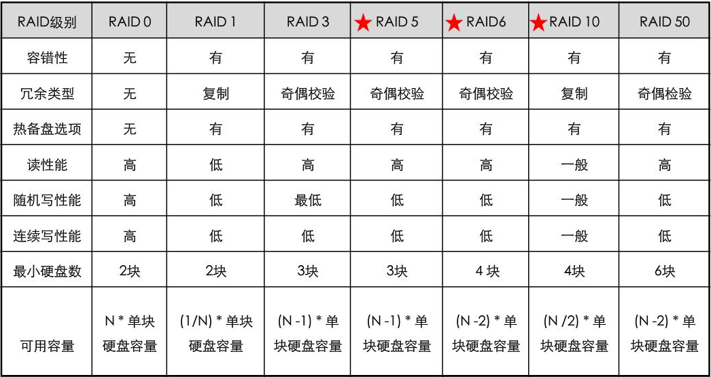
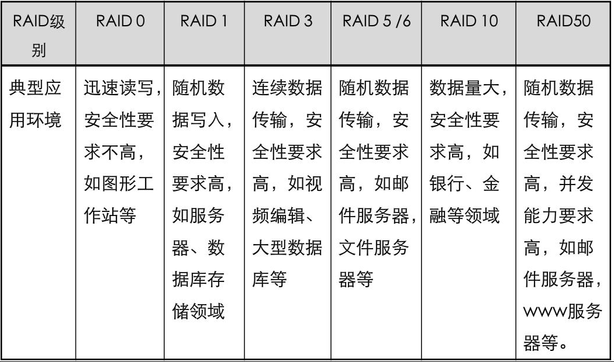

# raid与lvm2

<!-- TOC -->

- [raid与lvm2](#raid与lvm2)
    - [RAID](#raid)
        - [RAID是什么](#raid是什么)
        - [RAID概念](#raid概念)
        - [常用RAID级别](#常用raid级别)
        - [Linux的RAID实现](#linux的raid实现)
        - [RAID2.0+](#raid20)
    - [lvm](#lvm)
        - [lvm的特点](#lvm的特点)
        - [lvm的基本组成](#lvm的基本组成)
        - [lvm的管理工具](#lvm的管理工具)

<!-- /TOC -->

## RAID

### RAID是什么

RAID(Redundant Array of Independent Disk,独立冗余磁盘阵列)技术是加州大学伯克利分校1987年提出,最初是为了组合小的廉价磁盘来代替大的昂贵磁盘,同时希望磁盘失效时不会使对数据的访问受损失而开发出一定水平的数据保护技术

### RAID概念

- 实现方式

    硬件RAID:基于RAID卡
    软件RAID:基于cpu和算法

- 数据组织方式

    条带:磁盘中单个或者多个连续的扇区构成一个条带,它是组成分条的元素
    分条:同一磁盘阵列中的多个磁盘驱动器上的相同位置(编号)的条带

    写入数据时,会往同一分条中写入,而同一分条的条带分布在不同的磁盘中,同时并行写入从而获得速度上的提高

    缺点:一块硬盘坏了,那么几乎所有的数据都将丢失,没有可靠性

- RAID校验方式

    3个磁盘,前两个磁盘用于数据存储,后一个磁盘作校验盘采用XOR算法计算前两个磁盘的数据的校验值

    XOR校验的算法:相同为假,相异为真

    当一个数据盘坏掉之后,可用校验盘还原出坏掉的数据盘的数据,提高可靠性

    缺点:3个相同容量的磁盘,真正可用的部分仅为2/3

- 创建RAID组成员盘的要求

    硬盘容量大小相同
    硬盘接口类型相同
    硬盘速率要求相同

- RAID的几种状态

    RAID组创建(创建成功)-->RAID组正常工作(成员盘掉线或故障)-->RAID组降级(故障盘数超过冗余盘数)-->RAID组失效

- 热备盘

    热备(Hot Spare):当冗余的RAID阵列中某个磁盘失效时,在不干扰当前RAID系统正常使用的情况下,用RAID系统中另外一个正常的备用磁盘顶替失效磁盘

    热备通过配置热备盘实现,热备盘分为全局热备盘和局部热备盘

    热备盘要求和RAID组成员盘的容量,接口类型,速率一致,最好是采用同一厂家的同型号硬盘

- 预拷贝

    系统通过监控发现RAID组中某成员盘即将故障时,将即将故障成员盘中的数据提前拷贝到热备盘中,有效降低数据丢失风险

- 重构

    RAID阵列中发生故障的磁盘上的所有用户数据和校验数据的重新生成,并将这些数据写到热备盘上的过程

- RAID和LUN(Logical Unit Number)的关系

    RAID由几个硬盘组成,从整体上看相当于由多个硬盘组成的一个大的物理卷
    在物理卷的基础上可以按照指定容量创建一个或多个逻辑单元,这些逻辑单元称作LUN,可以作为映射给主机的基本块设备

### 常用RAID级别

RAID技术将多个单独的物理硬盘以不同的方式组合成一个逻辑硬盘,提高了硬盘的读写性能和数据安全性,根据不同的组合方式可以分为不同的RAID级别

- RAID0:无差错控制的条带化阵列

    数据写入:同时在多个磁盘中写入条带化数据
    数据读取:同时读取多个磁盘的数据
    数据丢失:若某一个驱动器发生故障,将导致其中的数据丢失

- RAID1:镜像结构的阵列

    数据写入:同时在多个磁盘写入相同数据
    数据读取:读取单个磁盘的数据
    数据恢复:若某一个驱动器发生故障,可以从另外一块硬盘中恢复

- RAID3:带奇偶校验码的并行阵列,至少3块硬盘

    数据写入:多个数据盘的数据进行异或算法,结果保存至校验盘
    数据读取:在除校验盘的所有其他盘中读取
    数据恢复:若数据盘的其中一个驱动器发生故障,可依据校验盘恢复数据

- RAID5:分布式奇偶校验码的独立磁盘结构,将校验码分布在不同的硬盘上,至少3块硬盘

    数据写入:向多个数据盘中写入数据时,每写入固定字节数据时进行一次奇偶校验
    数据读取:同时从多个数据盘中读取数据
    数据恢复:若一块驱动器发生故障时,可从其他盘恢复数据

- RAID6:带有两种校验的独立磁盘结构,采用两种奇偶校验方法,至少4块硬盘

    若同时损坏2块硬盘时,仍可恢复数据
    一般用在数据可靠性,可用性要求极高的场合
    常用的RAID6技术有RAID6 P+Q和RAID6 DP

- RAID10:将镜像和条带进行组合的RAID级别,先进行RAID1镜像然后再做RAID0,至少4块硬盘
- RAID50:将RAID5和RAID0进行两级组合的RAID级别,第一级是RAID5,第二级是RAID0

常用RAID级别的比较:

RAID典型应用场景:

### Linux的RAID实现

Linux通过内核空间中的md(multi device)模块和用户空间的mdadm工具实现

### RAID2.0+

RAID2.0+技术是华为针对传统RAID的缺点,设计的一种满足存储技术虚拟化架构发展趋势的全新的RAID技术,其变传统固定管理模式为两层虚拟化管理模式,在底层块级虚拟化(Virtual for Disk)硬盘管理的基础之上,通过一系列Smart效率提升软件,实现了上层虚拟化(Virtual for Pool)的高效资源管理

类似于ceph

## lvm

LVM是Logical Volume Manager(逻辑卷管理)的简写,它是Linux环境下对磁盘分区进行管理的一种机制

LVM利用Linux内核的device-mapper来实现存储系统的虚拟化(系统分区独立于底层硬件).通过LVM可以实现存储空间的抽象化并在上面建立虚拟分区(virtual partitions),可以更简便地扩大和缩小分区,可以增删分区时无需担心某个硬盘上没有足够的连续空间

### lvm的特点

- 优点

    比起正常的硬盘分区管理,LVM更富于弹性:
    1. 使用卷组(VG),使众多硬盘空间看起来像一个大硬盘
    2. 使用逻辑卷(LV),可以创建跨越众多硬盘空间的分区
    3. 可以创建小的逻辑卷(LV),在空间不足时再动态调整它的大小
    4. 在调整逻辑卷(LV)大小时可以不用考虑逻辑卷在硬盘上的位置,不用担心没有可用的连续空间
    5. 可以在线(online)对逻辑卷(LV)和卷组(VG)进行创建,删除,调整大小等操作.LVM上的文件系统也需要重新调整大小,某些文件系统也支持这样的在线操作
    6. 无需重新启动服务,就可以将服务中用到的逻辑卷(LV)在线(online)/动态(live)迁移至别的硬盘上
    7. 允许创建快照,可以保存文件系统的备份,同时使服务的下线时间(downtime)降低到最小
    这些优点使得LVM对服务器的管理非常有用,对于桌面系统管理的帮助则没有那么显著

- 缺点

    在系统设置时需要更复杂的额外步骤

### lvm的基本组成

- 物理卷Physical volume(PV):

    可以在上面建立卷组的媒介,可以是硬盘分区,也可以是硬盘本身或者回环文件(loopback file).物理卷包括一个特殊的header,其余部分被切割为一块块物理区域(physical extents)

- 卷组Volume group(VG):

    将一组物理卷收集为一个管理单元

- 逻辑卷Logical volume(LV):

    虚拟分区,由物理区域(physical extents)组成

- 物理区域Physical extent(PE):

    硬盘可供指派给逻辑卷的最小单位(通常为4MB)

示例:

两块物理硬盘:

    硬盘1 (/dev/sda):
        _ _ _ _ _ _ _ _ _ _ _ _ _ _ _ _ _ _ _ _ _ _ _ _ _ _ _ _ _ _ _
        |分区1 50GB (物理卷)           |分区2 80GB (物理卷)            |
        |/dev/sda1                    |/dev/sda2                     |
        |_ _ _ _ _ _ _ _ _ _ _ _ _ _ _|_ _ _ _ _ _ _ _ _ _ _ _ _ _ __|

    硬盘2 (/dev/sdb):
        _ _ _ _ _ _ _ _ _ _ _ _ _ _ _ _ _ _ _ _ _ _ _
        |分区1 120GB (物理卷)                         |
        |/dev/sdb1                                   |
        | _ _ _ _ _ _ _ _ _ _ _ _ _ _ _ _ _ _ _ _ _ _|

LVM方式:

    卷组VG1 (/dev/MyStorage/ = /dev/sda1 + /dev/sda2 + /dev/sdb1):
        _ _ _ _ _ _ _ _ _ _ _ _ _ _ _ _ _ _ _ _ _ _ _ _ _ _ _ _ _ _ _ _ _ _ _ _ _ _ _ _ _ _ _ _ _ _ _ _ _ _ _ _ __
        |逻辑卷1 15GB                  |逻辑卷2 35GB                        |逻辑卷3 200GB                         |
        |/dev/MyStorage/rootvol        |/dev/MyStorage/homevol             |/dev/MyStorage/mediavol              |
        |_ _ _ _ _ _ _ _ _ _ _ _ _ _ __|_ _ _ _ _ _ _ _ _ _ _ _ _ _ _ _ __ |_ _ _ _ _ _ _ _ _ _ _ _ _ _ _ _ _ _ _|

### lvm的管理工具

- pv管理工具:

    pvs:简要pv信息显示
    pvdisplay:显示pv的详细信息

    pvcreate /dev/DEVICE:创建pv

- vg管理工具:

    vgs
    vgdisplay

    vgcreate [-s #[kKmMgGtTpPeE]]  VolumeGroupName PhysicalDevicePath…
    vgextend VolumeGroupName PhysicalDevicePath…
    vgreduce VolumeGroupName PhysicalDevicePath…
        先做pvmove

    vgremove

- lv管理工具:

    lvs
    lvdisplay

    lvcreate -L #[mMgGtT] -n NAME VolumeGroup

    lvremove /dev/VG_NAME/LV_NAME

- 扩展逻辑卷:
    lvextend -L [+]#[mMgGtT] /dev/VG_NAME/LV_NAME
    resize2fs /dev/VG_NAME/LV_NAME

    注意:扩展后需要让系统识别,xfs_growfs,resize2fs dev_name

- 缩减逻辑卷:
    umount /dev/VG_NAME/LV_NAME
    e2fsck -f /dev/VG_NAME/LV_NAME
    resize2fs /dev/VG_NAME/LV_NAME #[mMgGtT]
    lvreduce -L [-]#[mMgGtT] /dev/VG_NAME/LV_NAME
    mount

- 快照:snapshot
    lvcreate -L [-]#[mMgGtT] -p r -s -n snapshot_lv_name original_lv_name