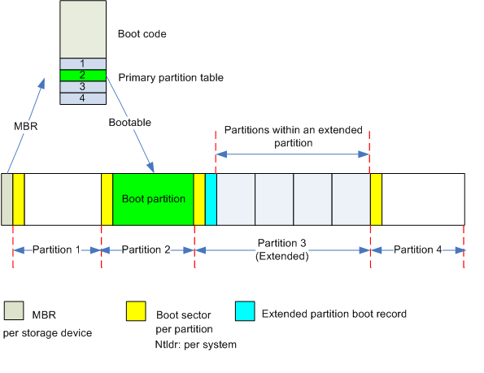
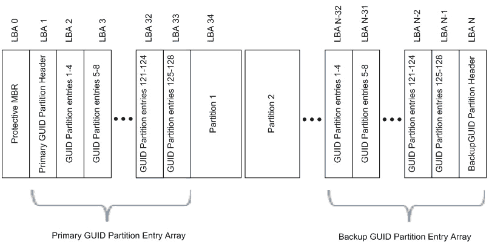

# 磁盘管理

<!-- TOC -->

- [磁盘管理](#磁盘管理)
    - [磁盘分类](#磁盘分类)
    - [机械式磁盘简介](#机械式磁盘简介)
    - [硬盘的分区表](#硬盘的分区表)
        - [MBR(Main Boot Record,主引导记录)](#mbrmain-boot-record主引导记录)
        - [GPT(GUID Partition Table,全局唯一标识磁盘分区表)](#gptguid-partition-table全局唯一标识磁盘分区表)
    - [Linux的磁盘设备](#linux的磁盘设备)
    - [分区工具](#分区工具)

<!-- /TOC -->

## 磁盘分类

磁盘分为两大类:并行和串行.其中并行的磁盘有IDE,SCSI等;串行的磁盘有SATA,SAS,USB等

## 机械式磁盘简介

机械式磁盘的组成:磁道,扇区,柱面等

- 磁道(Track)

    硬盘被一圈圈分成多个等分的同心圆,这些同心圆就是磁道

    这些磁道是有间隔的，因为磁化单元太近会产生干扰

- 扇区(Sector)

    每个磁道中被分成若干等份的区域,扇区是硬盘数据存储的最小单位

- 柱面(Cylinder)

    一块硬盘有多个磁盘片,每一片的磁道数都是相等的.具有相同磁道编号的同心圆组成的面就称作柱面.柱面可以认为是没有顶和底的圆柱体

    可以想到,一块磁盘的柱面数就是磁盘上的磁道数

    柱面是硬盘分区的最小单位

- 簇

    扇区是硬盘数据存储的最小单位,但操作系统无法对数目众多的扇区进行寻址,所以操作系统就将相邻的扇区组合在一起,形成一个簇

    每个簇可以包括2,4,8,16,32,64个扇区

## 硬盘的分区表

### MBR(Main Boot Record,主引导记录)

MBR是一个硬盘的信息区,是整个硬盘最重要的区域,如果是机械式硬盘,则位于其0磁道0柱面1扇区

一般来说,MBR有512个字节,且可以分为两个部分:

1. 第一部分有446个字节,用于存放引导代码,即bootloader
2. 第二部分有64个字节,用于存放磁盘分区表.每个分区的信息需要用16个字节来记录
3. 分区表的后面还会有两个字节55AA,用于填充数据和识别分区表

### GPT(GUID Partition Table,全局唯一标识磁盘分区表)

GPT是一个实体硬盘的分区表的结构布局的标准.它是可扩展固件接口(EFI)标准的一部分,被用于替代BIOS系统中的(MBR)分区表

GPT按LBA(逻辑区块地址,即扇区)划分,一般分为保护MBR部分和EFI部分;而EFI部分又可以分为4个区域:EFI信息区(GPT头),分区表,GPT分区,备份区域

1. 保护MBR(LBA0)

    保护MBR包含一个DOS分区表(即MBR),它只包含一个类型值为0xEE的分区项

    保护MBR的作用是阻止不能识别GPT分区的磁盘工具试图对其进行分区或格式化等操作.实际上,EFI根本不使用这个分区表

2. EFI信息区(起始于LBA1,通常也只占用这个扇区)

    EFI信息区也称为GPT头

    EFI信息区的作用是定义分区表的位置和大小

    EFI信息区记录的信息:

    1. GPT头签名("EFI PART")
    2. 版本号
    3. GPT头大小(通常是92字节)
    4. CRC校验和
    5. GPT头起始扇区号(通常是LBA1)
    6. GPT头备份位置扇区号(通常是整个磁盘最末一个扇区)
    7. GPT分区区域起始扇区号(通常为LBA34)
    8. GPT分区区域结束扇区号(通常是倒数第34扇区)
    9. 磁盘GUID
    10. 分区表起始扇区号(通常是LBA2)
    11. 分区表总项数(通常限定为128个)
    12. 每个分区表占用字节数的信息(通常为128字节)

3. 分区表(一般占用LBA2~LBA33扇区)

    分区表区域包含分区表项,这个区域由GPT头定义

    分区表用于定义各个分区的位置与大小

    分区表记录的信息:

    1. 用GUID表示的分区类型
    2. 用GUID表示的分区唯一标识符
    3. 该分区的起始扇区,用LBA值表示
    4. 该分区的结束扇区,用LBA值表示,通常是奇数
    5. 该分区的属性标志
    6. UTF-16LE编码的人类可读的分区名称,最大32个字符

4. 备份区域(位于磁盘的尾部)

    备份区域包含GPT头和分区表的备份,它占用GPT结束扇区和EFI结束扇区之间的33个扇区

    33个扇区的最后一个扇区用来备份1号扇区的EFI信息,其余的32个扇区用来备份LBA2~LBA33扇区的分区表

**ESP**
MBR分区表使用前446个字节来存放bootloader,而GPT分区表则使用一个单独的分区,即ESP(EFI System Partition)分区

ESP是一个FAT32格式的物理分区.支持EFI的电脑可以从ESP启动系统,EFI固件能从ESP中加载EFI启动程序

ESP分区有一个特殊的GUID号,EFI借此识别引导分区并使用此分区的bootloader引导系统(猜测)

## Linux的磁盘设备

Linux有专门的设备文件,一般在/dev目录下,每个设备文件都关联至一个设备的驱动程序,进而能够跟与之对应硬件设备进行通信

磁盘类型的设备文件叫块设备(block),存取单位为块;还有其它类型的设备文件如键盘,鼠标的字符设备(char),存取单位为字节

设备文件有专门的命名方式:

1. 主设备号(major number):标识设备类型.如IDE磁盘的主设备号是hd;SCSI,SATA,SAS,USB是sd;nvme磁盘是nvme
2. 次设备号(minor number):标识同一类型下的不同设备.一般来说顺序为从a至z
3. 分区号:标识同一个设备的不同分区.一般来说从1开始递增

分区的信息可以在/proc/partations目录中查看

## 分区工具

一些较为常用的分区工具有:fdisk,gdisk,parted,sfdisk
分区后可以用partx,kpartx,partprobe等工具让内核重读磁盘分区表