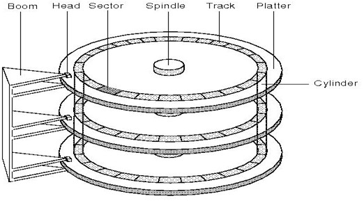
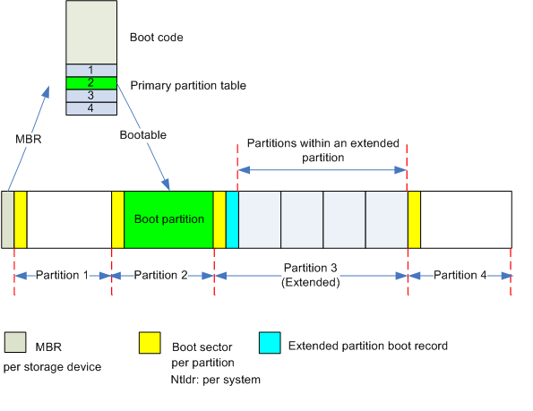
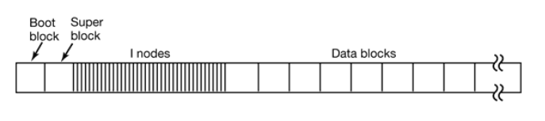
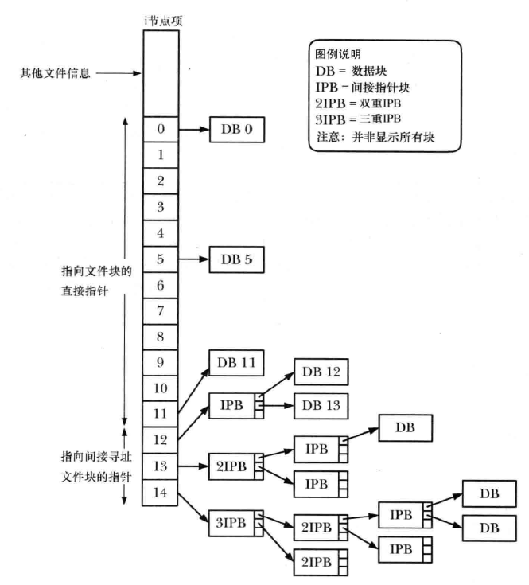
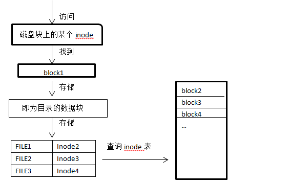
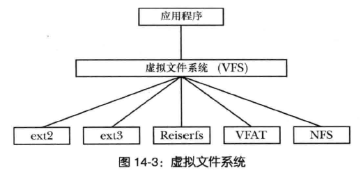

# Linux系统管理

<!-- TOC -->

- [Linux系统管理](#linux系统管理)
    - [磁盘管理](#磁盘管理)
        - [磁盘分类](#磁盘分类)
        - [机械式磁盘简介](#机械式磁盘简介)
        - [硬盘的分区表](#硬盘的分区表)
            - [MBR(Main Boot Record,主引导记录)](#mbrmain-boot-record主引导记录)
            - [GPT(GUID Partition Table,全局唯一标识磁盘分区表)](#gptguid-partition-table全局唯一标识磁盘分区表)
        - [Linux的磁盘设备](#linux的磁盘设备)
        - [分区工具](#分区工具)
    - [文件系统管理](#文件系统管理)
        - [文件系统简介](#文件系统简介)
        - [文件系统结构](#文件系统结构)
        - [Linux文件系统分类](#linux文件系统分类)
        - [文件系统的挂载](#文件系统的挂载)
        - [inode](#inode)
        - [链接文件](#链接文件)
        - [VFS](#vfs)
        - [文件系统相关的工具](#文件系统相关的工具)

<!-- /TOC -->

## 磁盘管理

### 磁盘分类

磁盘分为两大类:并行和串行.其中并行的磁盘有IDE,SCSI等;串行的磁盘有SATA,SAS,USB等

### 机械式磁盘简介

机械式磁盘的组成:磁道,扇区,柱面等

- 磁道(Track)

    硬盘被一圈圈分成多个等分的同心圆,这些同心圆就是磁道

    这些磁道是有间隔的，因为磁化单元太近会产生干扰

- 扇区(Sector)

    每个磁道中被分成若干等份的区域,扇区是硬盘数据存储的最小单位

- 柱面(Cylinder)

    一块硬盘有多个磁盘片,每一片的磁道数都是相等的.具有相同磁道编号的同心圆组成的面就称作柱面.柱面可以认为是没有顶和底的圆柱体

    可以想到,一块磁盘的柱面数就是磁盘上的磁道数

    柱面是硬盘分区的最小单位

- 簇

    扇区是硬盘数据存储的最小单位,但操作系统无法对数目众多的扇区进行寻址,所以操作系统就将相邻的扇区组合在一起,形成一个簇

    每个簇可以包括2,4,8,16,32,64个扇区

### 硬盘的分区表

#### MBR(Main Boot Record,主引导记录)

MBR是一个硬盘的信息区,是整个硬盘最重要的区域,如果是机械式硬盘,则位于其0磁道0柱面1扇区

一般来说,MBR有512个字节,且可以分为两个部分:

1. 第一部分有446个字节,用于存放引导代码,即bootloader
2. 第二部分有64个字节,用于存放磁盘分区表.每个分区的信息需要用16个字节来记录
3. 分区表的后面还会有两个字节55AA,用于填充数据和识别分区表

#### GPT(GUID Partition Table,全局唯一标识磁盘分区表)

GPT是一个实体硬盘的分区表的结构布局的标准.它是可扩展固件接口(EFI)标准的一部分,被用于替代BIOS系统中的(MBR)分区表

GPT按LBA(逻辑区块地址,即扇区)划分,一般分为保护MBR部分和EFI部分;而EFI部分又可以分为4个区域:EFI信息区(GPT头),分区表,GPT分区,备份区域

1. 保护MBR(LBA0)

    保护MBR包含一个DOS分区表(即MBR),它只包含一个类型值为0xEE的分区项

    保护MBR的作用是阻止不能识别GPT分区的磁盘工具试图对其进行分区或格式化等操作.实际上,EFI根本不使用这个分区表

2. EFI信息区(起始于LBA1,通常也只占用这个扇区)

    EFI信息区也称为GPT头

    EFI信息区的作用是定义分区表的位置和大小

    EFI信息区记录的信息:

    1. GPT头签名("EFI PART")
    2. 版本号
    3. GPT头大小(通常是92字节)
    4. CRC校验和
    5. GPT头起始扇区号(通常是LBA1)
    6. GPT头备份位置扇区号(通常是整个磁盘最末一个扇区)
    7. GPT分区区域起始扇区号(通常为LBA34)
    8. GPT分区区域结束扇区号(通常是倒数第34扇区)
    9. 磁盘GUID
    10. 分区表起始扇区号(通常是LBA2)
    11. 分区表总项数(通常限定为128个)
    12. 每个分区表占用字节数的信息(通常为128字节)

3. 分区表(一般占用LBA2~LBA33扇区)

    分区表区域包含分区表项,这个区域由GPT头定义

    分区表用于定义各个分区的位置与大小

    分区表记录的信息:

    1. 用GUID表示的分区类型
    2. 用GUID表示的分区唯一标识符
    3. 该分区的起始扇区,用LBA值表示
    4. 该分区的结束扇区,用LBA值表示,通常是奇数
    5. 该分区的属性标志
    6. UTF-16LE编码的人类可读的分区名称,最大32个字符

4. 备份区域(位于磁盘的尾部)

    备份区域包含GPT头和分区表的备份,它占用GPT结束扇区和EFI结束扇区之间的33个扇区

    33个扇区的最后一个扇区用来备份1号扇区的EFI信息,其余的32个扇区用来备份LBA2~LBA33扇区的分区表

**ESP**
MBR分区表使用前446个字节来存放bootloader,而GPT分区表则使用一个单独的分区,即ESP(EFI System Partition)分区

ESP是一个FAT32格式的物理分区.支持EFI的电脑可以从ESP启动系统,EFI固件能从ESP中加载EFI启动程序

ESP分区有一个特殊的GUID号,EFI借此识别引导分区并使用此分区的bootloader引导系统(猜测)

### Linux的磁盘设备

Linux有专门的设备文件,一般在/dev目录下,每个设备文件都关联至一个设备的驱动程序,进而能够跟与之对应硬件设备进行通信

磁盘类型的设备文件叫块设备(block),存取单位为块;还有其它类型的设备文件如键盘,鼠标的字符设备(char),存取单位为字节

设备文件有专门的命名方式:

1. 主设备号(major number):标识设备类型.如IDE磁盘的主设备号是hd;SCSI,SATA,SAS,USB是sd;nvme磁盘是nvme
2. 次设备号(minor number):标识同一类型下的不同设备.一般来说顺序为从a至z
3. 分区号:标识同一个设备的不同分区.一般来说从1开始递增

分区的信息可以在/proc/partations目录中查看

### 分区工具

一些较为常用的分区工具有:fdisk,gdisk,parted,sfdisk
分区后可以用partx,kpartx,partprobe等工具让内核重读磁盘分区表

## 文件系统管理

### 文件系统简介

文件系统定义了以什么样的结构存储数据.每个分区可以是不同的文件系统,文件系统的划分是针对分区的

在文件系统中,用来分配空间的基本单位是逻辑块,亦即文件系统所在磁盘设备上若干连续的物理块(使用mkfs命令创建文件系统时,可指定逻辑块的大小作为命令行参数)

### 文件系统结构

文件系统由以下几部分组成:

- 引导块

    总是作为文件系统的首块.引导块不为文件系统所用,只是包含用来引导操作系统的信息

    操作系统虽然只需一个引导块,但所有文件系统都设有引导块

- 超级块

    紧随引导块之后的一个独立块,包含与文件系统有关的参数信息,其中包括:inode表容量,文件系统中逻辑块的大小,以逻辑块计,文件系统的大小

- inode表

    文件系统中每个文件或目录的inode表中都对应着唯一一条记录.这条记录登记了有关文件的各种信息

- 数据块

    文件系统的大部分空间都用于存放数据,以构成驻留于文件系统之上的文件和目录

### Linux文件系统分类

Linux下可以运行众多文件系统,并且有多种分类标准

- 按平台分类

    1. Linux文件系统:ext2,ext3,ext4,xfs,btrfs,reiserfs,jfs,swap,iso9660
    2. Windows:fat32,ntfs
    3. FFS,UFS,JFS2
    4. 网络文件系统:NFS,CIFS
    5. 集群文件系统:GFS2,OCFS2
    6. 分布式文件系统:ceph,moosefs,mogilefs,GlusterFS,Lustre

- 根据其是否支持"journal"功能

    日志型文件系统:ext3,ext4,xfs,...
    非日志型文件系统:ext2,vfat

文件系统一般由内核中的模块和用户空间的管理工具组成

Linux有一个虚拟文件系统VFS,用于统一各个文件系统的操作

### 文件系统的挂载

将额外文件系统与根文件系统某现存的目录建立起关联关系,进而使得此目录作为其他文件访问入口的行为称之为挂载.而解除此关联关系的过程称之为卸载

挂载点下原有文件在挂载完成后会被临时隐藏

文件挂载的配置文件是/etc/fstab.其中每行定义一个要挂载的文件系统

    要挂载的设备或伪文件系统    挂载点  文件系统类型    挂载选项    转储频率    自检次序
    /dev/sda2     /                       xfs     defaults        0 0

- 要挂载的设备或伪文件系统

    设备文件,LABEL(LABEL=""),UUID(UUID=""),伪文件系统名称(proc,sysfs)

- 挂载选项

    defaults:相当于rw, suid, dev, exec, auto, nouser, and async
    noauto:不自动挂载(开机或使用mount -a都不会挂载)
    owner:允许设备拥有者去挂载
    user:允许一个用户去挂载
    comment:注释

- 转储频率

    0:不做备份
    1:每天转储
    2:每隔一天转储

- 自检次序

    0:不自检
    1:首先自检,一般只有rootfs采用1

### inode

针对文件系统上的每个文件,文件系统的inode表都会包含一个inode

对inode的标识,采用的是inode表的顺序位置,以数字表示.文件的inode号是(ls -li命令)所显示的第一列

- inode维护的信息

    1. 文件类型(常规文件,目录,符号链接,字符设备等)
    2. 文件属主(用户ID)
    3. 文件属组(组ID)
    4. 3类用户的访问权限:属主,属组以及其他用户
    5. 3个时间戳:对文件的最后访问时间(ls -lu),最后修改时间(ls -l),最后改变时间(ls -lc,最后改变inode信息的时间)
    6. 指向文件的硬链接数量
    7. 文件的大小,以字节为单位
    8. 实际分配给文件的块数量,以512个字节为单位
    9. 指向文件数据块的指针

    

    文件系统在存储文件时,数据块不一定连续,使得文件系统对磁盘空间的利用更为高效

- 操作系统读取磁盘文件的流程

    1. 根据某个inode号,找到目录的block,其存储着各种文件的inode
    2. 查询inode表,找到文件的inode节点
    3. 根据文件的inode,找到对应的block
    4. 读取文件

    

- inode内容

    inode

### 链接文件

链接文件分为硬链接和软链接

- 硬链接

    不能够对目录进行
    不能跨分区进行
    指向同一个inode的多个不同路径,创建文件的硬链接即为为inode创建新的引用路径,因此回增加其引用计数

- 软链接

    可以对目录进行
    可以跨分区
    指向的是另一个文件的路径,其大小为指向的路径字符串的长度,不增加或减少目标文件inode的引用计数

### VFS

Linux所支持的各种文件系统,其实现细节均不相同.这些差异包括文件块的分配方式,目录的组织方式等.如果每个与文件打交道的程序都需要理解各种文件系统的具体细节,那么编写与各类文件系统交互的程序将近乎于不可能完成的任务

虚拟文件系统(VFS)是一种内核特性,通过为文件系统操作创建抽象层来解决上述问题

VFS的原理其实很直白:

1. VFS针对文件系统定义了一套通用接口,所有与文件交互的程序都会按照这一接口来进行操作
2. 每种文件系统都会提供VFS接口的实现

这样一来,程序只需理解VFS接口,无需过问具体文件系统的实现细节

### 文件系统相关的工具

mkfs相关命令:文件系统创建
blkid:块设备属性信息查看
e2label:管理ext系列文件系统的LABEL
tune2fs:重新设定ext系列文件系统可调整参数的值
dumpe2fs:查看超级块信息
fsck:文件系统检测
e2fsck:ext系列文件系统专用的检测修复工具
mount,umount:挂载文件系统
fuser:查看正在访问指定文件系统的进程
swapon,swapoff:挂载交换分区
free:内存空间使用状态
df:文件系统空间占用等信息的查看工具
ln:链接文件
dd:转换和复制文件