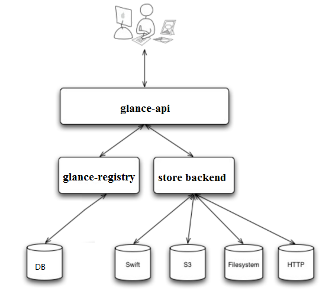
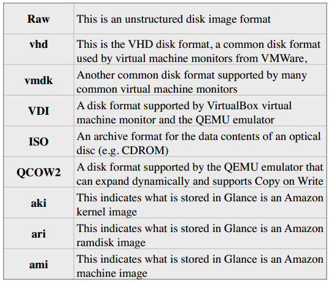

# glance

<!-- TOC -->

- [glance](#glance)
    - [理解Glance](#理解glance)
    - [Glance架构](#glance架构)
    - [创建Image](#创建image)
    - [删除image](#删除image)
    - [使用OpenStack CLI](#使用openstack-cli)
    - [日志](#日志)

<!-- /TOC -->

## 理解Glance

Image是一个模板,里面包含了基本的操作系统和其它的软件

Image Service的功能是管理Image,让用户能够发现,获取和保存Image

在OpenStack中,提供Image Service的是Glance,其具体功能如下:

1. 提供REST API让用户能够查询和获取image的元数据和image本身
2. 支持多种方式存储image,包括普通的文件系统,Swift,Amazon S3等
3. 对Instance执行Snapshot创建新的image

## Glance架构

- glance-api

    glance-api是系统后台运行的服务进程.对外提供REST API,响应image查询,获取和存储的调用

    glance-api不会真正处理请求.如果是与image metadata(元数据)相关的操作,glance-api会把请求转发给glance-registry;如果是与image自身存取有关的操作,glance-api会把请求转发给该image的store backend

- glance-registry

    glance-registry是系统后台运行的服务进程.负责处理和存取image的metadata,例如image的大小和类型

    Glance支持多种格式的image,包括:

    

- Database

    Image的metadata会保持到database中,默认是MySQL

- Store backend

    Glance自己并不存储image,真正的image是存放在backend中的

    Glance支持多种backend,包括

    1. A directory on a local file system(这是默认配置)
    2. GridFS
    3. Ceph RBD
    4. Amazon S3
    5. Sheepdog
    6. OpenStack Block Storage (Cinder)
    7. OpenStack Object Storage (Swift)
    8. VMware ESX

    具体使用哪种backend,是在/etc/glance/glance-api.conf中配置的

    其中[glance_store]配置段的filesystem_store_datadir字段决定了image存储的位置

    其它backend的配置参考:<http://docs.openstack.org/liberty/config-reference/content/configuring-image-service-backends.html>

## 创建Image

1. 将image上传至控制节点的文件系统中,例如/tmp/cirros.img
2. 设置环境变量

        ]$ source devstack/openrc admin admin

    Devstack的安装目录下有个openrc文件.source该文件就可以配置CLI的环境变量.这里我们传入了两个参数,第一个参数是OpenStack用户名admin;第二个参数是Project名admin

3.执行image创建命令

        glance image-create –name cirros –file /tmp/cirros-0.3.4-x86_64-disk.img –disk-format qcow2 –container-format bare –progress

        上传后,在/opt/stack/data/glance/images目录下查看新的Image

## 删除image

1. 设置环境变量

        ]$ source devstack/openrc admin admin

2. 查询现有image

        ]$ glance image-list
        ]$ ll /opt/stack/data/glance/images/

3. 删除image

        ]$ glance image-delete cde5c262-4f5e-4713-bb57-6734df9b8405
        ]$ glance image-list

## 使用OpenStack CLI

OpenStack服务都有自己的CLI.比如Glance就是glance,Nova就是nova

但Keystone比较特殊,现在使用openstack来代替老版的keystone命令.比如keystone user-list变成了openstack user list

不同服务的命令虽然不同,但这些命令的使用方式却非常类似:

- 执行命令之前,需要设置环境变量

    这些变量包含用户名,Project,密码等.如果不设置,每次执行命令的时候都必须设置相关的命令行参数

- 各个服务的命令都有增删改查的操作

    其格式是:

        CMD <obj>-create [parm1] [parm2]…
        CMD <obj>-delete [parm]
        CMD <obj>-update [parm1] [parm2]…
        CMD <obj>-list
        CMD <obj>-show [parm]

    例如glance管理的是image,那么CMD就是glance,obj就是image;neutron管理的是网络和子网,那么CMD就是neutron,obj就是net和subnet

    有的命令obj可以省略,比如nova.因为操作都是针对instance

- 每个对象都有ID

    delete,show等操作都以ID为参数

- 可用help查看命令的语法

    除了delete,show等操作只需要ID一个参数,其他操作可能需要更多的参数,用help查看所需的参数.格式为:

        CMD help [SUB-CMD]

## 日志

Glance主要有两个日志:glance_api.log和glance_registry.log,保存在/var/log/httpd/目录中

glance-api日志记录REST API调用情况
glance-registry日志记录Glance服务处理请求的过程以及数据库操作