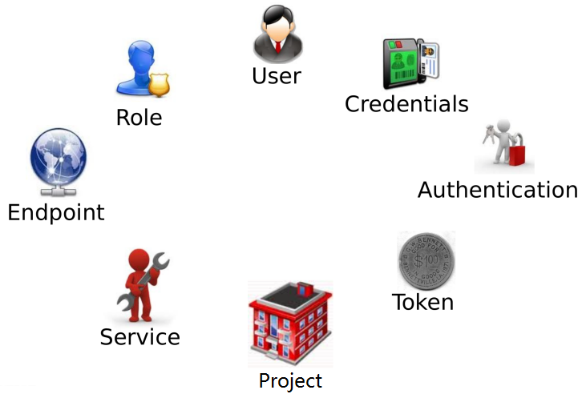
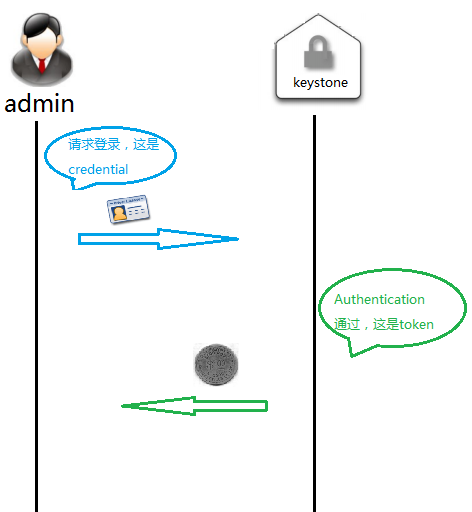
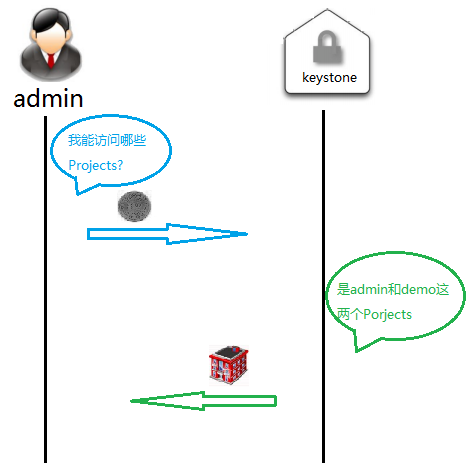
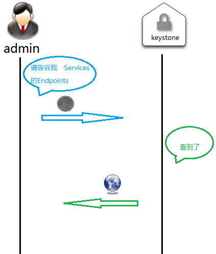
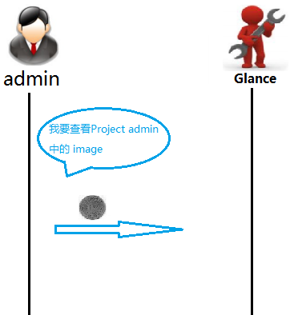
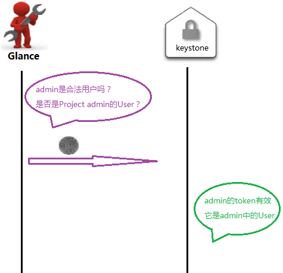
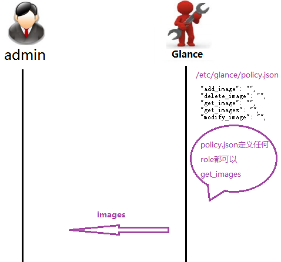

# keystone

<!-- TOC -->

- [keystone](#keystone)
    - [keystone概念](#keystone概念)
    - [基础概念](#基础概念)
    - [Keystone认证实例](#keystone认证实例)
    - [日志](#日志)

<!-- /TOC -->

## keystone概念

作为OpenStack的基础支持服务,Keystone做下面这几件事情:

1. 管理用户及其权限
2. 维护OpenStack Services的Endpint
3. Authentication(认证)和Authorization(授权)

## 基础概念

- User

    User指代任何使用OpenStack的实体,可以是真正的用户,其它系统或者服务

    当User请求访问OpenStack时,Keystone会对其进行验证

    除了admin和demo,OpenStack也为nova,cinder,glance,neutron服务创建了相应的User.admin也可以管理这些User

- Credentials

    Credentials是User用来证明自己身份的信息,可以是:

    1. 用户名/密码
    2. Token
    3. API Key
    4. 其它高级方式

- Authentication

    Authentication是Keystone验证User身份的过程

    User访问OpenStack时向Keystone提交用户名和密码形式的Credentials,Keystone验证通过后回给User签发一个Token作为后续访问的Credential

- Token

    Token是由数字和字母组成的字符串,User成功Authentication后由Keystone分配给User

    1. Token用做访问Service的Credential
    2. Service会通过Keystone验证Token的有效性
    3. Token的有效期默认是24小时

- Project

    Project用于将OpenStack的资源(计算,存储,网络)进行分组和隔离

    根据OpenStack服务的对象不同,Project可以是一个客户,部门或者项目组

    1. 资源的所有权是属于Project的,而不是User
    2. Tenant/Project/Account事实上都指Project
    3. 每个User必须挂在Project里才能访问该Project的资源.一个User可以属于多个Project
    4. admin相当于root用户,具有最高权限

- Service

    OpenStack的Service包括Compute(Nova),Block Storage(Cinder),Object Storage(Swift),Image Service(Glance),Networking Service(Neutron)等

    每个Service都会提供若干个Endpoint,User通过Endpoint访问资源和执行操作

- Endpoint

    Endpoint是一个网络上可访问的地址,通常是一个URL

    Service通过Endpoint暴露自己的API

    Keystone负责管理和维护每个Service的Endpoint

- Role

    Keystone借助Role来实现Authorization,即:能干什么

    1. Keystone定义Role
    2. 为User分配一个或多个Role
    3. Service决定每个Role能做什么事情(通过policy.json对Role进行访问控制)

## Keystone认证实例

1. 登录

    当使用一个用户登录时,Keystone会依据credential接收用户的请求,如果Authentication成功,则给予用户一个token

    

2. 显示操作界面

    操作界面能看到用户可访问的Project,是Keystone所发送的

    

    同时,用户能访问Intance,Volume,Image等服务,是因为从Keystone拿到了各Service的Endpoints

    

    Token中包含了User的Role信息

3. 显示image列表

    点击"Images",会显示image列表

    首先,用户将请求发送到Glance的Endpoint

    

    其次,Glance向Keystone询问admin身份的有效性

    

    接下来,Glance会查看/etc/glance/policy.json,判断admin是否有查看image的权限

    

    权限判定通过,Glance将image列表交给admin

## 日志

OpenStack排查问题的方法主要是通过日志

每个Service都有自己的日志文件

Keystone主要有两个日志:keystone.log和keystone_access.log,保存在 /var/log/httpd目录下

如果需要得到最详细的日志信息,可以在/etc/keystone/keystone.conf中打开debug选项