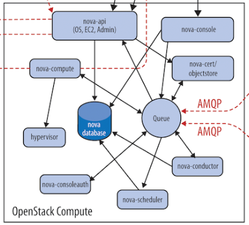
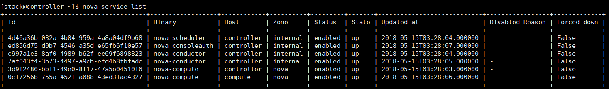
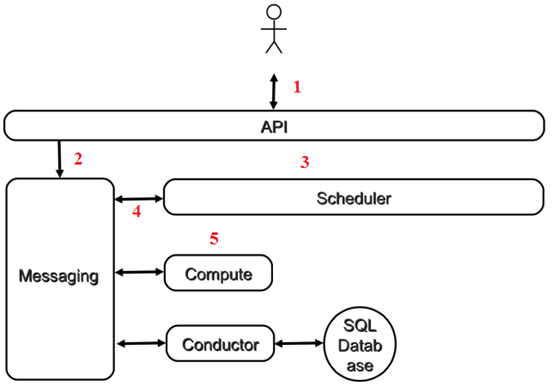
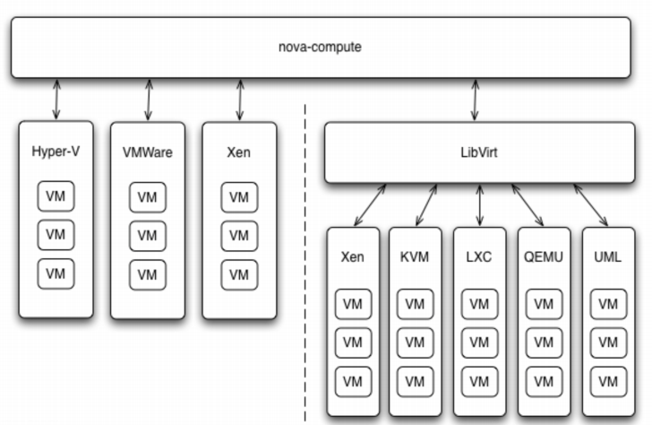
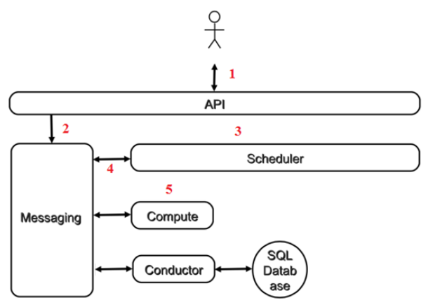
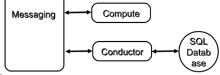
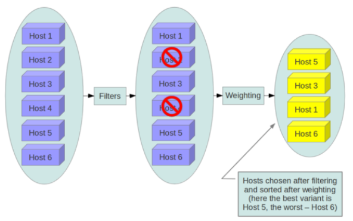

# nova

<!-- TOC -->

- [nova](#nova)
    - [nova架构](#nova架构)
        - [主要组件简介](#主要组件简介)
        - [物理部署方案](#物理部署方案)
        - [子服务协同工作的方式](#子服务协同工作的方式)
        - [OpenStack通用设计思路](#openstack通用设计思路)
    - [各组件详解](#各组件详解)
        - [nova-api](#nova-api)
        - [nova-conductor](#nova-conductor)
        - [nova-scheduler](#nova-scheduler)
            - [调度方式](#调度方式)
        - [nova-compute](#nova-compute)

<!-- /TOC -->

## nova架构

Nova是OpenStack最核心的服务,负责维护和管理云环境的计算资源

可以看出,Nova处于OpenStack的中心,其他组件都为Nova提供支持:

1. Glance为VM提供image
2. Cinder和Swift分别为VM提供块存储和对象存储
3. Neutron为VM提供网络连接

### 主要组件简介

Nova架构如下:

Nova的架构比较复杂,包含很多组件.这些组件以子服务(后台daemon进程)的形式运行,可以分为以下几类:

1. API

    **nova-api**
    接收和响应客户的API调用

2. Compute Core

    **nova-scheduler**
    虚机调度服务,负责决定在哪个计算节点上运行虚机
    **nova-compute**
    管理虚机的核心服务,通过调用Hypervisor API实现虚机生命周期管理
    **Hypervisor**
    计算节点上跑的虚拟机管理程序,虚机管理最底层的程序
    不同的虚拟化技术提供自己的Hypervisor
    常用的Hypervisor有KVM,Xen,VMWare等
    **nova-conductor**
    nova-compute经常需要更新数据库,比如更新虚机的状态
    出于安全和伸缩性的考虑,nova-compute并不会直接访问数据库,而是将这个任务委托给nova-conductor

3. Console Interface

    **nova-console**
    用户可以通过多种方式访问虚机的控制台:

    1. nova-novncproxy:基于Web浏览器的VNC访问
    2. nova-spicehtml5proxy:基于HTML5浏览器的SPICE访问
    3. nova-xvpnvncproxy:基于Java客户端的VNC访问

    **nova-consoleauth**
    负责对访问虚机控制台提供Token认证

    **nova-cert**
    提供x509证书支持

4. Database

    Nova会有一些数据需要存放到数据库中,一般使用MySQL
    数据库安装在控制节点上
    Nova使用命名为"nova"的数据库

5. Message Queue

    Nova众多的子服务之间需要相互协调和通信
    为解耦各个子服务,Nova通过Message Queue作为子服务的信息中转站

    OpenStack默认是使用RabbitMQ作为Message Queue

### 物理部署方案

对于Nova,它的子服务会部署在两类节点上:计算节点和控制节点

可以通过nova service-list命令查看nova-*子服务都分布在哪些节点上

### 子服务协同工作的方式

虚机创建流程:

1. 客户(可以是OpenStack最终用户,也可以是其他程序)向API(nova-api)发送请求:"帮我创建一个虚机"
2. API对请求做一些必要处理后,向Messaging(RabbitMQ)发送了一条消息:"让Scheduler创建一个虚机"
3. Scheduler(nova-scheduler)从Messaging获取到API发给它的消息,然后执行调度算法,从若干计算节点中选出节点A
4. Scheduler向Messaging发送了一条消息:"在计算节点A上创建这个虚机"
5. 计算节点A的Compute(nova-compute)从Messaging中获取到Scheduler发给它的消息,然后在本节点的Hypervisor上启动虚机
6. 在虚机创建的过程中,Compute如果需要查询或更新数据库信息,会通过Messaging向 Conductor(nova-conductor)发送消息,Conductor负责数据库访问

### OpenStack通用设计思路

- API前端服务

    每个OpenStack组件可能包含若干子服务,其中必定有一个API服务负责接收客户请求

    以Nova为例,nova-api作为Nova组件对外的唯一窗口,向客户暴露Nova能够提供的功能

    当客户需要执行虚机相关的操作,能且只能向nova-api发送REST请求

    设计API前端服务的好处:

    1. 对外提供统一接口,隐藏实现细节
    2. API提供REST标准调用服务,便于与第三方系统集成
    3. 可以通过运行多个API服务实例轻松实现API的高可用,比如运行多个nova-api进程

- Scheduler调度服务

    对于某项操作,如果有多个实体都能够完成任务,那么通常会有一个scheduler负责从这些实体中挑选出一个最合适的来执行操作

    以Nova为例,Nova有多个计算节点.当需要创建虚机时,nova-scheduler会根据计算节点当时的资源使用情况选择一个最合适的计算节点来运行虚机

- Worker工作服务

    调度服务只管分配任务,真正执行任务的是Worker工作服务

    在Nova中,这个Worker就是nova-compute

    将Scheduler和Worker从职能上进行划分使得OpenStack非常容易扩展:

    1. 当计算资源不够了无法创建虚机时,可以增加计算节点(增加Worker)
    2. 当客户的请求量太大调度不过来时,可以增加Scheduler

- Driver框架

    OpenStack采用基于Driver的框架

    Nova-compute为这些Hypervisor定义了统一的接口,hypervisor只需要实现这些接口,就可以以driver的形式即插即用到OpenStack中

    

    在nova-compute的配置文件/etc/nova/nova.conf中由compute_driver配置项指定该计算节点使用哪种Hypervisor的driver

    Glance有本地文件系统,Cinder,Ceph,Swift等Driver框架,Cinder,Neutron也有driver框架

- Messaging服务

    Messaging是nova-*子服务交互的中枢

    

    程序之间的调用通常分两种:同步调用和异步调用

    **同步调用**
    API直接调用Scheduler的接口就是同步调用
    其特点是API发出后需要一直等待,直到Scheduler完成对Compute的调度,将结果返回给API后API才能够继续做后面的工作

    **异步调用**
    API通过Messaging间接调用Scheduler就是异步调用
    其特点是API发出请求后不需要等待,直接返回,继续做后面的工作
    Scheduler从Messaging接收到请求后执行调度操作,完成后将结果也通过Messaging发送给API
     
    在OpenStack这类分布式系统中,通常采用异步调用的方式,其好处是:

    1. 解耦各子服务

        子服务不需要知道其他服务在哪里运行,只需要发送消息给Messaging就能完成调用

    2. 提高性能

        异步调用使得调用者无需等待结果返回.这样可以继续执行更多的工作,提高系统总的吞吐量

    3. 提高伸缩性

        子服务可以根据需要进行扩展,启动更多的实例处理更多的请求,在提高可用性的同时也提高了整个系统的伸缩性,而且这种变化不会影响到其它子服务,也就是说变化对别人是透明的

- Database

    OpenStack各组件都需要维护自己的状态信息
    比如Nova中有虚机的规格,状态,这些信息都是在数据库中维护的
    每个OpenStack组件在MySQL中有自己的数据库

## 各组件详解

### nova-api

Nova-api是整个Nova组件的门户,所有对Nova的请求都首先由nova-api处理.Nova-api向外界暴露若干HTTP REST API接口

在keystone中可以查询nova-api的endpoints

    ]# openstack endpoint show 0f8d1c099a3c4344920a915940f372a6
    +--------------+-----------------------------------+
    | Field        | Value                             |
    +--------------+-----------------------------------+
    | enabled      | True                              |
    | id           | 0f8d1c099a3c4344920a915940f372a6  |
    | interface    | public                            |
    | region       | RegionOne                         |
    | region_id    | RegionOne                         |
    | service_id   | 7f49fc2ff3824520904c0fceb5aba26e  |
    | service_name | nova                              |
    | service_type | compute                           |
    | url          | http://192.168.10.11/compute/v2.1 |
    +--------------+-----------------------------------+

客户端可以将请求发送到endpoints指定的地址,向nova-api请求操作

Nova-api对接收到的HTTP API请求会做如下处理:

1. 检查客户端传人的参数是否合法有效
2. 调用Nova其他子服务的处理客户端HTTP请求
3. 格式化Nova其他子服务返回的结果并返回给客户端

nova-api接收并响应所有和虚拟机生命周期相关的操作

### nova-conductor

nova-compute需要获取和更新数据库中instance的信息.但nova-compute并不会直接访问数据库,而是通过nova-conductor实现数据的访问

这样做有两个显著好处:

1. 更高的系统安全性
2. 更好的系统伸缩性

### nova-scheduler

nova-scheduler负责接收nova-api的虚机创建请求并对在哪台节点上创建进行调度

用户创建Instance时会提出资源需求,这些需求定义在Flavor模板中,包括VCPU,RAM,DISK和Metadata这四类

#### 调度方式

在/etc/nova/nova.conf中,nova通过scheduler_driver,scheduler_available_filters和scheduler_default_filters这三个参数来配置nova-scheduler

- Filter scheduler

    Filter scheduler是nova-scheduler默认的调度器,调度过程分为两步:

    1. 通过过滤器(filter)选择满足条件的计算节点(运行nova-compute)
    2. 通过权重计算(weighting)选择在最优(权重值最大)的计算节点上创建Instance

        [scheduler]
        workers = 2
        driver = filter_scheduler

    

- Filter

    当Filter scheduler需要执行调度操作时,会让filter对计算节点进行判断,filter返回True或False

    Nova.conf中的enabled_filters指定了scheduler可以使用的filter

        enabled_filters = RetryFilter,AvailabilityZoneFilter,ComputeFilter,ComputeCapabilitiesFilter,ImagePropertiesFilter,ServerGroupAntiAffinityFilter,ServerGroupAffinityFilter,SameHostFilter,DifferentHostFilter

    Filter scheduler将按照列表中的顺序依次过滤

- RetryFilter

    RetryFilter的作用是刷掉之前已经调度过的节点

    如果某个节点在之前调度时失败,那么再次调度时将直接刷掉该节点

- AvailabilityZoneFilter

    为提高容灾性和提供隔离服务,可以将计算节点划分到不同的Availability Zone中

    默认有一个名为"Nova"的Availability Zone,所有的计算节点初始都是放在"Nova"中.用户可以创建自己的Availability Zone

    创建Instance时,需要指定将Instance部署到某个Availability Zone中

    nova-scheduler在做filtering时,会使用AvailabilityZoneFilter将不属于指定Availability Zone的计算节点过滤掉

- RamFilter

    RamFilter将不能满足flavor内存需求的计算节点过滤掉

    为提高系统资源利用率,内存允许overcommit,超过程度由nova.conf中的ram_allocation_ratio这个参数来控制的,默认是1.5

- DiskFilter

    DiskFilter将不能满足flavor磁盘需求的计算节点过滤掉

    Disk同样允许overcommit,通过nova.conf中disk_allocation_ratio控制,默认值为1

- CoreFilter

    CoreFilter将不能满足flavor vCPU需求的计算节点过滤掉

    vCPU同样允许overcommit,通过nova.conf中cpu_allocation_ratio控制,默认值为16

    这意味着一个8颗CPU的计算节点,nova-scheduler在调度时认为它有128个vCPU

- ComputeFilter

    ComputeFilter保证只有nova-compute服务正常工作的计算节点才能够被nova-scheduler调度

    ComputeFilter显然是必选的filter

- ComputeCapabilitiesFilter

    ComputeCapabilitiesFilter根据计算节点的特性来筛选

    Compute的Capabilities在Metadata中指定,例如架构,套接字,线程等等

    如果没有设置 Metadata,ComputeCapabilitiesFilter不会起作用,所有节点都会通过筛选

- ImagePropertiesFilter

    ImagePropertiesFilter根据所选image的属性来筛选匹配的计算节点

    跟flavor类似,image也有metadata,用于指定其属性

    如果没有设置Image的Metadata,ImagePropertiesFilter不会起作用,所有节点都会通过筛选

- ServerGroupAntiAffinityFilter

    ServerGroupAntiAffinityFilter可以尽量将Instance分散部署到不同的节点上

    创建Instance时,可以指定创建到有anti-affinity策略的server group中,那么它们就会尽量的分散部署到不同的计算节点上

    1. 创建一个anti-affinity策略的server group "group-1"

            nova server-group-create –policy anti-affinity group-1

    2. 依次创建Instance,将inst1,inst2和inst3放到group-1中

            nova boot –image IMAGE_ID –flavor 1 –hint group=group-1 inst1
            nova boot –image IMAGE_ID –flavor 1 –hint group=group-1 inst2
            nova boot –image IMAGE_ID –flavor 1 –hint group=group-1 inst3

    创建instance时如果没有指定server group,ServerGroupAntiAffinityFilter会直接通过,不做任何过滤

- ServerGroupAffinityFilter

    与ServerGroupAntiAffinityFilter的作用相反,ServerGroupAffinityFilter会尽量将instance 部署到同一个计算节点上

    1. 创建一个affinity策略的server group “group-2”

            nova server-group-create –policy affinity group-2

    2. 依次创建instance,将inst1,inst2和inst3放到group-2中

            nova boot –image IMAGE_ID –flavor 1 –hint group=group-2 inst1
            nova boot –image IMAGE_ID –flavor 1 –hint group=group-2 inst2
            nova boot –image IMAGE_ID –flavor 1 –hint group=group-2 inst3

    因为group-2的策略是Affinity,调度时ServerGroupAffinityFilter会将inst1,inst2和inst3部署到一个计算节点

    创建instance时如果没有指定server group,ServerGroupAffinityFilter会直接通过,不做任何过滤

- Weight

    经过前面一堆filter的过滤,nova-scheduler选出了能够部署instance的计算节点

    如果多个计算节点通过了过滤,那么最终将通过weight选择节点

    默认scheduler根据计算节点空闲的内存量计算权重值.空闲内存越多,权重越大

- 日志

    整个过程都被记录到nova-scheduler的日志中(一般在/var/log/nova/scheduler.log中)

    要显示DEBUG日志,需要在/etc/nova/nova.conf中打开debug选项

        [DEFAULT]
        debug = True

### nova-compute