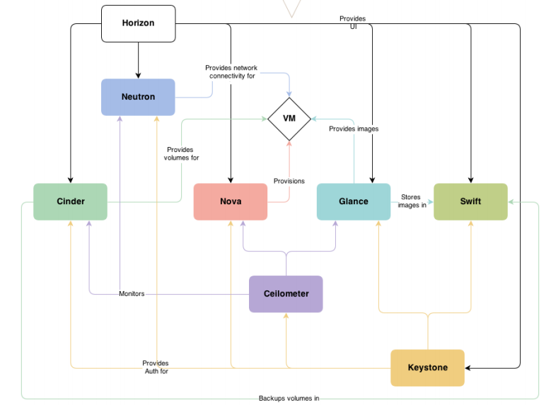

# 架构

<!-- TOC -->

- [架构](#架构)
    - [逻辑架构](#逻辑架构)
    - [实验环境](#实验环境)
        - [部署拓扑](#部署拓扑)
    - [部署DevStack](#部署devstack)

<!-- /TOC -->

## 逻辑架构

- Nova:管理VM的生命周期,是Openstack中最核心的服务
- Neutron:为Openstack提供网络连接服务,负责创建L2,L3网络,为VM提供虚拟网络和物理网络连接
- Glance:管理VM的启动镜像,Nova创建VM时将使用Glance提供的镜像
- Cinder:为VM提供块存储服务.Cinder提供的每一个Volume在VM看来就是一块虚拟硬盘,一般作数据盘
- Swift:提供对象存储服务.VM可以通过RESTful API存放对象数据.作为可选的方案,Glance可以将镜像存放在Swift中;Cinder也可以将Volume备份到Swift中
- Keystone:为OpenStack的各种服务提供认证和权限管理服务
- Ceilometer:提供OpenStack监控和计量服务,为报警,统计或计费提供数据
- Horizon:为OpenStack用户提供一个Web的自服务Portal

## 实验环境

自己学习使用的实验环境推荐使用DevStack.<http://docs.openstack.org/developer/devstack/>

### 部署拓扑

OpenStack是一个分布式系统,由若干不同功能的节点(Node)组成:

1. 控制节点(Controller Node)

    管理OpenStack.其上运行的服务有Keystone,Glance,Horizon以及Nova和Neutron中管理相关的组件

    控制节点也运行支持OpenStack的服务,例如SQL数据库,消息队列和网络时间服务NTP

2. 网络节点(Network Node)

    其上运行的服务为Neutron,为OpenStack提供L2和L3网络.包括虚拟机网络,DHCP,路由,NAT等

3. 存储节点(Storage Node)

    提供块存储(Cinder)或对象存储(Swift)服务

4. 计算节点(Compute Node)

    其上运行Hypervisor(默认使用KVM),同时运行Neutron服务的agent,为虚拟机提供网络支持

实验环境:

1. devstack-controller:控制节点+网络节点+块存储节点+计算节点
2. devstack-compute:计算节点

网络规划:

1. Management Network:用于OpenStack内部管理用,比如各服务之间的通信.使用ens33,192.168.10.0/24网段
2. VM(Tenant) Network:OpenStack部署的虚拟机所使用的网络.使用ens37,192.168.80.0/24网段
3. External Network:用于连接Neutron,使VM能够访问到外部网络

## 部署DevStack

