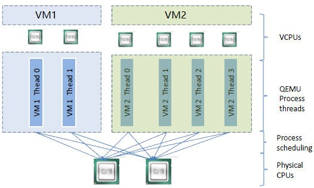
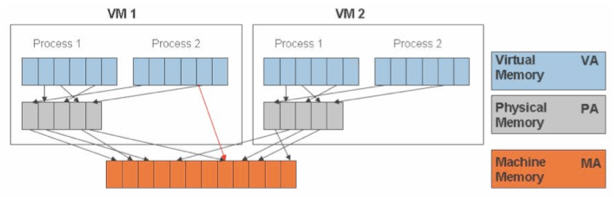
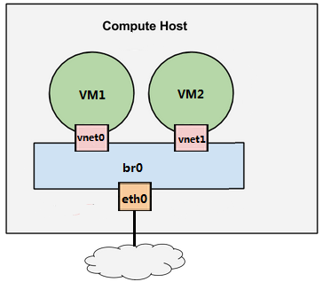

# openstack预备知识

<!-- TOC -->

- [openstack预备知识](#openstack预备知识)
    - [虚拟化](#虚拟化)
        - [基本概念](#基本概念)
        - [KVM](#kvm)
            - [Libvirt](#libvirt)
            - [KVM实操](#kvm实操)
                - [准备KVM实验环境](#准备kvm实验环境)
                - [启动第一个KVM虚拟机](#启动第一个kvm虚拟机)
                - [远程管理KVM虚拟机](#远程管理kvm虚拟机)
            - [KVM虚拟化原理](#kvm虚拟化原理)
                - [CPU虚拟化](#cpu虚拟化)
                - [内存虚拟化](#内存虚拟化)
                - [存储虚拟化](#存储虚拟化)
                - [网络虚拟化](#网络虚拟化)

<!-- /TOC -->

## 虚拟化

### 基本概念

虚拟化使得在一台物理的服务器上可以跑多台虚拟机,并共享物理机的CPU,内存,IO硬件资源.在逻辑上虚拟机之间是相互隔离的

宿主机通过一个叫做Hypervisor的程序实现将自己的硬件资源虚拟化,提供给客户机使用

Hypervisor有两种类型,分别是1型虚拟化和2型虚拟化:

1. 1型虚拟化

    Hypervisor直接安装在物理机上,多个虚拟机在Hypervisor上运行.Hypervisor实现方式一般是一个特殊定制的Linux系统.例如Xen和ESXi

    

2. 2型虚拟化

    物理机上首先安装常规的操作系统.Hypervisor作为OS上的一个程序模块运行,并对虚拟机进行管理.例如KVM,VirtualBox,VMWare Workstation

    

理论上说:

- 1型虚拟化一般对硬件虚拟化功能进行了特别优化,性能上比2型要高
- 2型虚拟化因为基于普通的操作系统,会比较灵活,比如支持虚拟机嵌套.嵌套意味着可以在KVM虚拟机中再运行KVM

### KVM

KVM是x86平台上运用最广泛的虚拟化方案.KVM全称是Kernel-Based Virtual Machine

KVM有一个内核模块叫kvm.ko,只用于管理虚拟CPU和内存;IO的虚拟化则交给Linux内核和Qemu来实现

#### Libvirt

Libvirt是KVM的管理工具

Libvirt包含3个东西:后台daemon程序libvirtd,API库以及命令行工具virsh

1. libvirtd是服务程序,接收和处理API请求
2. API库使可以开发基于Libvirt的高级工具,如virt-manager
3. virsh是KVM的命令行工具

#### KVM实操

##### 准备KVM实验环境

1. 确认CPU是否支持虚拟化

        ]# egrep -o '(vmx|svm)' /proc/cpuinfo

2. 安装KVM

        ]# sudo pacman -S qemu libvirt virt-manager bridge-utils vlan

3. 启动Libvirtd服务

        ]# systemctl enable libvirtd
        ]# systemctl start libvirtd

##### 启动第一个KVM虚拟机

1. 通过virt-manager命令启动图形化界面
2. 创建一个新的虚拟机
3. 选择从哪里启动虚拟机,可以选择安装新的OS,从网络安装,PXE安装以及导入磁盘映像等方式
4. 告诉virt-manager镜像的位置.推荐选择cirros镜像<http://download.cirros-cloud.net/>
5. 为虚拟机分配CPU和内存
6. 选择网络(nat,host-only,bridge)
7. 开启虚拟机

可以通过virsh命令管理虚拟机

    ]# virsh list //查看宿主机上的虚拟机

##### 远程管理KVM虚拟机

1. 修改Libvirt配置文件(Libvirt默认不接受远程管理)

        ]# vim /etc/conf.d/libvirtd
            start_libvirtd=”yes”
            libvirtd_opts=”-d -l”

        ]# vim /etc/libvirt/libvirtd.conf
            listen_tls = 0
            listen_tcp = 1
            unix_sock_group = “libvirtd”
            unix_sock_ro_perms = “0777”
            unix_sock_rw_perms = “0770”
            auth_unix_ro = “none”
            auth_unix_rw = “none”
            auth_tcp = “none”

2. 重启Libvirtd服务

3. 打开virt-manager,添加远程宿主机

#### KVM虚拟化原理

##### CPU虚拟化

KVM的虚拟化需要CPU硬件的支持

一个KVM虚拟机在宿主机中其实是一个qemu-kvm进程,与其他Linux进程一样被调度

虚拟机中的每个vCPU则对应qemu-kvm进程中的一个线程,如图:

虚拟机的vCPU总数可以超过物理CPU的数量,叫做CPU overcommit(超配)

##### 内存虚拟化

KVM通过内存虚拟化共享物理系统内存,动态分配给虚拟机,如图:

KVM需要实现VA(虚拟内存)->PA(物理内存)->MA(机器内存)直接的地址转换.虚拟机OS控制VA->PA,而KVM负责PA->MA

##### 存储虚拟化

KVM的存储虚拟化是通过存储池(Storage Pool)和卷(Volume)来管理的

Storage Pool是宿主机上可以看到的一片存储空间,可以是多种类型;Volume是在Storage Pool中划分的一块空间,宿主机将Volume分配给虚拟机,Volume在虚拟机中看到的就是一块硬盘

- 目录类型的Storage Pool

    文件目录是最常用的Storage Pool类型.例如KVM默认将/var/libvirtd/libvirtd/images作为Storage Pool

    此时Volume则是该目录下面的文件,一个文件就是一个Volume,例如qcow2格式的文件

    KVM所有可以使用的Storage Pool都定义在/etc/libvirt/storage目录下,每个Pool一个xml文件,默认有一个default.xml

    使用文件做Volume的优点:存储方便,移植性好,可复制,可远程访问(镜像文件可存储在通过网络连接的远程文件系统)

- LVM类型的Storage Pool

    宿主机上VG中的LV也可以作为虚拟磁盘分配给虚拟机使用(LV没有MBR引导记录,只能作为数据盘)

    这时,宿主机的VG就是一个Storage Pool,VG中的LV就是Volume

    LV的优点是有较好的性能;不足的地方是管理和移动性方面不足镜像文件,而且不能通过网络远程使用

    示例:

    1. 在宿主机创建一个容量为10G的VG,命名为HostVG
    2. 创建一个Storage Pool的定义文件/etc/libvirt/storage/HostVG.xml

            <pool type="logical">
            <name>HostVG</name>
            <source>
                <name>HostVG</name>
                <format type="lvm2"/>
            </source>
            <target>
                <path>/dev/HostVG</path>
            </target>
            </pool>

    3. 通过virsh命令创建新的Storage Pool "HostVG"

            ]# virsh pool-define /etc/libvirt/storage/HostVG.xml //创建新的Storage Pool

            ]# virsh pool-start HostVG //启用该Storage Pool

            ]# virsh pool-list --all

    4. 此时即可以在virt-manager添加LV的虚拟磁盘

- 其他类型的Storage Pool

KVM还支持iSCSI,Ceph等多种类型的Storage Pool,不过最常用的就是目录型

其他类型可参考文档<http://libvirt.org/storage.html>

##### 网络虚拟化

网络虚拟化是虚拟化技术中最复杂的部分,却也是虚拟化中十分重要的资源

1. Linux Bridge了解

    Linux Bridge是Linux上用来做TCP/IP二层协议交换的设备,其功能相当于一个二层交换机

    Linux Bridge可以实现虚拟机与外界的通信

    

2. 配置linux Bridge br0

        ]# brctl addbr br0 //创建Linux Bridge
        ]# brctl addif eno1 //将eno1挂在br0上
        ]# ip address flush eno1 //刷新状态,eno1应该没有ip
        ]# ip address add 192.168.10.1/24 dev br0 //为br0配置ip
        ]# brctl show

3. 配置VM

    在virt-manager查看VM1的网卡配置,将其指定连接到br0上

    开启VM1,此时查看br0,会发现添加了一个vnet0设备

        ]# virsh start VM1
        ]# brctl show

    可以通过vrish确认vnet0是VM1的虚拟网卡

        ]# virsh domiflist VM1

    为VM1配置ip,发现可以ping通br0

    在VM2上进行相同配置,VM1和VM2互ping,不通,待解决...