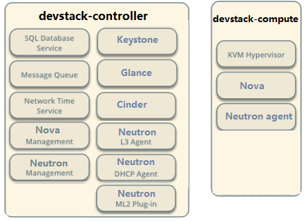

# 架构

<!-- TOC -->

- [架构](#架构)
    - [逻辑架构](#逻辑架构)
    - [实验环境](#实验环境)
        - [部署拓扑](#部署拓扑)
    - [部署DevStack](#部署devstack)

<!-- /TOC -->

## 逻辑架构

- Nova:管理VM的生命周期,是Openstack中最核心的服务
- Neutron:为Openstack提供网络连接服务,负责创建L2,L3网络,为VM提供虚拟网络和物理网络连接
- Glance:管理VM的启动镜像,Nova创建VM时将使用Glance提供的镜像
- Cinder:为VM提供块存储服务.Cinder提供的每一个Volume在VM看来就是一块虚拟硬盘,一般作数据盘
- Swift:提供对象存储服务.VM可以通过RESTful API存放对象数据.作为可选的方案,Glance可以将镜像存放在Swift中;Cinder也可以将Volume备份到Swift中
- Keystone:为OpenStack的各种服务提供认证和权限管理服务
- Ceilometer:提供OpenStack监控和计量服务,为报警,统计或计费提供数据
- Horizon:为OpenStack用户提供一个Web的自服务Portal

## 实验环境

自己学习使用的实验环境推荐使用DevStack.<http://docs.openstack.org/developer/devstack/>

### 部署拓扑

OpenStack是一个分布式系统,由若干不同功能的节点(Node)组成:

1. 控制节点(Controller Node)

    管理OpenStack.其上运行的服务有Keystone,Glance,Horizon以及Nova和Neutron中管理相关的组件

    控制节点也运行支持OpenStack的服务,例如SQL数据库,消息队列和网络时间服务NTP

2. 网络节点(Network Node)

    其上运行的服务为Neutron,为OpenStack提供L2和L3网络.包括虚拟机网络,DHCP,路由,NAT等

3. 存储节点(Storage Node)

    提供块存储(Cinder)或对象存储(Swift)服务

4. 计算节点(Compute Node)

    其上运行Hypervisor(默认使用KVM),同时运行Neutron服务的agent,为虚拟机提供网络支持

实验环境:

1. devstack-controller:控制节点+网络节点+块存储节点+计算节点
2. devstack-compute:计算节点

网络规划:

1. Management Network:用于OpenStack内部管理用,比如各服务之间的通信.使用ens33,192.168.10.0/24网段
2. VM(Tenant) Network:OpenStack部署的虚拟机所使用的网络.使用ens37,192.168.80.0/24网段
3. External Network:用于连接Neutron,使VM能够访问到外部网络

## 部署DevStack

1. 从devstack镜像站点下载代码<http://git.trystack.cn/openstack-dev/devstack>

        ]# yum install git
        ]# git clone http://git.trystack.cn/openstack-dev/devstack

2. 配置devstack用户

        ]# devstack/tools/create-stack-user.sh
        ]# mv devstack /opt/stack
        ]# chown -R stack:stack /opt/stack/devstack
        ]# su – stack
        ]# cd devstack

3. 编写devstack配置文件

    - controller

            ]# vim local.conf
            [[local|localrc]]

            MULTI_HOST=true
            HOST_IP=192.168.10.11 # management & api network 
            LOGFILE=/opt/stack/logs/stack.sh.log

            # Credentials 
            ADMIN_PASSWORD=admin 
            MYSQL_PASSWORD=secret 
            RABBIT_PASSWORD=secret 
            SERVICE_PASSWORD=secret 
            SERVICE_TOKEN=abcdefghijklmnopqrstuvwxyz

            # enable neutron-ml2-vlan 
            disable_service n-net 
            enable_service q-svc,q-agt,q-dhcp,q-l3,q-meta,neutron,q-lbaas,q-fwaas,q-vpn 
            Q_AGENT=linuxbridge 
            ENABLE_TENANT_VLANS=True 
            TENANT_VLAN_RANGE=3001:4000 
            PHYSICAL_NETWORK=default

            LOG_COLOR=False 
            LOGDIR=$DEST/logs 
            SCREEN_LOGDIR=$LOGDIR/screen

            # use TryStack git mirror 
            GIT_BASE=http://git.trystack.cn 
            NOVNC_REPO=http://git.trystack.cn/kanaka/noVNC.git 
            SPICE_REPO=http://git.trystack.cn/git/spice/spice-html5.git

    - compute

            [[local|localrc]]

            MULTI_HOST=true
            HOST_IP=192.168.10.12 # management & api network

            # Credentials
            ADMIN_PASSWORD=admin
            MYSQL_PASSWORD=secret
            RABBIT_PASSWORD=secret
            SERVICE_PASSWORD=secret
            SERVICE_TOKEN=abcdefghijklmnopqrstuvwxyz

            # Service information
            SERVICE_HOST=192.168.10.11
            MYSQL_HOST=$SERVICE_HOST
            RABBIT_HOST=$SERVICE_HOST
            GLANCE_HOSTPORT=$SERVICE_HOST:9292
            Q_HOST=$SERVICE_HOST
            KEYSTONE_AUTH_HOST=$SERVICE_HOST
            KEYSTONE_SERVICE_HOST=$SERVICE_HOST

            CEILOMETER_BACKEND=mongodb
            DATABASE_TYPE=mysql

            ENABLED_SERVICES=n-cpu,q-agt,neutron
            Q_AGENT=linuxbridge
            ENABLE_TENANT_VLANS=True
            TENANT_VLAN_RANGE=3001:4000
            PHYSICAL_NETWORK=default

            # vnc config
            NOVA_VNC_ENABLED=True
            NOVNCPROXY_URL=”http://$SERVICE_HOST:6080/vnc_auto.html”
            VNCSERVER_LISTEN=$HOST_IP
            VNCSERVER_PROXYCLIENT_ADDRESS=$VNCSERVER_LISTEN

            LOG_COLOR=False
            LOGDIR=$DEST/logs
            SCREEN_LOGDIR=$LOGDIR/screen

            # use TryStack git mirror 
            GIT_BASE=http://git.trystack.cn 
            NOVNC_REPO=http://git.trystack.cn/kanaka/noVNC.git 
            SPICE_REPO=http://git.trystack.cn/git/spice/spice-html5.git

4. 配置pip加速

        ]# pip install --upgrade pip
        ]# mkdir ~/.pip
        ]# vim ~/.pip/pip.conf
        [global]
        index-url = https://mirrors.aliyun.com/pypi/simple/

        [install]
        trusted-host=mirrors.aliyun.com

5. 开始部署

    分别在controller和compute上执行./stack.sh

    需要等很长很长时间

6. 取消iptables策略(直接访问会显示no route to host)

    ]# iptables -t filter -D INPUT 10

7. 验证openstack正常运行

    浏览器直接访问192.168.10.11,使用admin/admin登录